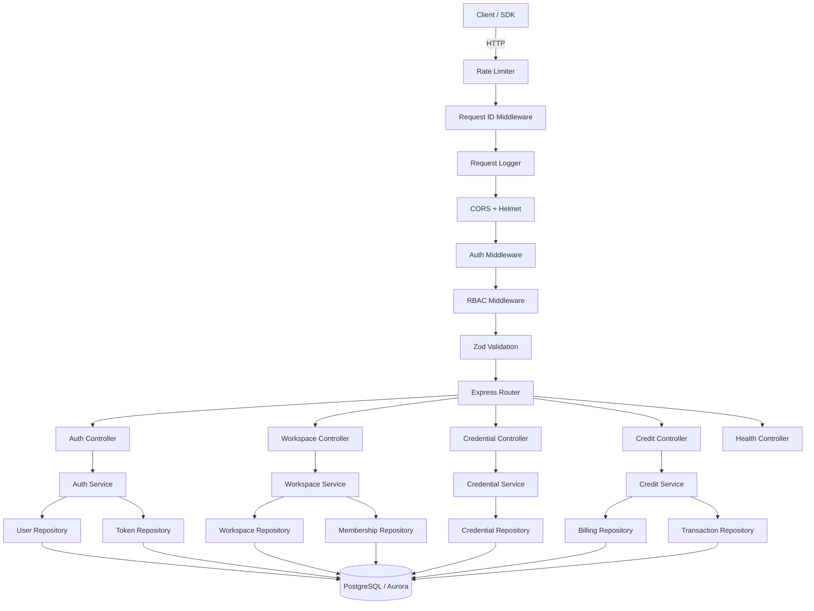
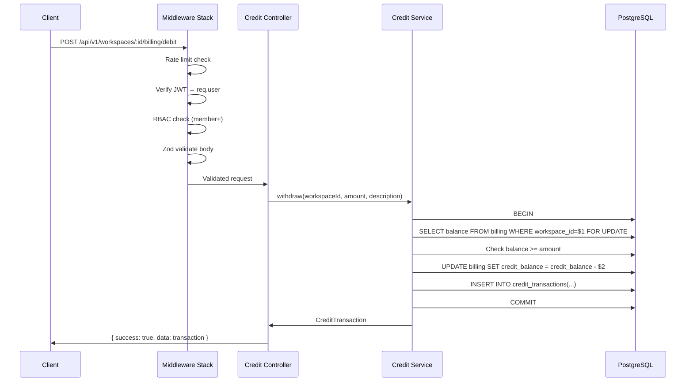
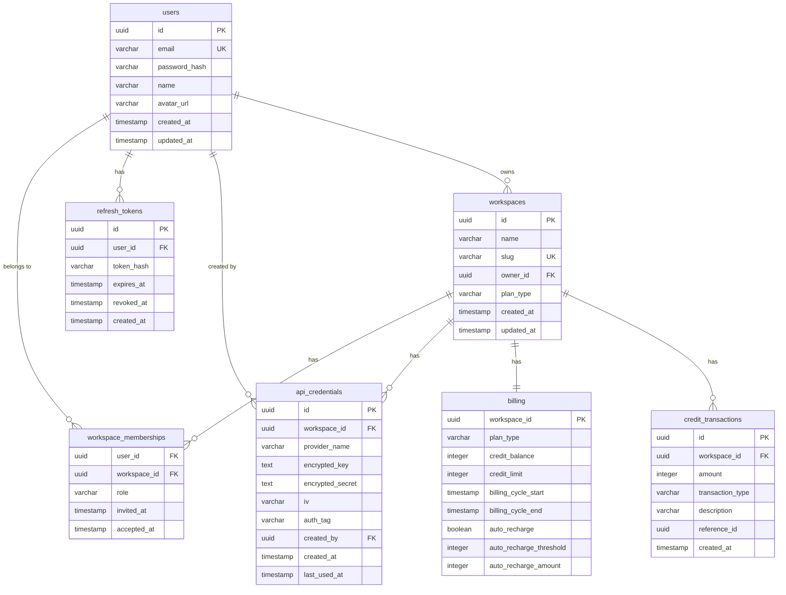

# Design Document: Core Backend Foundation

## Overview

This module establishes the foundational backend for a modern GTM data engine. It provides a stateless Express.js API gateway with a layered architecture (routes → controllers → services → repositories), PostgreSQL for transactional storage, JWT-based authentication with refresh token rotation, RBAC middleware, multi-tenant workspace management, AES-256-GCM encrypted credential storage, and a consumption-based credit/billing system.

The system is designed for horizontal scalability (stateless JWT auth, no server-side sessions) and Aurora compatibility. All future modules will depend on this foundation:
- **Module 2**: Enrichment orchestration (Temporal.io workflows, credit consumption)
- **Module 3**: Scraping microservices (Python/Playwright, credential retrieval)
- **Module 4**: Spreadsheet UI (React/AG Grid, real-time data)
- **Module 5**: OLAP layer (ClickHouse, analytics)
- **Module 6**: Search (OpenSearch, full-text indexing)

### Key Design Decisions

1. **Layered architecture** — Routes handle HTTP, controllers orchestrate, services contain business logic, repositories handle data access. Enables independent testing and future refactoring.
2. **JWT with refresh token rotation** — Stateless access tokens (15min) for scalability, database-backed refresh tokens (7d) for revocation. Rotation on each refresh prevents token reuse.
3. **PostgreSQL row-level locking for credits** — `SELECT ... FOR UPDATE` ensures correct concurrent credit operations without external distributed locks.
4. **AES-256-GCM per-workspace encryption** — Workspace-specific keys derived from a master key + workspace ID. Authenticated encryption prevents tampering and unauthorized decryption.
5. **Zod validation at middleware level** — Request validation happens before business logic, keeping services clean and ensuring consistent error responses.
6. **Modular structure** — Each domain (auth, workspace, credential, credit) is a self-contained module with its own routes, controller, service, schemas, and repository. Future modules plug in the same way.

## Architecture



### Middleware Pipeline Order

1. **Rate Limiter** — Sliding window per IP. Auth endpoints: 5/min. General: 100/min.
2. **Request ID** — Generates UUID, attaches to `req` and `X-Request-Id` response header.
3. **Request Logger** — Logs method, path, status, response time as structured JSON.
4. **CORS + Helmet** — Security headers and cross-origin configuration.
5. **Auth Middleware** — Extracts and verifies JWT from `Authorization: Bearer <token>`. Sets `req.user`. Skips public routes (register, login, health).
6. **RBAC Middleware** — Route-level decorator specifying minimum role. Checks `req.user` membership + role in target workspace.
7. **Zod Validation** — Validates `req.body`, `req.params`, `req.query` against route-specific schemas.
8. **Error Handler** — Global catch-all that formats all errors into JSON_Envelope.

### Request Flow Example (Credit Debit)



## Components and Interfaces

### Directory Structure

```
packages/backend/
├── src/
│   ├── config/
│   │   └── env.ts                 # Zod-validated environment config
│   ├── middleware/
│   │   ├── auth.ts                # JWT verification
│   │   ├── rbac.ts                # Role-based access control
│   │   ├── validate.ts            # Zod schema validation
│   │   ├── rateLimiter.ts         # Rate limiting (sliding window)
│   │   ├── requestId.ts           # X-Request-Id generation
│   │   ├── requestLogger.ts       # Structured JSON logging
│   │   └── errorHandler.ts        # Global error → JSON_Envelope
│   ├── modules/
│   │   ├── auth/
│   │   │   ├── auth.routes.ts
│   │   │   ├── auth.controller.ts
│   │   │   ├── auth.service.ts
│   │   │   ├── auth.schemas.ts    # Zod request/response schemas
│   │   │   ├── user.repository.ts
│   │   │   └── token.repository.ts
│   │   ├── workspace/
│   │   │   ├── workspace.routes.ts
│   │   │   ├── workspace.controller.ts
│   │   │   ├── workspace.service.ts
│   │   │   ├── workspace.schemas.ts
│   │   │   ├── workspace.repository.ts
│   │   │   └── membership.repository.ts
│   │   ├── credential/
│   │   │   ├── credential.routes.ts
│   │   │   ├── credential.controller.ts
│   │   │   ├── credential.service.ts
│   │   │   ├── credential.schemas.ts
│   │   │   └── credential.repository.ts
│   │   └── credit/
│   │       ├── credit.routes.ts
│   │       ├── credit.controller.ts
│   │       ├── credit.service.ts
│   │       ├── credit.schemas.ts
│   │       ├── billing.repository.ts
│   │       └── transaction.repository.ts
│   ├── shared/
│   │   ├── types.ts               # Shared TypeScript interfaces
│   │   ├── errors.ts              # Custom AppError classes
│   │   ├── envelope.ts            # JSON envelope helper
│   │   ├── encryption.ts          # AES-256-GCM encrypt/decrypt
│   │   ├── db.ts                  # pg-pool connection pool
│   │   └── logger.ts              # Structured JSON logger
│   ├── app.ts                     # Express app assembly
│   └── server.ts                  # Entry point, env validation
├── migrations/
│   ├── 001_create_users.ts
│   ├── 002_create_workspaces.ts
│   ├── 003_create_workspace_memberships.ts
│   ├── 004_create_api_credentials.ts
│   ├── 005_create_billing.ts
│   ├── 006_create_credit_transactions.ts
│   └── 007_create_refresh_tokens.ts
├── tests/
│   ├── unit/
│   └── property/
├── package.json
├── tsconfig.json
└── .env.example
```


### Core TypeScript Interfaces

```typescript
// === JSON Envelope ===
interface ApiResponse<T> {
  success: boolean;
  data: T | null;
  error: { code: string; message: string } | null;
  meta?: { page: number; limit: number; total: number };
}

// === User ===
interface User {
  id: string;           // UUID
  email: string;
  passwordHash: string; // bcrypt, 12 rounds
  name: string;
  avatarUrl: string | null;
  createdAt: Date;
  updatedAt: Date;
}

// === Workspace ===
interface Workspace {
  id: string;           // UUID
  name: string;
  slug: string;         // unique, URL-safe
  ownerId: string;      // FK to users
  planType: 'free' | 'pro' | 'enterprise';
  createdAt: Date;
  updatedAt: Date;
}

// === Workspace Membership ===
type WorkspaceRole = 'owner' | 'admin' | 'member' | 'viewer';

interface WorkspaceMembership {
  userId: string;
  workspaceId: string;
  role: WorkspaceRole;
  invitedAt: Date;
  acceptedAt: Date | null;
}

// === Role Hierarchy (numeric for comparison) ===
const ROLE_HIERARCHY: Record<WorkspaceRole, number> = {
  viewer: 0,
  member: 1,
  admin: 2,
  owner: 3,
};

// === Auth Context (attached to req.user) ===
interface AuthContext {
  userId: string;
  workspaceId?: string;
  role?: WorkspaceRole;
}

// === Refresh Token ===
interface RefreshToken {
  id: string;
  userId: string;
  tokenHash: string;    // SHA-256 hash of the raw token
  expiresAt: Date;
  revokedAt: Date | null;
  createdAt: Date;
}

// === API Credential (third-party keys) ===
interface ApiCredential {
  id: string;
  workspaceId: string;
  providerName: string;
  encryptedKey: string;    // AES-256-GCM ciphertext (base64)
  encryptedSecret: string; // AES-256-GCM ciphertext (base64)
  iv: string;              // Initialization vector (base64)
  authTag: string;         // GCM authentication tag (base64)
  createdBy: string;       // FK to users
  createdAt: Date;
  lastUsedAt: Date | null;
}

// === Billing Record ===
interface BillingRecord {
  workspaceId: string;     // PK, FK to workspaces
  planType: 'free' | 'pro' | 'enterprise';
  creditBalance: number;   // Integer
  creditLimit: number;
  billingCycleStart: Date;
  billingCycleEnd: Date;
  autoRecharge: boolean;
  autoRechargeThreshold: number;
  autoRechargeAmount: number;
}

// === Credit Transaction ===
type CreditTransactionType = 'purchase' | 'usage' | 'refund' | 'bonus';

interface CreditTransaction {
  id: string;
  workspaceId: string;
  amount: number;          // positive = credit, negative = debit
  transactionType: CreditTransactionType;
  description: string;
  referenceId: string | null; // nullable, links to enrichment jobs
  createdAt: Date;
}

// === Pagination ===
interface PaginationOptions {
  page: number;
  limit: number;
}

interface PaginatedResult<T> {
  items: T[];
  total: number;
  page: number;
  limit: number;
}
```

### Key Service Interfaces

```typescript
interface IAuthService {
  register(email: string, password: string, name: string): Promise<User>;
  login(email: string, password: string): Promise<{ accessToken: string; refreshToken: string }>;
  refresh(refreshToken: string): Promise<{ accessToken: string; refreshToken: string }>;
  logout(refreshToken: string): Promise<void>;
}

interface IWorkspaceService {
  create(name: string, ownerId: string): Promise<Workspace>;
  list(userId: string): Promise<Workspace[]>;
  getById(workspaceId: string, userId: string): Promise<Workspace>;
  update(workspaceId: string, data: { name?: string }): Promise<Workspace>;
  delete(workspaceId: string): Promise<void>;
  addMember(workspaceId: string, email: string, role: WorkspaceRole): Promise<WorkspaceMembership>;
  removeMember(workspaceId: string, userId: string): Promise<void>;
  updateMemberRole(workspaceId: string, userId: string, role: WorkspaceRole): Promise<void>;
}

interface ICredentialService {
  store(workspaceId: string, providerName: string, key: string, secret: string, createdBy: string): Promise<ApiCredential>;
  list(workspaceId: string): Promise<Array<Omit<ApiCredential, 'encryptedKey' | 'encryptedSecret' | 'iv' | 'authTag'> & { maskedKey: string }>>;
  delete(credentialId: string): Promise<void>;
  // Internal only — used by enrichment services in future modules
  decrypt(credentialId: string): Promise<{ key: string; secret: string }>;
}

interface ICreditService {
  getBilling(workspaceId: string): Promise<BillingRecord>;
  addCredits(workspaceId: string, amount: number, description: string): Promise<CreditTransaction>;
  debit(workspaceId: string, amount: number, description: string, referenceId?: string): Promise<CreditTransaction>;
  getTransactions(workspaceId: string, options: PaginationOptions): Promise<PaginatedResult<CreditTransaction>>;
}
```

### Encryption Module Design

```typescript
// shared/encryption.ts
// Uses Node.js crypto module — no external dependencies

interface EncryptionResult {
  ciphertext: string;  // base64
  iv: string;          // base64
  authTag: string;     // base64
}

// Key derivation: HKDF(masterKey, workspaceId) → 256-bit workspace key
// This ensures each workspace has a unique encryption key without storing extra keys

function deriveWorkspaceKey(masterKey: Buffer, workspaceId: string): Buffer;
function encrypt(plaintext: string, key: Buffer): EncryptionResult;
function decrypt(ciphertext: string, iv: string, authTag: string, key: Buffer): string;
```

### Error Handling Classes

```typescript
// shared/errors.ts
class AppError extends Error {
  constructor(
    public statusCode: number,
    public code: string,
    message: string
  ) {
    super(message);
  }
}

class ValidationError extends AppError {
  constructor(message: string) { super(400, 'VALIDATION_ERROR', message); }
}
class AuthenticationError extends AppError {
  constructor(message: string) { super(401, 'AUTHENTICATION_ERROR', message); }
}
class AuthorizationError extends AppError {
  constructor(message: string) { super(403, 'AUTHORIZATION_ERROR', message); }
}
class NotFoundError extends AppError {
  constructor(message: string) { super(404, 'NOT_FOUND', message); }
}
class ConflictError extends AppError {
  constructor(message: string) { super(409, 'CONFLICT', message); }
}
class RateLimitError extends AppError {
  constructor(message: string) { super(429, 'RATE_LIMIT_EXCEEDED', message); }
}
class InsufficientCreditsError extends AppError {
  constructor(message: string) { super(402, 'INSUFFICIENT_CREDITS', message); }
}
```

## Data Models

### Entity-Relationship Diagram



### PostgreSQL Schema Details

- All primary keys: UUIDs via `gen_random_uuid()`.
- `workspace_memberships`: composite unique constraint on `(user_id, workspace_id)`.
- `billing.credit_balance`: `CHECK (credit_balance >= 0)` enforces non-negative at DB level.
- `credit_transactions`: append-only — no UPDATE/DELETE at application layer.
- `api_credentials.encrypted_key` and `encrypted_secret`: base64-encoded AES-256-GCM ciphertext.

### Indexes

| Table | Index | Purpose |
|-------|-------|---------|
| users | `users_email_idx` UNIQUE on `email` | Login lookup |
| workspaces | `workspaces_slug_idx` UNIQUE on `slug` | Slug lookup |
| workspaces | `workspaces_owner_id_idx` on `owner_id` | FK index |
| workspace_memberships | `wm_user_id_idx` on `user_id` | List user's workspaces |
| workspace_memberships | `wm_workspace_id_idx` on `workspace_id` | List workspace members |
| refresh_tokens | `rt_token_hash_idx` on `token_hash` | Token lookup |
| refresh_tokens | `rt_user_id_idx` on `user_id` | Revoke all user tokens |
| api_credentials | `ac_workspace_id_idx` on `workspace_id` | List workspace credentials |
| billing | PK on `workspace_id` | Direct lookup |
| credit_transactions | `ct_workspace_created_idx` on `(workspace_id, created_at DESC)` | Transaction history |

### Credit Operations — Concurrency Strategy

All credit mutations use `SELECT ... FOR UPDATE` within a transaction:

```sql
BEGIN;
  SELECT credit_balance FROM billing WHERE workspace_id = $1 FOR UPDATE;
  -- App checks: credit_balance + amount >= 0 (for debits, amount is negative)
  UPDATE billing SET credit_balance = credit_balance + $2, updated_at = NOW() WHERE workspace_id = $1;
  INSERT INTO credit_transactions (id, workspace_id, amount, transaction_type, description, reference_id, created_at)
    VALUES (gen_random_uuid(), $1, $2, $3, $4, $5, NOW());
  -- If auto_recharge enabled and new balance < threshold, trigger recharge
COMMIT;
```

This serializes access to the billing row, preventing double-spending and lost updates under concurrent requests.


## Correctness Properties

*A property is a characteristic or behavior that should hold true across all valid executions of a system — essentially, a formal statement about what the system should do. Properties serve as the bridge between human-readable specifications and machine-verifiable correctness guarantees.*

### Property 1: Password hashing round-trip

*For any* valid email and password, registering a user and then verifying the stored password hash with bcrypt.compare against the original password should return true.

**Validates: Requirements 2.1**

### Property 2: Login token structure

*For any* registered user with valid credentials, calling login should return an access token that decodes to a payload containing the user's ID and an expiry approximately 15 minutes in the future, and a refresh token that is a non-empty string.

**Validates: Requirements 2.3**

### Property 3: Invalid credentials produce uniform error

*For any* login attempt with either a wrong email or a wrong password, the response should be a 401 status with an identical error message, making it impossible to distinguish which field was incorrect.

**Validates: Requirements 2.4**

### Property 4: Refresh token rotation invalidates old token

*For any* valid refresh token, calling refresh should return a new access token and a new refresh token, and the original refresh token should no longer be accepted for subsequent refresh calls.

**Validates: Requirements 2.5**

### Property 5: Logout invalidates refresh token

*For any* valid refresh token, after calling logout with that token, attempting to use it for refresh should fail with a 401 status.

**Validates: Requirements 2.7**

### Property 6: RBAC role hierarchy enforcement

*For any* required minimum role and any user workspace role, access should be granted if and only if the user's role is greater than or equal to the minimum in the hierarchy (owner > admin > member > viewer). For all role pairs (r_required, r_user), the RBAC middleware should return allow when ROLE_HIERARCHY[r_user] >= ROLE_HIERARCHY[r_required] and deny otherwise.

**Validates: Requirements 3.1, 3.2**

### Property 7: RBAC uses workspace-scoped role

*For any* user who holds different roles in two different workspaces, accessing a resource in workspace A should use the role from workspace A's membership, not the role from workspace B.

**Validates: Requirements 3.4**

### Property 8: Workspace creation assigns owner membership

*For any* user creating a workspace, the resulting workspace_memberships table should contain a record with that user's ID, the new workspace's ID, and role = 'owner'.

**Validates: Requirements 4.1**

### Property 9: Workspace listing returns exactly user's workspaces

*For any* user with memberships in a set of workspaces W, calling list workspaces should return exactly the workspaces in W — no more, no less.

**Validates: Requirements 4.2**

### Property 10: Member addition creates correct membership

*For any* workspace and valid user, adding them as a member with a specified role should create a workspace_membership record with that exact role.

**Validates: Requirements 4.6**

### Property 11: Member removal deletes membership

*For any* workspace member who is not the last owner, removing them should result in no membership record existing for that user-workspace pair.

**Validates: Requirements 4.7**

### Property 12: Member role update persists correctly

*For any* workspace member and a new valid role, updating their role should result in the membership record reflecting the new role.

**Validates: Requirements 4.8**

### Property 13: Last owner protection invariant

*For any* workspace with exactly one owner, attempting to remove that owner or change their role to a non-owner role should be rejected, and the membership should remain unchanged.

**Validates: Requirements 4.9**

### Property 14: Credential encryption round-trip

*For any* plaintext API key and secret, encrypting with AES-256-GCM using a workspace-derived key and then decrypting with the same key, IV, and auth tag should return the original plaintext values.

**Validates: Requirements 5.1**

### Property 15: Credential API responses contain only masked values

*For any* stored API credential, the list endpoint response should contain a masked key showing only the last 4 characters (e.g., `****abcd`) and should never contain the raw key or secret anywhere in the response body.

**Validates: Requirements 5.2, 5.6**

### Property 16: Credential deletion removes from listing

*For any* stored credential, after calling delete, the credential should no longer appear in the list endpoint results for that workspace.

**Validates: Requirements 5.3**

### Property 17: Unique IV per encryption operation

*For any* two encryption operations (even with the same plaintext and key), the generated IVs should be different.

**Validates: Requirements 5.4**

### Property 18: Per-workspace key derivation produces distinct keys

*For any* two different workspace IDs, deriving encryption keys from the same master key should produce different 256-bit keys.

**Validates: Requirements 5.5**

### Property 19: Credit addition increases balance by exact amount

*For any* workspace with an existing balance B and a positive credit amount A, after adding credits, the new balance should equal B + A and a transaction with type "purchase" and amount A should be recorded.

**Validates: Requirements 6.2**

### Property 20: Credit debit decreases balance by exact amount

*For any* workspace with balance B and debit amount A where A <= B, after debiting, the new balance should equal B - A and a transaction with type "usage" and amount -A should be recorded.

**Validates: Requirements 6.4**

### Property 21: Insufficient credit debit rejection

*For any* workspace with balance B and debit amount A where A > B, the debit operation should be rejected and the balance should remain B with no new transaction recorded.

**Validates: Requirements 6.5**

### Property 22: Transaction listing is reverse chronological

*For any* workspace with multiple credit transactions, the list endpoint should return them sorted by created_at in descending order (newest first).

**Validates: Requirements 6.3**

### Property 23: Auto-recharge triggers at threshold

*For any* workspace with auto_recharge enabled, threshold T, and recharge amount R, when a debit causes the balance to drop below T, the balance should be automatically increased by R and an additional "purchase" transaction should be recorded.

**Validates: Requirements 6.6**

### Property 24: Concurrent credit operations produce correct final balance

*For any* workspace with initial balance B and a set of concurrent credit operations (additions and debits), the final balance should equal B plus the algebraic sum of all successful operations, with no lost updates.

**Validates: Requirements 6.7**

### Property 25: Transaction ledger immutability

*For any* credit transaction, once recorded, querying the transaction by ID at any later point should return identical data (amount, type, description, created_at). The total count of transactions for a workspace should be monotonically non-decreasing.

**Validates: Requirements 6.8**

### Property 26: API response envelope conformance

*For any* API request to any endpoint (valid or invalid), the response body should conform to the JSON_Envelope schema `{ success, data, error }` and the response should include an `X-Request-Id` header containing a valid UUID.

**Validates: Requirements 7.1, 7.2**

### Property 27: Structured log output

*For any* API request, the application should produce a structured JSON log entry containing at minimum the fields: method, path, statusCode, and responseTime.

**Validates: Requirements 7.9**

## Error Handling

### Error Classification

| Error Type | HTTP Status | Error Code | Trigger |
|-----------|-------------|------------|---------|
| Validation | 400 | `VALIDATION_ERROR` | Zod schema validation failure |
| Authentication | 401 | `AUTHENTICATION_ERROR` | Missing/invalid/expired JWT or refresh token |
| Authorization | 403 | `AUTHORIZATION_ERROR` | Insufficient role or no workspace membership |
| Not Found | 404 | `NOT_FOUND` | Resource does not exist |
| Conflict | 409 | `CONFLICT` | Duplicate email, duplicate slug |
| Insufficient Credits | 402 | `INSUFFICIENT_CREDITS` | Debit exceeds available balance |
| Rate Limited | 429 | `RATE_LIMIT_EXCEEDED` | Too many requests from same IP |
| Internal | 500 | `INTERNAL_ERROR` | Unhandled exceptions |

### Error Handling Strategy

1. **Custom AppError hierarchy** — All known errors extend `AppError` with statusCode, code, and message. The global error handler catches these and formats them into JSON_Envelope.
2. **Unknown errors** — Any error not extending `AppError` is treated as a 500 with a generic message. The actual error is logged internally but never exposed to the client.
3. **Database errors** — PostgreSQL constraint violations (unique, FK, check) are caught and mapped to appropriate AppError subclasses (ConflictError for unique violations, ValidationError for check violations).
4. **Validation errors** — Zod parse errors are caught in the validation middleware and converted to 400 responses with field-level error details.
5. **Auth errors** — JWT verification failures and expired tokens produce 401. Invalid credentials produce 401 with a generic message (no email/password distinction).

### Error Response Format

```json
{
  "success": false,
  "data": null,
  "error": {
    "code": "VALIDATION_ERROR",
    "message": "email: Invalid email format"
  }
}
```

## Testing Strategy

### Testing Framework

- **Test runner**: Vitest (fast, TypeScript-native, compatible with Jest API)
- **Property-based testing**: fast-check (mature PBT library for TypeScript)
- **HTTP testing**: supertest (Express integration testing)
- **Database**: Testcontainers with PostgreSQL for integration tests, or pg-mem for unit-level DB tests

### Unit Tests

Unit tests cover specific examples, edge cases, and error conditions:

- Encryption/decryption with known test vectors
- Zod schema validation with valid and invalid inputs
- Role hierarchy comparison edge cases
- JSON envelope formatting
- Password hashing verification
- JWT token creation and verification
- Error class instantiation and status codes

### Property-Based Tests

Each correctness property maps to a single property-based test using fast-check. Minimum 100 iterations per test.

Test tagging format: `Feature: core-backend-foundation, Property {N}: {title}`

Key property test groupings:

1. **Auth properties** (Properties 1-5): Generate random valid emails/passwords, test registration round-trip, login token structure, error uniformity, refresh rotation, logout invalidation.
2. **RBAC properties** (Properties 6-7): Generate all role combinations, test hierarchy enforcement and workspace scoping.
3. **Workspace properties** (Properties 8-13): Generate random workspace/user configurations, test CRUD operations and last-owner invariant.
4. **Encryption properties** (Properties 14-18): Generate random plaintext strings and workspace IDs, test round-trip, masking, deletion, IV uniqueness, key derivation distinctness.
5. **Credit properties** (Properties 19-25): Generate random balance/amount combinations, test arithmetic correctness, rejection, ordering, auto-recharge, concurrency, immutability.
6. **Infrastructure properties** (Properties 26-27): Generate random API requests, test envelope conformance and log structure.

### Integration Tests

Integration tests verify end-to-end flows through the Express app with a real PostgreSQL instance:

- Full registration → login → create workspace → add member → store credential → add credits → debit flow
- Concurrent credit operations (multiple parallel debit requests)
- Rate limiting behavior (5 requests then 429)
- RBAC enforcement across different workspace contexts
