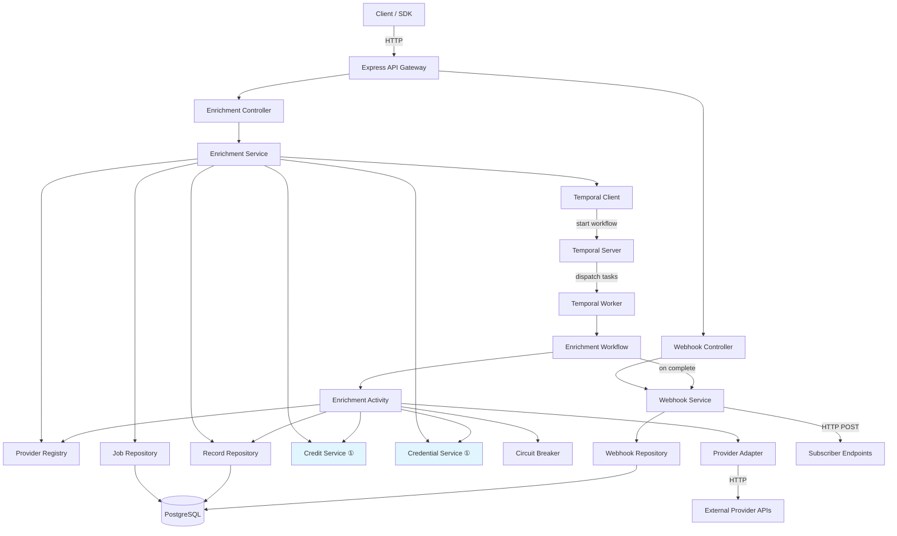
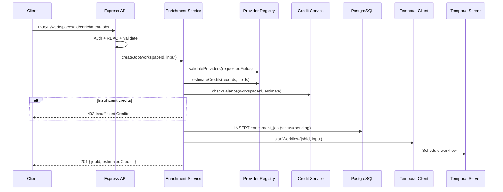
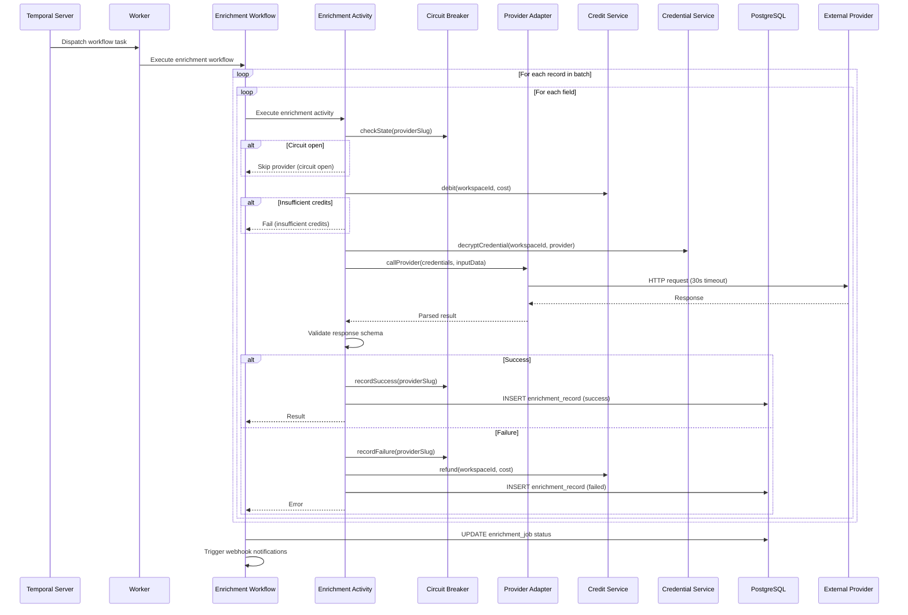
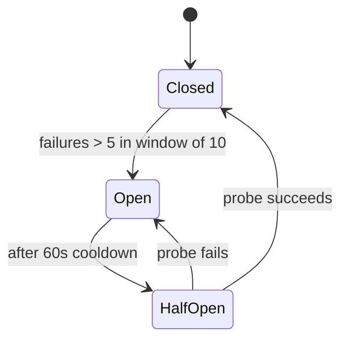
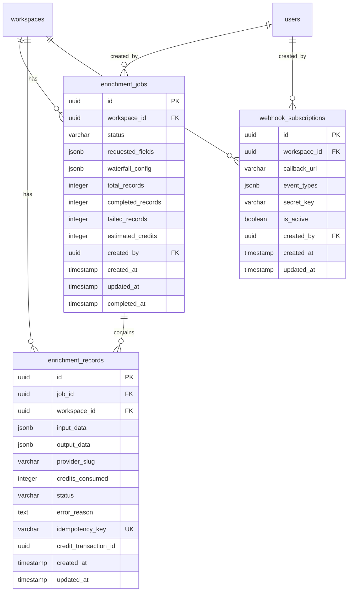

# Design Document: Module 2 — Enrichment Orchestration

## Overview

This module implements the enrichment orchestration layer for Morket — the core value engine that transforms raw contact and company records into enriched, actionable GTM data. It integrates Temporal.io as a durable workflow engine to orchestrate multi-step enrichment jobs that call external provider APIs (Apollo, Clearbit, Hunter, etc.), supports waterfall fallback strategies, manages per-call credit consumption, and provides webhook notifications for async integrations.

The module builds on Module 1's foundation: JWT auth, RBAC, encrypted credential storage, credit system, and the layered Routes → Controllers → Services → Repositories architecture.

### Key Design Decisions

1. **Temporal.io for workflow orchestration** — Provides durable execution, automatic retries, replay safety, and cancellation signals out of the box. Enrichment jobs can survive process restarts and network failures without custom state management.
2. **In-process provider registry** — Providers are registered as code-level configurations with adapter functions rather than database rows. This keeps the registry fast, type-safe, and version-controlled. Adding a provider is a code change, not a database migration.
3. **Idempotency via composite keys** — Each enrichment activity uses `{jobId}:{recordIndex}:{fieldName}:{providerSlug}` as an idempotency key. Combined with a UNIQUE constraint on the enrichment_records table, this prevents duplicate processing during Temporal workflow replays.
4. **Credit debit-before-call with refund-on-failure** — Credits are debited before the external API call and refunded if the call fails. This prevents over-consumption while ensuring credits are only permanently consumed for successful enrichments.
5. **In-memory circuit breaker per provider** — Tracks failures in a sliding window per provider. Simple, fast, and sufficient for a single-process worker. If horizontal scaling is needed later, this can be moved to Redis.
6. **Waterfall credits only for accepted results** — In a waterfall sequence, credits are debited per attempt but refunded for providers that return incomplete results. Only the final accepted provider's credits are permanently consumed.
7. **HMAC-SHA256 webhook signatures** — Each webhook subscription has a secret key. Deliveries include an HMAC signature header so receivers can verify authenticity without shared infrastructure.

## Architecture



*① Module 1 services reused directly*

### Request Flow: Create Enrichment Job



### Workflow Execution Flow



## Components and Interfaces

### Directory Structure

```
packages/backend/src/modules/enrichment/
├── enrichment.routes.ts          # Express routes for jobs, records, webhooks
├── enrichment.controller.ts      # HTTP request handling
├── enrichment.service.ts         # Job creation, validation, orchestration
├── enrichment.schemas.ts         # Zod schemas for all endpoints
├── job.repository.ts             # enrichment_jobs CRUD
├── record.repository.ts          # enrichment_records CRUD
├── webhook.repository.ts         # webhook_subscriptions CRUD
├── webhook.service.ts            # Webhook delivery with HMAC + retries
├── provider-registry.ts          # In-memory provider catalog
├── circuit-breaker.ts            # Per-provider circuit breaker
├── temporal/
│   ├── client.ts                 # Temporal client setup + workflow starters
│   ├── worker.ts                 # Temporal worker setup
│   ├── workflows.ts              # Enrichment workflow definitions
│   └── activities.ts             # Enrichment activity implementations
└── adapters/
    ├── types.ts                  # Provider adapter interface
    ├── apollo.adapter.ts         # Apollo API adapter
    ├── clearbit.adapter.ts       # Clearbit API adapter
    └── hunter.adapter.ts         # Hunter API adapter
```

### Core TypeScript Interfaces

```typescript
// === Provider Registry ===

type EnrichmentFieldType = 'email' | 'phone' | 'company_info' | 'job_title' | 'social_profiles' | 'address';

interface ProviderDefinition {
  slug: string;                          // e.g. 'apollo', 'clearbit', 'hunter'
  displayName: string;
  supportedFields: EnrichmentFieldType[];
  creditCostPerCall: number;             // positive integer
  inputSchema: z.ZodSchema;             // Zod schema for input validation
  outputSchema: z.ZodSchema;            // Zod schema for output validation
  requiredCredentialType: string;        // matches providerName in credential store
  adapter: ProviderAdapter;
}

interface ProviderAdapter {
  enrich(credentials: { key: string; secret: string }, input: Record<string, unknown>): Promise<ProviderResult>;
}

interface ProviderResult {
  success: boolean;
  data: Record<string, unknown> | null;
  isComplete: boolean;                   // false = partial/empty result (triggers waterfall)
  error?: string;
}

// === Enrichment Job ===

type JobStatus = 'pending' | 'running' | 'completed' | 'failed' | 'partially_completed' | 'cancelled';

interface EnrichmentJob {
  id: string;                            // UUID
  workspaceId: string;
  status: JobStatus;
  requestedFields: EnrichmentFieldType[];
  waterfallConfig: WaterfallConfig | null;
  totalRecords: number;
  completedRecords: number;
  failedRecords: number;
  estimatedCredits: number;
  createdBy: string;
  createdAt: Date;
  updatedAt: Date;
  completedAt: Date | null;
}

interface WaterfallConfig {
  [field: string]: {                     // field name → ordered provider list
    providers: string[];                 // provider slugs in priority order
  };
}

interface CreateJobInput {
  records: Record<string, unknown>[];
  fields: EnrichmentFieldType[];
  waterfallConfig?: WaterfallConfig;
}

// === Enrichment Record ===

type RecordStatus = 'success' | 'failed' | 'skipped';

interface EnrichmentRecord {
  id: string;                            // UUID
  jobId: string;
  workspaceId: string;
  inputData: Record<string, unknown>;
  outputData: Record<string, unknown> | null;
  providerSlug: string;
  creditsConsumed: number;
  status: RecordStatus;
  errorReason: string | null;
  idempotencyKey: string;
  creditTransactionId: string | null;
  createdAt: Date;
  updatedAt: Date;
}

// === Webhook ===

interface WebhookSubscription {
  id: string;                            // UUID
  workspaceId: string;
  callbackUrl: string;
  eventTypes: string[];                  // e.g. ['job.completed', 'job.failed']
  secretKey: string;
  isActive: boolean;
  createdBy: string;
  createdAt: Date;
  updatedAt: Date;
}

interface WebhookPayload {
  event: string;
  jobId: string;
  workspaceId: string;
  status: JobStatus;
  summary: {
    totalRecords: number;
    completedRecords: number;
    failedRecords: number;
    creditsConsumed: number;
  };
  timestamp: string;                     // ISO 8601
}

// === Circuit Breaker ===

type CircuitState = 'closed' | 'open' | 'half-open';

interface CircuitBreakerState {
  state: CircuitState;
  failureCount: number;
  lastFailureTime: number | null;
  recentCalls: Array<{ timestamp: number; success: boolean }>;
}
```

### Key Service Interfaces

```typescript
// === Enrichment Service ===

interface IEnrichmentService {
  createJob(workspaceId: string, userId: string, input: CreateJobInput): Promise<EnrichmentJob>;
  getJob(workspaceId: string, jobId: string): Promise<EnrichmentJob>;
  listJobs(workspaceId: string, options: PaginationOptions): Promise<PaginatedResult<EnrichmentJob>>;
  cancelJob(workspaceId: string, jobId: string): Promise<EnrichmentJob>;
  getRecord(workspaceId: string, recordId: string): Promise<EnrichmentRecord>;
  listRecords(workspaceId: string, jobId: string, options: PaginationOptions): Promise<PaginatedResult<EnrichmentRecord>>;
}

// === Webhook Service ===

interface IWebhookService {
  createSubscription(workspaceId: string, userId: string, callbackUrl: string, eventTypes: string[]): Promise<WebhookSubscription>;
  listSubscriptions(workspaceId: string): Promise<WebhookSubscription[]>;
  deleteSubscription(workspaceId: string, webhookId: string): Promise<void>;
  deliverEvent(workspaceId: string, payload: WebhookPayload): Promise<void>;
}

// === Provider Registry ===

interface IProviderRegistry {
  getProvider(slug: string): ProviderDefinition | undefined;
  getAllProviders(): ProviderDefinition[];
  getProvidersForField(field: EnrichmentFieldType): ProviderDefinition[];
  validateProviders(slugs: string[]): void;  // throws if any slug is unknown
  estimateCredits(records: number, fields: EnrichmentFieldType[], waterfallConfig?: WaterfallConfig): number;
}

// === Circuit Breaker ===

interface ICircuitBreaker {
  canCall(providerSlug: string): boolean;
  recordSuccess(providerSlug: string): void;
  recordFailure(providerSlug: string): void;
  getState(providerSlug: string): CircuitBreakerState;
  reset(providerSlug: string): void;
}
```

### API Endpoints

| Method | Path | Role | Description |
|--------|------|------|-------------|
| GET | `/api/v1/providers` | public | List all registered providers |
| GET | `/api/v1/providers/:providerSlug` | public | Get provider details |
| POST | `/api/v1/workspaces/:id/enrichment-jobs` | member+ | Create enrichment job |
| GET | `/api/v1/workspaces/:id/enrichment-jobs` | member+ | List jobs (paginated) |
| GET | `/api/v1/workspaces/:id/enrichment-jobs/:jobId` | member+ | Get job details |
| POST | `/api/v1/workspaces/:id/enrichment-jobs/:jobId/cancel` | member+ | Cancel running job |
| GET | `/api/v1/workspaces/:id/enrichment-jobs/:jobId/records` | member+ | List job records (paginated) |
| GET | `/api/v1/workspaces/:id/enrichment-records/:recordId` | member+ | Get single record |
| POST | `/api/v1/workspaces/:id/webhooks` | admin+ | Create webhook subscription |
| GET | `/api/v1/workspaces/:id/webhooks` | member+ | List webhook subscriptions |
| DELETE | `/api/v1/workspaces/:id/webhooks/:webhookId` | admin+ | Delete webhook subscription |


### Component Details

#### Provider Registry (`provider-registry.ts`)

An in-memory Map of `ProviderDefinition` objects keyed by slug. Populated at application startup. Each provider definition includes:
- Zod schemas for input/output validation
- An adapter function implementing the `ProviderAdapter` interface
- Credit cost and supported fields metadata

Adding a new provider requires:
1. Creating an adapter file in `adapters/`
2. Registering the definition in the registry initialization

No existing provider code needs modification (open/closed principle).

#### Circuit Breaker (`circuit-breaker.ts`)

Per-provider in-memory state machine with three states:



- Sliding window: tracks the most recent 10 calls per provider
- Threshold: 5 failures within the window triggers open state
- Cooldown: 60 seconds before transitioning to half-open
- Half-open: allows exactly 1 probe call; success → closed, failure → open

Configuration is injectable for testing:

```typescript
interface CircuitBreakerConfig {
  windowSize: number;       // default: 10
  failureThreshold: number; // default: 5
  cooldownMs: number;       // default: 60_000
}
```

#### Temporal Workflow (`temporal/workflows.ts`)

The enrichment workflow processes records sequentially within batches:

```typescript
// Pseudocode for workflow logic
async function enrichmentWorkflow(input: WorkflowInput): Promise<void> {
  for (const batch of input.batches) {
    for (const record of batch.records) {
      for (const field of input.requestedFields) {
        if (cancellationRequested) break;
        
        const providers = getProvidersForField(field, input.waterfallConfig);
        let result = null;
        
        for (const providerSlug of providers) {
          const idempotencyKey = `${input.jobId}:${record.index}:${field}:${providerSlug}`;
          result = await executeEnrichmentActivity({
            ...record,
            field,
            providerSlug,
            idempotencyKey,
          });
          
          if (result.success && result.isComplete) break; // waterfall stops
        }
        
        updateProgress(record, field, result);
      }
    }
  }
  
  finalizeJob(computeFinalStatus());
  await triggerWebhooks();
}
```

Key Temporal configuration:
- Workflow ID: `enrichment-job-{jobId}` (ensures uniqueness)
- Task queue: `enrichment-tasks`
- Activity retry policy: max 3 attempts, initial interval 1s, backoff coefficient 2.0
- Activity timeout: `startToCloseTimeout` = 30s per activity
- Workflow supports cancellation via Temporal signals

#### Enrichment Activity (`temporal/activities.ts`)

Each activity execution:
1. Check circuit breaker state for the provider
2. Debit credits from workspace via Credit Service
3. Decrypt provider credentials via Credential Service
4. Call external API via provider adapter (30s timeout)
5. Validate response against provider output schema
6. On success: record result, record circuit breaker success
7. On failure: refund credits, record circuit breaker failure, record error

The activity uses the idempotency key to check for existing records before executing, preventing duplicate work on Temporal replay.

#### Webhook Service (`webhook.service.ts`)

Webhook delivery:
1. Query active subscriptions matching the event type for the workspace
2. For each subscription:
   - Serialize payload as JSON
   - Compute HMAC-SHA256 signature using the subscription's secret key
   - Send HTTP POST with `Content-Type: application/json` and `X-Webhook-Signature` header
   - Timeout: 10 seconds per delivery attempt
   - Retry: up to 3 times with exponential backoff (5s, 10s, 20s)

## Data Models

### Entity-Relationship Diagram



### PostgreSQL Schema

```sql
-- Migration: create enrichment tables

CREATE TYPE enrichment_job_status AS ENUM (
  'pending', 'running', 'completed', 'failed', 'partially_completed', 'cancelled'
);

CREATE TYPE enrichment_record_status AS ENUM (
  'success', 'failed', 'skipped'
);

CREATE TABLE enrichment_jobs (
  id UUID PRIMARY KEY DEFAULT gen_random_uuid(),
  workspace_id UUID NOT NULL REFERENCES workspaces(id) ON DELETE CASCADE,
  status enrichment_job_status NOT NULL DEFAULT 'pending',
  requested_fields JSONB NOT NULL,
  waterfall_config JSONB,
  total_records INTEGER NOT NULL,
  completed_records INTEGER NOT NULL DEFAULT 0,
  failed_records INTEGER NOT NULL DEFAULT 0,
  estimated_credits INTEGER NOT NULL,
  created_by UUID NOT NULL REFERENCES users(id),
  created_at TIMESTAMPTZ NOT NULL DEFAULT NOW(),
  updated_at TIMESTAMPTZ NOT NULL DEFAULT NOW(),
  completed_at TIMESTAMPTZ
);

CREATE INDEX idx_enrichment_jobs_workspace_created
  ON enrichment_jobs(workspace_id, created_at DESC);

CREATE TABLE enrichment_records (
  id UUID PRIMARY KEY DEFAULT gen_random_uuid(),
  job_id UUID NOT NULL REFERENCES enrichment_jobs(id) ON DELETE CASCADE,
  workspace_id UUID NOT NULL REFERENCES workspaces(id) ON DELETE CASCADE,
  input_data JSONB NOT NULL,
  output_data JSONB,
  provider_slug VARCHAR(100) NOT NULL,
  credits_consumed INTEGER NOT NULL DEFAULT 0,
  status enrichment_record_status NOT NULL,
  error_reason TEXT,
  idempotency_key VARCHAR(500) NOT NULL UNIQUE,
  credit_transaction_id UUID,
  created_at TIMESTAMPTZ NOT NULL DEFAULT NOW(),
  updated_at TIMESTAMPTZ NOT NULL DEFAULT NOW()
);

CREATE INDEX idx_enrichment_records_job_created
  ON enrichment_records(job_id, created_at);

CREATE TABLE webhook_subscriptions (
  id UUID PRIMARY KEY DEFAULT gen_random_uuid(),
  workspace_id UUID NOT NULL REFERENCES workspaces(id) ON DELETE CASCADE,
  callback_url VARCHAR(2048) NOT NULL,
  event_types JSONB NOT NULL,
  secret_key VARCHAR(256) NOT NULL,
  is_active BOOLEAN NOT NULL DEFAULT true,
  created_by UUID NOT NULL REFERENCES users(id),
  created_at TIMESTAMPTZ NOT NULL DEFAULT NOW(),
  updated_at TIMESTAMPTZ NOT NULL DEFAULT NOW()
);

CREATE INDEX idx_webhook_subscriptions_workspace
  ON webhook_subscriptions(workspace_id);
```

### Schema Notes

- All UUIDs generated via `gen_random_uuid()` per project convention.
- `enrichment_jobs.status` and `enrichment_records.status` use PostgreSQL enums for type safety.
- `enrichment_records.idempotency_key` has a UNIQUE constraint to prevent duplicate records from Temporal replays. Format: `{jobId}:{recordIndex}:{fieldName}:{providerSlug}`.
- `enrichment_records.output_data` is nullable — null for failed/skipped records.
- `waterfall_config` is nullable — null when no waterfall strategy is configured.
- Foreign keys cascade on workspace deletion to clean up enrichment data.
- Indexes follow the query patterns: jobs listed by workspace in reverse chronological order, records listed by job in chronological order.

