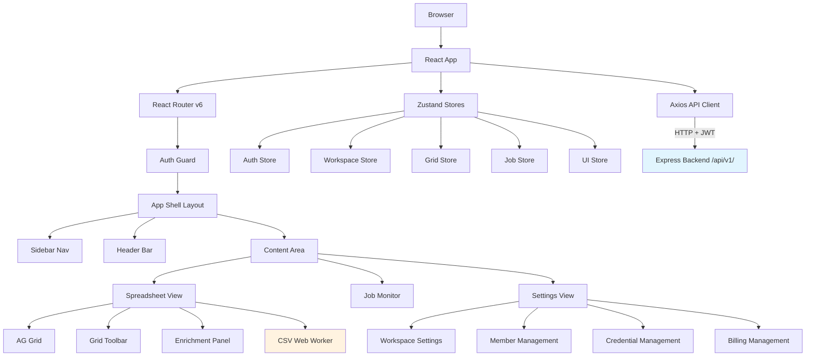
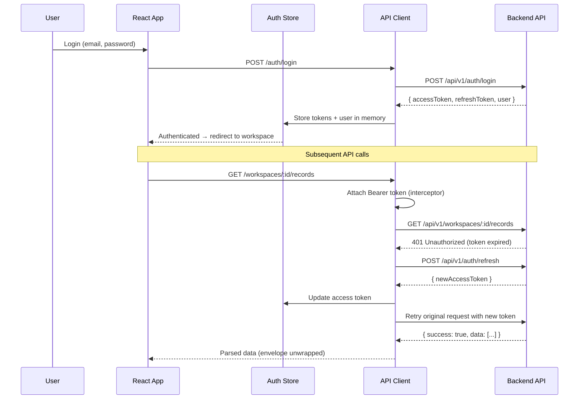
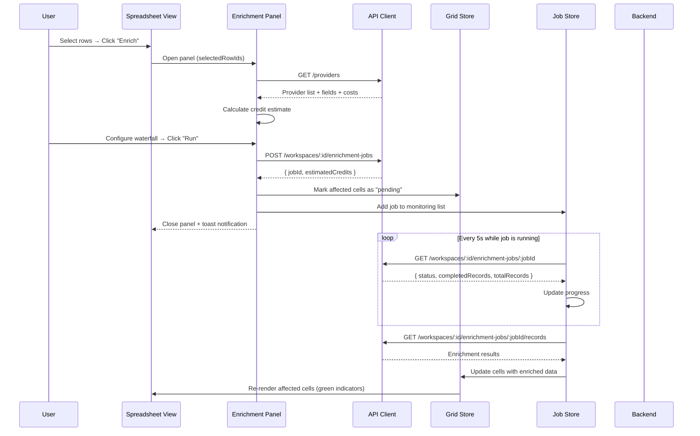

# Design Document: Module 4 — Frontend Spreadsheet UI

## Overview

This module implements the React 18+ TypeScript single-page application that serves as Morket's primary user interface — a spreadsheet-centric workspace for viewing, editing, and enriching GTM contact and company records. It consumes the backend REST API (Modules 1 & 2) and presents workspace management, enrichment configuration, job monitoring, credential management, and credit/billing features through an AG Grid-powered tabular interface.

The frontend runs as `packages/frontend/` in the monorepo and communicates exclusively with the Express.js backend at `/api/v1/`. It handles JWT authentication with automatic token refresh, role-based UI adaptation (owner/admin/member/viewer), CSV import/export via Web Workers, and real-time enrichment job monitoring via polling.

### Key Design Decisions

1. **AG Grid Community for virtualized grid** — AG Grid provides DOM virtualization out of the box, handling 100k+ rows without custom windowing. Its column API supports inline editing, sorting, filtering, column reordering, resizing, and pinning — all required by the spreadsheet requirements. Community edition covers all needed features.
2. **Zustand over Redux/Context** — Zustand provides lightweight, selector-based state management with built-in shallow equality checks. This prevents unnecessary re-renders in a grid-heavy UI where state changes are frequent. No boilerplate, no providers, no reducers.
3. **Axios for API client** — Axios interceptors provide a clean mechanism for attaching JWT tokens, handling 401 → refresh → retry flows, and parsing the backend JSON envelope. Request/response interceptors keep auth logic centralized.
4. **Web Workers for CSV processing** — CSV parsing and generation for large datasets (10k+ records) must not block the main thread. Dedicated Web Workers handle these operations, communicating results via `postMessage`.
5. **React Router v6 for routing** — Nested routes with layout components map naturally to the workspace-scoped URL structure (`/workspaces/:workspaceId/*`). Route guards handle auth redirects.
6. **Tailwind CSS for styling** — Utility-first CSS keeps styles co-located with components, avoids CSS-in-JS runtime overhead, and provides consistent design tokens. AG Grid's theme is customized via CSS variables.
7. **In-memory token storage** — Access tokens stored in Zustand (memory only), not localStorage, to reduce XSS token theft surface. Refresh tokens rely on httpOnly cookies if the backend supports it, otherwise stored in memory with the understanding that page refresh requires re-login.
8. **Debounced auto-save with dirty tracking** — Cell edits are tracked as pending changes in the Grid_Store. Auto-save fires every 30s if dirty, with manual save available. Failed saves retain pending changes for retry.
9. **Polling for job monitoring** — WebSocket would be ideal but the backend doesn't expose one. Polling every 5s for running jobs is simple, reliable, and sufficient for the enrichment job lifecycle.

## Architecture



### Authentication & API Flow



### Enrichment Flow



## Components and Interfaces

### Directory Structure

```
packages/frontend/
├── public/
│   └── index.html
├── src/
│   ├── api/
│   │   ├── client.ts                 # Axios instance + interceptors
│   │   ├── auth.api.ts               # Auth endpoints
│   │   ├── workspace.api.ts          # Workspace CRUD endpoints
│   │   ├── records.api.ts            # Record CRUD endpoints
│   │   ├── enrichment.api.ts         # Enrichment jobs + providers
│   │   ├── credentials.api.ts        # Credential management endpoints
│   │   ├── billing.api.ts            # Billing + credit endpoints
│   │   └── members.api.ts            # Member management endpoints
│   ├── stores/
│   │   ├── auth.store.ts             # Auth tokens + user profile
│   │   ├── workspace.store.ts        # Workspace list + active workspace + user role
│   │   ├── grid.store.ts             # Row data, column defs, selection, pending changes, undo stack
│   │   ├── job.store.ts              # Enrichment jobs + polling state
│   │   └── ui.store.ts               # Toast notifications, offline status, sidebar state
│   ├── components/
│   │   ├── layout/
│   │   │   ├── AppShell.tsx          # Main layout: sidebar + header + content
│   │   │   ├── Sidebar.tsx           # Navigation links
│   │   │   ├── Header.tsx            # Workspace switcher + user menu
│   │   │   └── AuthGuard.tsx         # Route protection HOC
│   │   ├── auth/
│   │   │   ├── LoginForm.tsx         # Login page
│   │   │   └── RegisterForm.tsx      # Registration page
│   │   ├── spreadsheet/
│   │   │   ├── SpreadsheetView.tsx   # AG Grid wrapper + toolbar
│   │   │   ├── GridToolbar.tsx       # Add row, import, export, column mgmt buttons
│   │   │   ├── StatusBar.tsx         # Row count, selection count, filter state
│   │   │   ├── ColumnDialog.tsx      # Add/edit column dialog
│   │   │   ├── CellRenderer.tsx      # Custom cell renderer with enrichment status
│   │   │   └── ContextMenu.tsx       # Right-click context menu
│   │   ├── enrichment/
│   │   │   ├── EnrichmentPanel.tsx   # Side panel for enrichment config
│   │   │   └── WaterfallConfig.tsx   # Drag-and-drop provider ordering
│   │   ├── jobs/
│   │   │   ├── JobMonitor.tsx        # Job list + summary card
│   │   │   ├── JobRow.tsx            # Expandable job row with progress bar
│   │   │   └── JobRecordDetail.tsx   # Per-record enrichment breakdown
│   │   ├── settings/
│   │   │   ├── SettingsLayout.tsx    # Settings sub-navigation
│   │   │   ├── WorkspaceSettings.tsx # Workspace name + delete
│   │   │   ├── MemberSettings.tsx    # Member list + invite + role mgmt
│   │   │   ├── CredentialSettings.tsx# Credential list + add/delete
│   │   │   └── BillingSettings.tsx   # Credit balance + transactions
│   │   └── shared/
│   │       ├── Toast.tsx             # Toast notification component
│   │       ├── ConfirmDialog.tsx     # Reusable confirmation dialog
│   │       ├── LoadingSpinner.tsx    # Loading indicator
│   │       ├── OfflineBanner.tsx     # Network status banner
│   │       └── ErrorBoundary.tsx     # React error boundary
│   ├── workers/
│   │   └── csv.worker.ts            # Web Worker for CSV parse/generate
│   ├── hooks/
│   │   ├── useAuth.ts               # Auth convenience hook
│   │   ├── useRole.ts               # Role-based permission checks
│   │   ├── useAutoSave.ts           # Auto-save timer hook
│   │   ├── useJobPolling.ts         # Job status polling hook
│   │   └── useOnlineStatus.ts       # Network connectivity hook
│   ├── utils/
│   │   ├── permissions.ts           # Role → allowed actions mapping
│   │   └── formatters.ts            # Date, number, credit formatters
│   ├── types/
│   │   ├── api.types.ts             # Backend response types
│   │   ├── grid.types.ts            # Column definitions, cell status
│   │   └── enrichment.types.ts      # Provider, job, record types
│   ├── App.tsx                       # Root component + router setup
│   ├── main.tsx                      # Entry point
│   └── index.css                     # Tailwind directives + AG Grid theme overrides
├── tests/
│   ├── unit/                         # Vitest unit tests
│   ├── property/                     # fast-check property tests
│   └── setup.ts                      # Test setup (jsdom, mocks)
├── package.json
├── tsconfig.json
├── vite.config.ts                    # Vite build config
├── tailwind.config.js
└── postcss.config.js
```

### Core TypeScript Interfaces

```typescript
// === API Client (src/api/client.ts) ===

interface ApiEnvelope<T> {
  success: boolean;
  data: T | null;
  error: string | null;
  meta: Record<string, unknown> | null;
}

interface ApiError {
  status: number;
  message: string;
  fieldErrors?: Record<string, string>;  // field-level validation errors
}

// === Auth Types (src/types/api.types.ts) ===

interface User {
  id: string;
  email: string;
  displayName: string;
  createdAt: string;
}

interface AuthTokens {
  accessToken: string;
  refreshToken: string;
}

interface LoginRequest {
  email: string;
  password: string;
}

interface RegisterRequest {
  email: string;
  password: string;
  displayName: string;
}

// === Workspace Types ===

type WorkspaceRole = 'owner' | 'admin' | 'member' | 'viewer';

interface Workspace {
  id: string;
  name: string;
  createdAt: string;
  updatedAt: string;
}

interface WorkspaceMember {
  userId: string;
  email: string;
  displayName: string;
  role: WorkspaceRole;
  joinedAt: string;
}

// === Grid Types (src/types/grid.types.ts) ===

type ColumnDataType = 'text' | 'number' | 'email' | 'url' | 'date' | 'boolean';
type CellEnrichmentStatus = 'enriched' | 'pending' | 'failed' | 'empty';

interface ColumnDefinition {
  id: string;
  field: string;                          // AG Grid field key
  headerName: string;
  dataType: ColumnDataType;
  width: number;
  pinned: 'left' | null;
  hidden: boolean;
  sortable: boolean;
  filterable: boolean;
  editable: boolean;
  enrichmentField: string | null;         // Bound enrichment field (e.g. 'email', 'phone')
  enrichmentProvider: string | null;      // Provider slug for header icon
  order: number;                          // Column display order
}

interface RecordRow {
  id: string;                             // Record UUID
  [field: string]: unknown;               // Dynamic fields based on column definitions
  _enrichmentStatus: Record<string, CellEnrichmentStatus>;  // field → status
  _isDirty: boolean;                      // Has unsaved changes
  _isNew: boolean;                        // Newly added, not yet persisted
}

interface PendingChange {
  recordId: string;
  field: string;
  oldValue: unknown;
  newValue: unknown;
  timestamp: number;
}

interface UndoEntry {
  type: 'cell_edit' | 'row_add' | 'row_delete';
  changes: PendingChange[];
  deletedRows?: RecordRow[];              // For undo of row deletion
}

// === Enrichment Types (src/types/enrichment.types.ts) ===

type EnrichmentFieldType = 'email' | 'phone' | 'company_info' | 'job_title' | 'social_profiles' | 'address';
type JobStatus = 'pending' | 'running' | 'completed' | 'failed' | 'partially_completed' | 'cancelled';

interface Provider {
  slug: string;
  displayName: string;
  supportedFields: EnrichmentFieldType[];
  creditCostPerCall: number;
}

interface WaterfallConfig {
  [field: string]: {
    providers: string[];                  // Provider slugs in priority order
  };
}

interface EnrichmentJob {
  id: string;
  workspaceId: string;
  status: JobStatus;
  requestedFields: EnrichmentFieldType[];
  waterfallConfig: WaterfallConfig | null;
  totalRecords: number;
  completedRecords: number;
  failedRecords: number;
  estimatedCredits: number;
  createdBy: string;
  createdAt: string;
  updatedAt: string;
  completedAt: string | null;
}

interface EnrichmentRecord {
  id: string;
  jobId: string;
  providerSlug: string;
  creditsConsumed: number;
  status: 'success' | 'failed' | 'skipped';
  errorReason: string | null;
  outputData: Record<string, unknown> | null;
}

// === Credential Types ===

interface Credential {
  id: string;
  providerName: string;
  maskedKey: string;                      // Last 4 chars only
  createdAt: string;
}

// === Billing Types ===

interface BillingInfo {
  creditBalance: number;
  planType: string;
  autoRecharge: boolean;
  creditLimit: number;
}

interface CreditTransaction {
  id: string;
  type: string;
  amount: number;
  description: string;
  createdAt: string;
}
```

### Zustand Store Interfaces

```typescript
// === Auth Store (src/stores/auth.store.ts) ===

interface AuthState {
  user: User | null;
  accessToken: string | null;
  refreshToken: string | null;
  isAuthenticated: boolean;
  isLoading: boolean;

  login: (req: LoginRequest) => Promise<void>;
  register: (req: RegisterRequest) => Promise<void>;
  logout: () => Promise<void>;
  setTokens: (tokens: AuthTokens) => void;
  clearAuth: () => void;
}

// === Workspace Store (src/stores/workspace.store.ts) ===

interface WorkspaceState {
  workspaces: Workspace[];
  activeWorkspaceId: string | null;
  currentRole: WorkspaceRole | null;
  members: WorkspaceMember[];
  isLoading: boolean;

  fetchWorkspaces: () => Promise<void>;
  setActiveWorkspace: (id: string) => void;
  createWorkspace: (name: string) => Promise<Workspace>;
  updateWorkspace: (id: string, name: string) => Promise<void>;
  deleteWorkspace: (id: string) => Promise<void>;
  fetchMembers: (workspaceId: string) => Promise<void>;
  inviteMember: (workspaceId: string, email: string, role: WorkspaceRole) => Promise<void>;
  updateMemberRole: (workspaceId: string, userId: string, role: WorkspaceRole) => Promise<void>;
  removeMember: (workspaceId: string, userId: string) => Promise<void>;
}

// === Grid Store (src/stores/grid.store.ts) ===

interface GridState {
  rows: RecordRow[];
  columns: ColumnDefinition[];
  selectedRowIds: Set<string>;
  pendingChanges: PendingChange[];
  undoStack: UndoEntry[];
  sortModel: Array<{ colId: string; sort: 'asc' | 'desc' }>;
  filterModel: Record<string, unknown>;
  hiddenColumnIds: Set<string>;
  isLoading: boolean;
  isDirty: boolean;

  // Data operations
  loadRecords: (workspaceId: string) => Promise<void>;
  addRow: () => void;
  deleteRows: (rowIds: string[]) => void;
  updateCell: (recordId: string, field: string, value: unknown) => void;
  saveChanges: (workspaceId: string) => Promise<void>;
  undo: () => void;

  // Column operations
  loadColumns: (workspaceId: string) => Promise<void>;
  addColumn: (col: Omit<ColumnDefinition, 'id' | 'order'>) => void;
  updateColumn: (colId: string, updates: Partial<ColumnDefinition>) => void;
  deleteColumn: (colId: string) => void;
  hideColumn: (colId: string) => void;
  showColumn: (colId: string) => void;
  reorderColumns: (columnOrder: string[]) => void;
  resizeColumn: (colId: string, width: number) => void;

  // Selection
  setSelectedRows: (ids: Set<string>) => void;
  clearSelection: () => void;

  // Sort/Filter
  setSortModel: (model: Array<{ colId: string; sort: 'asc' | 'desc' }>) => void;
  setFilterModel: (model: Record<string, unknown>) => void;

  // Enrichment status
  setCellEnrichmentStatus: (recordId: string, field: string, status: CellEnrichmentStatus) => void;
  bulkUpdateEnrichmentStatus: (updates: Array<{ recordId: string; field: string; status: CellEnrichmentStatus; value?: unknown }>) => void;
}

// === Job Store (src/stores/job.store.ts) ===

interface JobState {
  jobs: EnrichmentJob[];
  activePollingJobIds: Set<string>;
  summary: {
    totalJobs: number;
    totalRecordsEnriched: number;
    totalCreditsConsumed: number;
    successRate: number;
  };
  isLoading: boolean;

  fetchJobs: (workspaceId: string) => Promise<void>;
  fetchJobRecords: (workspaceId: string, jobId: string) => Promise<EnrichmentRecord[]>;
  cancelJob: (workspaceId: string, jobId: string) => Promise<void>;
  startPolling: (workspaceId: string, jobId: string) => void;
  stopPolling: (jobId: string) => void;
}

// === UI Store (src/stores/ui.store.ts) ===

type ToastType = 'success' | 'error' | 'warning' | 'info';

interface Toast {
  id: string;
  type: ToastType;
  message: string;
  autoDismiss: boolean;                   // true for success, false for error
}

interface UIState {
  toasts: Toast[];
  isOffline: boolean;
  isSidebarCollapsed: boolean;
  isSidebarOpen: boolean;                 // Mobile hamburger state

  addToast: (type: ToastType, message: string) => void;
  removeToast: (id: string) => void;
  setOffline: (offline: boolean) => void;
  toggleSidebar: () => void;
  setSidebarOpen: (open: boolean) => void;
}
```

### API Client Design

```typescript
// src/api/client.ts — Axios instance with interceptors

import axios, { AxiosInstance, InternalAxiosRequestConfig, AxiosResponse, AxiosError } from 'axios';

const apiClient: AxiosInstance = axios.create({
  baseURL: '/api/v1',
  timeout: 30_000,
  headers: { 'Content-Type': 'application/json' },
});

// Request interceptor: attach JWT
apiClient.interceptors.request.use((config: InternalAxiosRequestConfig) => {
  const token = useAuthStore.getState().accessToken;
  if (token) {
    config.headers.Authorization = `Bearer ${token}`;
  }
  return config;
});

// Response interceptor: unwrap envelope, handle 401 refresh
apiClient.interceptors.response.use(
  (response: AxiosResponse<ApiEnvelope<unknown>>) => {
    return response.data.data; // Unwrap envelope, return data directly
  },
  async (error: AxiosError<ApiEnvelope<unknown>>) => {
    if (error.response?.status === 401 && !error.config?._isRetry) {
      // Attempt token refresh
      error.config._isRetry = true;
      const refreshed = await refreshAccessToken();
      if (refreshed) {
        return apiClient(error.config!);
      }
      // Refresh failed → logout
      useAuthStore.getState().clearAuth();
      window.location.href = '/login';
    }
    if (error.response?.status === 429) {
      useUIStore.getState().addToast('warning', 'Rate limited. Please wait before retrying.');
    }
    if (error.response?.status === 500) {
      useUIStore.getState().addToast('error', 'A server error occurred. Please try again later.');
    }
    throw parseApiError(error);
  }
);

// Enrichment job creation gets a longer timeout
const enrichmentClient = axios.create({
  ...apiClient.defaults,
  timeout: 120_000,
});
```

### CSV Web Worker Interface

```typescript
// src/workers/csv.worker.ts

// Messages from main thread → worker
type CSVWorkerRequest =
  | { type: 'parse'; payload: { fileContent: string; columnMappings: Record<string, string> } }
  | { type: 'generate'; payload: { rows: Record<string, unknown>[]; columns: string[] } };

// Messages from worker → main thread
type CSVWorkerResponse =
  | { type: 'parse_result'; payload: { rows: Record<string, unknown>[]; skipped: Array<{ row: number; reason: string }> } }
  | { type: 'generate_result'; payload: { csvContent: string } }
  | { type: 'progress'; payload: { percent: number } }
  | { type: 'error'; payload: { message: string } };
```

### Role-Based Permission Map

```typescript
// src/utils/permissions.ts

const ROLE_PERMISSIONS: Record<WorkspaceRole, Set<string>> = {
  viewer: new Set(['view_records', 'export_csv']),
  member: new Set([
    'view_records', 'export_csv',
    'edit_records', 'add_records', 'delete_records',
    'import_csv', 'run_enrichment',
    'manage_columns',
  ]),
  admin: new Set([
    'view_records', 'export_csv',
    'edit_records', 'add_records', 'delete_records',
    'import_csv', 'run_enrichment',
    'manage_columns',
    'manage_credentials', 'manage_members',
    'edit_workspace',
  ]),
  owner: new Set([
    'view_records', 'export_csv',
    'edit_records', 'add_records', 'delete_records',
    'import_csv', 'run_enrichment',
    'manage_columns',
    'manage_credentials', 'manage_members',
    'edit_workspace',
    'delete_workspace', 'manage_billing',
  ]),
};

function hasPermission(role: WorkspaceRole, action: string): boolean {
  return ROLE_PERMISSIONS[role]?.has(action) ?? false;
}
```

### Key Component Behaviors

#### AppShell (`src/components/layout/AppShell.tsx`)
- Renders sidebar (collapsible at <768px), header, and `<Outlet />` for nested routes
- Sidebar links: Spreadsheet, Jobs, Settings (with sub-routes)
- Header: Workspace_Switcher dropdown, user avatar, logout button
- Persists `lastWorkspaceId` to localStorage on workspace switch
- On mount: reads `lastWorkspaceId` from localStorage and redirects if no workspace in URL

#### AuthGuard (`src/components/layout/AuthGuard.tsx`)
- Wraps protected routes
- If `!isAuthenticated`: redirect to `/login`
- If authenticated but `workspaces.length === 0`: show workspace creation prompt
- Otherwise: render children

#### SpreadsheetView (`src/components/spreadsheet/SpreadsheetView.tsx`)
- Configures AG Grid with `rowModelType: 'clientSide'`, `rowSelection: 'multiple'`
- Column definitions derived from Grid_Store columns
- Custom cell renderer shows enrichment status color indicators
- `onCellValueChanged` → `gridStore.updateCell()` → marks dirty
- `onColumnResized` → `gridStore.resizeColumn()`
- `onColumnMoved` → `gridStore.reorderColumns()`
- `onSortChanged` → `gridStore.setSortModel()`
- `onFilterChanged` → debounced 300ms → `gridStore.setFilterModel()`
- Context menu via `getContextMenuItems` callback
- Keyboard: Ctrl/Cmd+Z → `gridStore.undo()`

#### EnrichmentPanel (`src/components/enrichment/EnrichmentPanel.tsx`)
- Slide-in side panel (right side)
- Shows selected record count from Grid_Store
- Fetches providers from `/providers` endpoint
- Groups fields by type, shows provider options per field
- Credit estimation: `selectedRows.length × sum(creditCostPerCall for selected providers)`
- Waterfall config: drag-and-drop provider ordering per field
- Disables "Run" button if estimated cost > credit balance
- On submit: POST enrichment job → close panel → toast → mark cells pending

#### JobMonitor (`src/components/jobs/JobMonitor.tsx`)
- Summary card: total jobs, records enriched, credits consumed, success rate
- Job list: sorted by creation date desc
- Each job row: status badge, progress bar, credits, timestamp
- Expandable: click to load per-record details
- Running jobs: auto-poll every 5s via `useJobPolling` hook
- Cancel button on running jobs
- Toast on terminal state transition

#### Auto-Save Hook (`src/hooks/useAutoSave.ts`)
- `setInterval` at 30s
- Checks `gridStore.isDirty`
- If dirty: calls `gridStore.saveChanges(workspaceId)`
- On failure: toast error, retain pending changes
- Cleanup on unmount


## Data Models

The frontend is a stateless SPA — it does not have its own database. All persistent data lives in the backend (PostgreSQL). The frontend manages transient state in Zustand stores and localStorage.

### State Persistence Strategy

| State | Storage | Lifetime | Rationale |
|-------|---------|----------|-----------|
| Access token | Zustand (memory) | Session | XSS mitigation — not in localStorage |
| Refresh token | Zustand (memory) / httpOnly cookie | Session | Prefer httpOnly cookie if backend supports |
| User profile | Zustand (memory) | Session | Fetched on login, cleared on logout |
| Last workspace ID | localStorage | Persistent | Survives page refresh for UX continuity |
| Workspace list | Zustand (memory) | Session | Fetched on auth, refreshed on switch |
| Grid row data | Zustand (memory) | Session | Fetched per workspace, replaced on switch |
| Column definitions | Zustand (memory) | Session | Fetched per workspace |
| Column widths/order | Zustand (memory) + backend | Session + Persistent | Saved to backend on change |
| Pending changes | Zustand (memory) | Until save | Lost on page refresh (acceptable — auto-save at 30s) |
| Undo stack | Zustand (memory) | Session | Max 50 entries, not persisted |
| Sidebar collapsed | localStorage | Persistent | User preference |
| Toast notifications | Zustand (memory) | Transient | Auto-dismiss or manual dismiss |

### Backend API Endpoints Consumed

| Endpoint | Method | Used By | Description |
|----------|--------|---------|-------------|
| `/api/v1/auth/register` | POST | Auth Store | User registration |
| `/api/v1/auth/login` | POST | Auth Store | User login |
| `/api/v1/auth/refresh` | POST | API Client | Token refresh |
| `/api/v1/auth/logout` | POST | Auth Store | User logout |
| `/api/v1/workspaces` | GET | Workspace Store | List user workspaces |
| `/api/v1/workspaces` | POST | Workspace Store | Create workspace |
| `/api/v1/workspaces/:id` | PUT | Settings View | Update workspace name |
| `/api/v1/workspaces/:id` | DELETE | Settings View | Delete workspace |
| `/api/v1/workspaces/:id/members` | GET | Workspace Store | List members |
| `/api/v1/workspaces/:id/members` | POST | Settings View | Invite member |
| `/api/v1/workspaces/:id/members/:userId/role` | PUT | Settings View | Change member role |
| `/api/v1/workspaces/:id/members/:userId` | DELETE | Settings View | Remove member |
| `/api/v1/workspaces/:id/records` | GET | Grid Store | Fetch records |
| `/api/v1/workspaces/:id/records` | POST | Grid Store | Create record |
| `/api/v1/workspaces/:id/records/batch` | PUT | Grid Store | Batch update records |
| `/api/v1/workspaces/:id/records/batch` | DELETE | Grid Store | Batch delete records |
| `/api/v1/workspaces/:id/columns` | GET | Grid Store | Fetch column definitions |
| `/api/v1/workspaces/:id/columns` | POST | Grid Store | Create column |
| `/api/v1/workspaces/:id/columns/:colId` | PUT | Grid Store | Update column |
| `/api/v1/workspaces/:id/columns/:colId` | DELETE | Grid Store | Delete column |
| `/api/v1/providers` | GET | Enrichment Panel | List providers + fields |
| `/api/v1/workspaces/:id/enrichment-jobs` | GET | Job Store | List enrichment jobs |
| `/api/v1/workspaces/:id/enrichment-jobs` | POST | Enrichment Panel | Create enrichment job |
| `/api/v1/workspaces/:id/enrichment-jobs/:jobId` | GET | Job Store | Get job status (polling) |
| `/api/v1/workspaces/:id/enrichment-jobs/:jobId/cancel` | POST | Job Monitor | Cancel job |
| `/api/v1/workspaces/:id/enrichment-jobs/:jobId/records` | GET | Job Monitor | Job record details |
| `/api/v1/workspaces/:id/credentials` | GET | Settings View | List credentials (masked) |
| `/api/v1/workspaces/:id/credentials` | POST | Settings View | Store credential |
| `/api/v1/workspaces/:id/credentials/:credId` | DELETE | Settings View | Delete credential |
| `/api/v1/workspaces/:id/billing` | GET | Settings View | Billing info + balance |
| `/api/v1/workspaces/:id/billing/credits` | POST | Settings View | Add credits |
| `/api/v1/workspaces/:id/billing/transactions` | GET | Settings View | Transaction history |

### Route Structure

```
/login                                    → LoginForm
/register                                 → RegisterForm
/workspaces/:workspaceId/
  ├── spreadsheet                         → SpreadsheetView
  ├── jobs                                → JobMonitor
  └── settings/
      ├── workspace                       → WorkspaceSettings
      ├── members                         → MemberSettings
      ├── credentials                     → CredentialSettings
      └── billing                         → BillingSettings
```


## Correctness Properties

*A property is a characteristic or behavior that should hold true across all valid executions of a system — essentially, a formal statement about what the system should do. Properties serve as the bridge between human-readable specifications and machine-verifiable correctness guarantees.*

### Property 1: Unauthenticated route redirect

*For any* route path in the application and any unauthenticated state (no access token in Auth_Store), navigating to that route should result in a redirect to `/login`.

**Validates: Requirements 1.3**

### Property 2: Last workspace ID round-trip persistence

*For any* valid workspace UUID, setting it as the active workspace should persist it to localStorage, and reading the last workspace ID from localStorage should return the same UUID.

**Validates: Requirements 1.7**

### Property 3: Responsive sidebar collapse

*For any* viewport width, the sidebar should be collapsed into a hamburger menu if and only if the width is below 768px.

**Validates: Requirements 1.6**

### Property 4: Auth token storage on successful authentication

*For any* successful authentication response (login or register) containing an access token and refresh token, both tokens should be stored in the Auth_Store in memory, and neither token should appear in localStorage.

**Validates: Requirements 2.1, 2.2, 2.7**

### Property 5: Token refresh and retry on 401

*For any* API request that receives a 401 response, the API client should attempt to refresh the access token. If the refresh succeeds, the original request should be retried with the new access token.

**Validates: Requirements 2.3, 2.4**

### Property 6: Auth state cleared on refresh failure

*For any* token refresh attempt that fails (invalid or expired refresh token), the Auth_Store should be cleared (user, accessToken, refreshToken all null) and the application should redirect to `/login`.

**Validates: Requirements 2.5**

### Property 7: Field-level validation error rendering

*For any* map of field names to error messages returned by the backend, each error message should be rendered adjacent to its corresponding form input field in the DOM.

**Validates: Requirements 2.8, 16.6**

### Property 8: Bearer token attachment on authenticated requests

*For any* API request made while the Auth_Store contains an access token, the request's Authorization header should equal `Bearer {accessToken}`.

**Validates: Requirements 3.1**

### Property 9: API envelope parsing

*For any* backend response conforming to the `{ success, data, error, meta }` envelope format, the API client should return the `data` field when `success` is true, and throw an `ApiError` with the `error` message when `success` is false.

**Validates: Requirements 3.2**

### Property 10: HTTP error status toast messages

*For any* API response with status code 429, 403, or 500, the UI store should receive a toast notification with a status-appropriate message (rate limit warning for 429, permission denied for 403, server error for 500).

**Validates: Requirements 3.3, 3.4, 13.5**

### Property 11: Zod schema pre-validation

*For any* request payload that violates its corresponding Zod schema, the API client should throw a validation error before sending the HTTP request.

**Validates: Requirements 3.6**

### Property 12: Column definitions drive grid columns

*For any* set of ColumnDefinition objects in the Grid_Store, the AG Grid should render exactly those columns (matching field, headerName, width, and sort/filter configuration), excluding columns marked as hidden.

**Validates: Requirements 4.2**

### Property 13: Sort correctness

*For any* column and dataset, applying ascending sort should produce rows ordered by that column's values in ascending order, and applying descending sort should produce the reverse order.

**Validates: Requirements 4.3**

### Property 14: Filter correctness

*For any* column, filter text, and dataset, the visible rows after filtering should be exactly those rows whose value in that column contains the filter text (case-insensitive).

**Validates: Requirements 4.4**

### Property 15: Cell edit updates Grid_Store and marks dirty

*For any* cell edit (recordId, field, newValue), the Grid_Store should reflect the new value for that record's field, the record should be marked as dirty, and a PendingChange entry should be added.

**Validates: Requirements 4.6, 5.4**

### Property 16: Status bar accuracy

*For any* grid state with N total rows, M selected rows, and an active filter, the status bar should display N as total count, M as selected count, and indicate the active filter state.

**Validates: Requirements 4.9**

### Property 17: Column layout persistence

*For any* column resize (colId, newWidth) or column reorder operation, the Grid_Store should reflect the updated width or column order immediately after the operation.

**Validates: Requirements 4.10, 4.11**

### Property 18: Enrichment status cell rendering

*For any* cell enrichment status value (enriched, pending, failed, empty), the cell renderer should produce the corresponding color indicator (green, yellow, red, gray respectively).

**Validates: Requirements 4.12**

### Property 19: Add row increases row count

*For any* grid state with N rows, adding a new row should result in N+1 rows in the Grid_Store, with the new row at the bottom having `_isNew: true` and all fields empty.

**Validates: Requirements 5.1**

### Property 20: Delete rows removes exactly selected rows

*For any* grid state and any subset of selected row IDs, confirming deletion should remove exactly those rows from the Grid_Store, leaving all other rows unchanged.

**Validates: Requirements 5.2, 5.3**

### Property 21: Save failure retains pending changes

*For any* set of pending changes in the Grid_Store, if the save operation fails (API error), all pending changes should be retained in the store (not cleared), and a toast notification should be added to the UI store.

**Validates: Requirements 5.6**

### Property 22: Undo reverses edits in LIFO order

*For any* sequence of up to 50 edit operations (cell edits, row additions, row deletions), each undo should reverse the most recent operation, restoring the previous state. The undo stack should never exceed 50 entries.

**Validates: Requirements 5.7**

### Property 23: CSV parse round-trip

*For any* set of records and column definitions, generating a CSV string and then parsing it back should produce records with equivalent field values for all columns.

**Validates: Requirements 6.2, 6.5**

### Property 24: CSV import validation partitioning

*For any* CSV file containing a mix of valid and invalid rows, the import should insert exactly the valid rows into the Grid_Store, skip exactly the invalid rows, and the reported counts (imported + skipped) should equal the total row count.

**Validates: Requirements 6.3, 6.4**

### Property 25: CSV export subset correctness

*For any* export operation (filtered or selected), the generated CSV should contain exactly the specified subset of records — matching the filtered visible rows or the selected rows respectively.

**Validates: Requirements 6.5, 6.6**

### Property 26: Credit cost estimation arithmetic

*For any* combination of N selected records, a set of enrichment fields, and provider credit costs, the estimated cost should equal N × Σ(creditCostPerCall for each selected provider per field).

**Validates: Requirements 7.3**

### Property 27: Enrichment run button disabled when over budget

*For any* estimated credit cost and workspace credit balance, the "Run Enrichment" button should be disabled if and only if the estimated cost exceeds the credit balance.

**Validates: Requirements 7.6**

### Property 28: Enrichment results update grid cells

*For any* set of enrichment results (recordId, field, value, status), the Grid_Store should update the corresponding cells with the enriched values and set the enrichment status to "enriched" for successful results or "failed" for failed results.

**Validates: Requirements 7.8**

### Property 29: Job list sort invariant

*For any* list of enrichment jobs, the Job Monitor should display them sorted by `createdAt` in descending order (newest first).

**Validates: Requirements 8.1**

### Property 30: Job summary aggregation

*For any* list of enrichment jobs, the summary card should display correct aggregates: total jobs = list length, total records enriched = Σ(completedRecords), total credits consumed = Σ(estimatedCredits for completed jobs), success rate = completedRecords / totalRecords across all jobs.

**Validates: Requirements 8.6**

### Property 31: Terminal job state stops polling

*For any* enrichment job that transitions to a terminal state (completed, failed, partially_completed, cancelled), the job should be removed from the active polling set.

**Validates: Requirements 8.7**

### Property 32: Workspace switcher lists all workspaces

*For any* list of workspaces returned by the API, the Workspace Switcher dropdown should contain an entry for each workspace.

**Validates: Requirements 9.3**

### Property 33: Workspace switch updates context

*For any* workspace switch from workspace A to workspace B, the Workspace_Store should update activeWorkspaceId to B's ID, and the Grid_Store should clear existing data and trigger a reload for workspace B.

**Validates: Requirements 9.4**

### Property 34: Delete workspace name confirmation

*For any* workspace name, the delete confirmation dialog should only enable the confirm button when the typed input exactly matches the workspace name (case-sensitive).

**Validates: Requirements 9.6**

### Property 35: Role-based UI permissions

*For any* user role (viewer, member, admin, owner), the UI should show or hide controls according to the ROLE_PERMISSIONS map: viewers see read-only grid with no action buttons; members can edit but not manage credentials/members; admins can manage credentials and members but not delete workspace or manage billing; owners see all controls.

**Validates: Requirements 10.5, 11.6, 12.5, 13.1, 13.2, 13.3, 13.4, 13.6**

### Property 36: Credential masking

*For any* credential displayed in the UI, only the masked key (last 4 characters) should be present. The raw API key or secret value should never appear in the rendered DOM or in any Zustand store state.

**Validates: Requirements 11.1, 11.3, 11.5**

### Property 37: Low credit balance warning

*For any* credit balance and credit limit, a warning banner should be displayed if and only if the balance is less than 10% of the limit.

**Validates: Requirements 12.6**

### Property 38: Toast auto-dismiss behavior

*For any* toast notification, if the toast type is "success" then `autoDismiss` should be true, and if the toast type is "error" then `autoDismiss` should be false.

**Validates: Requirements 16.2**

### Property 39: Error boundary catches and renders fallback

*For any* JavaScript error thrown by a child component within the error boundary, the boundary should catch the error, render a fallback UI containing a "Reload" button, and log the error to the browser console.

**Validates: Requirements 16.5**

### Property 40: Hidden column data retention

*For any* column that is hidden, the column data should be retained in the Grid_Store (all row values for that field preserved), the column should not appear in the visible grid, and the column ID should appear in the hidden columns list.

**Validates: Requirements 14.5**

### Property 41: Waterfall config ordering

*For any* enrichment field with multiple providers, the waterfall configuration should preserve the user-specified provider priority order, and the resulting WaterfallConfig object should contain the providers in exactly that order.

**Validates: Requirements 7.4**

### Property 42: Member list displays required fields

*For any* workspace member, the rendered member list entry should contain the member's name, email, role, and join date.

**Validates: Requirements 10.1**

### Property 43: Enrichment panel selected count accuracy

*For any* set of selected rows in the Grid_Store, the Enrichment Panel should display the exact count of selected rows.

**Validates: Requirements 7.1**


## Error Handling

### Error Categories and Handling Strategy

| Error Type | Source | Handling | User Feedback |
|------------|--------|----------|---------------|
| Network error | Fetch/Axios | Detect via `navigator.onLine` + request failure | Offline banner + disabled actions |
| 401 Unauthorized | Backend | Auto-refresh token → retry or logout | Silent if refresh succeeds; redirect to login if fails |
| 403 Forbidden | Backend | No retry | Toast: "You don't have permission for this action" |
| 404 Not Found | Backend | No retry | Toast: "The requested resource was not found" |
| 422 Validation | Backend | No retry | Inline field-level errors on forms |
| 429 Rate Limited | Backend | No retry (user-initiated) | Toast: "Too many requests. Please wait before retrying." |
| 500 Server Error | Backend | No retry | Toast: "A server error occurred. Please try again later." |
| Zod validation | Client-side | Prevent request | Inline field-level errors before submission |
| CSV parse error | Web Worker | Skip invalid rows | Summary toast with skip count and reasons |
| Auto-save failure | Backend | Retain pending changes | Toast: "Auto-save failed. Your changes are preserved locally." |
| Unhandled JS error | React | Error boundary catch | Fallback UI with "Reload" button |

### Error Boundary Strategy

```
<ErrorBoundary>                    ← Top-level: catches fatal errors
  <AppShell>
    <ErrorBoundary>                ← Per-route: isolates page crashes
      <SpreadsheetView />
    </ErrorBoundary>
    <ErrorBoundary>
      <JobMonitor />
    </ErrorBoundary>
    <ErrorBoundary>
      <SettingsView />
    </ErrorBoundary>
  </AppShell>
</ErrorBoundary>
```

- Top-level boundary: catches errors that escape route-level boundaries. Shows full-page fallback.
- Route-level boundaries: catch errors within a specific view. Show in-place fallback with "Reload" button while keeping the app shell functional.
- Error boundaries log errors to `console.error` with component stack traces.

### Offline Detection

- `useOnlineStatus` hook listens to `window.addEventListener('online'/'offline')`.
- When offline: UI store sets `isOffline: true`, OfflineBanner renders, action buttons that require API calls are disabled.
- When online: UI store sets `isOffline: false`, banner removed, actions re-enabled.
- Auto-save pauses while offline and resumes when connectivity returns.

### Toast Notification Lifecycle

1. Action triggers toast via `uiStore.addToast(type, message)`
2. Toast rendered in a fixed-position container (top-right)
3. Success toasts: auto-dismiss after 5 seconds via `setTimeout`
4. Error toasts: persist until user clicks dismiss button
5. Max 5 visible toasts; oldest dismissed when limit exceeded

## Testing Strategy

### Testing Framework and Tools

- **Test runner**: Vitest (fast, Vite-native, TypeScript support)
- **Property-based testing**: fast-check (JavaScript PBT library, 100+ iterations per property)
- **Component testing**: React Testing Library (DOM-based, accessibility-focused)
- **HTTP mocking**: MSW (Mock Service Worker) for intercepting API calls in tests
- **Browser environment**: jsdom (via Vitest config)

### Test Organization

```
packages/frontend/tests/
├── unit/                          # Unit tests for stores, utils, hooks
│   ├── stores/
│   │   ├── auth.store.test.ts
│   │   ├── workspace.store.test.ts
│   │   ├── grid.store.test.ts
│   │   ├── job.store.test.ts
│   │   └── ui.store.test.ts
│   ├── utils/
│   │   ├── permissions.test.ts
│   │   └── formatters.test.ts
│   ├── hooks/
│   │   └── useAutoSave.test.ts
│   └── api/
│       └── client.test.ts
├── property/                      # Property-based tests (fast-check)
│   ├── api-envelope.property.test.ts
│   ├── csv-roundtrip.property.test.ts
│   ├── grid-operations.property.test.ts
│   ├── enrichment-cost.property.test.ts
│   ├── permissions.property.test.ts
│   ├── toast-behavior.property.test.ts
│   └── sort-filter.property.test.ts
└── setup.ts                       # Test setup (jsdom, MSW handlers)
```

### Dual Testing Approach

**Unit tests** cover:
- Specific examples and edge cases (e.g., empty workspace list shows creation prompt)
- Component rendering (e.g., LoginForm renders email and password fields)
- Integration points (e.g., API client interceptor attaches token)
- UI interactions (e.g., double-click cell enters edit mode)
- Timer-based behaviors (e.g., auto-save triggers at 30s, debounce at 300ms)
- Offline/online detection transitions

**Property-based tests** cover:
- Universal properties across all valid inputs (e.g., CSV round-trip, sort correctness)
- Arithmetic correctness (e.g., credit cost estimation)
- State invariants (e.g., undo stack never exceeds 50, role permissions map)
- Data transformation correctness (e.g., envelope parsing, filter matching)

### Property-Based Testing Configuration

- Library: `fast-check` (npm package)
- Minimum iterations: 100 per property test
- Each property test must reference its design document property via comment tag
- Tag format: `// Feature: frontend-spreadsheet-ui, Property {number}: {property_title}`

### Key Property Test Implementations

Each correctness property from the design maps to a single property-based test:

| Property | Test File | Generator Strategy |
|----------|-----------|-------------------|
| P2: Workspace ID round-trip | `grid-operations.property.test.ts` | `fc.uuid()` |
| P4: Auth token storage | `api-envelope.property.test.ts` | `fc.record({ accessToken: fc.string(), refreshToken: fc.string() })` |
| P9: Envelope parsing | `api-envelope.property.test.ts` | `fc.record({ success: fc.boolean(), data: fc.anything(), error: fc.string() })` |
| P13: Sort correctness | `sort-filter.property.test.ts` | `fc.array(fc.record(...))` with random column selection |
| P14: Filter correctness | `sort-filter.property.test.ts` | `fc.array(fc.record(...))` with `fc.string()` filter |
| P22: Undo LIFO | `grid-operations.property.test.ts` | `fc.array(fc.oneof(cellEdit, rowAdd, rowDelete), { maxLength: 50 })` |
| P23: CSV round-trip | `csv-roundtrip.property.test.ts` | `fc.array(fc.record(...))` with column definitions |
| P24: CSV validation partition | `csv-roundtrip.property.test.ts` | Mix of valid/invalid row generators |
| P26: Credit estimation | `enrichment-cost.property.test.ts` | `fc.nat()` for record count, `fc.array(fc.record({ cost: fc.nat() }))` for providers |
| P35: Role permissions | `permissions.property.test.ts` | `fc.constantFrom('viewer', 'member', 'admin', 'owner')` with action checks |
| P38: Toast auto-dismiss | `toast-behavior.property.test.ts` | `fc.constantFrom('success', 'error', 'warning', 'info')` |

### Unit Test Focus Areas

- **Auth flows**: Login, register, logout, token refresh (MSW mocked)
- **Component rendering**: AppShell layout, sidebar collapse, context menus
- **Timer behaviors**: Auto-save interval, debounced filter, polling interval
- **Edge cases**: Empty workspace list, last owner removal, zero credit balance
- **Offline detection**: Online/offline event handling
- **Error boundary**: Component crash → fallback UI rendering
