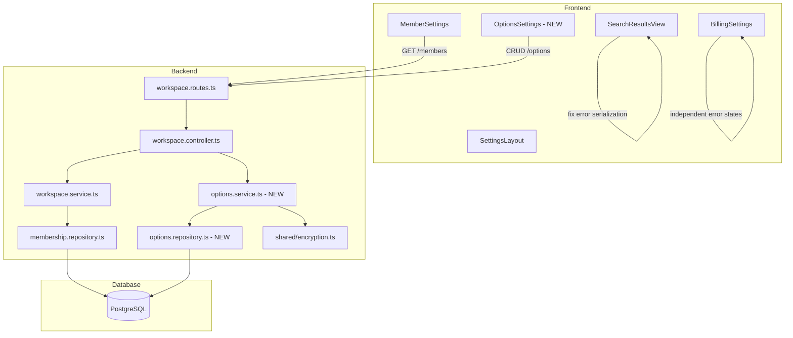

# Design Document: Menu Fixes & Options Configuration

## Overview

This feature addresses two categories of work:

1. **Bug fixes** for three broken frontend pages (Search, Members, Billing) caused by incorrect error serialization, a missing backend endpoint, and unhandled API failures.
2. **New Options configuration page** — a Settings tab where workspace admins can configure all third-party service connections (enrichment providers, scraper, CRM, billing, infrastructure) from a single location, with encrypted storage and connection testing.

### Root Cause Analysis

| Page | Root Cause | Fix |
|------|-----------|-----|
| Search | `search.store.ts` catch block calls `String(err)` on a parsed `ApiError` object, producing `[object Object]` | Extract `err.message` from the `ApiError` object; add network error detection |
| Members | Frontend calls `GET /workspaces/:id/members` but no such route exists — `membership.repository.findAllForWorkspace()` is implemented but never wired through controller/routes | Add `listMembers` to controller, service, and routes |
| Billing | `BillingSettings.tsx` renders `billing.creditBalance` etc. without null guards; when `getBilling()` rejects, `billing` stays `null` and the component crashes the ErrorBoundary | Add independent loading/error states per section; guard all data access |

### Design Decisions

- **Search error fix**: The Axios response interceptor already calls `parseApiError()` which returns an `ApiError` object with a `message` string. The search store catch block receives this parsed object but calls `String(err)` instead of accessing `err.message`. The fix normalizes error extraction to always produce a string.
- **Members endpoint**: Follows the existing workspace module pattern — add a `listMembers` service function that calls `membershipRepo.findAllForWorkspace()`, a controller handler, and wire the GET route with `requireRole('member')`.
- **Billing resilience**: Split the single `useEffect` into two independent data-fetching calls with separate loading/error state per section. Add null guards before rendering data cards.
- **Options page**: Reuses the existing credential module's encryption pattern (AES-256-GCM with HKDF per-workspace key derivation). Stores service configurations in a new `service_configurations` table. The Options page is a new React component added as a tab in SettingsLayout with its own route.

## Architecture

### System Context



### Change Scope

**Frontend-only changes** (no backend):
- `search.store.ts` — fix error extraction in catch block
- `SearchResultsView.tsx` — add retry button, hide results/pagination on error
- `MemberSettings.tsx` — add loading/error states with retry
- `BillingSettings.tsx` — split into independent sections with per-section error/loading states

**Backend changes**:
- `workspace.routes.ts` — add `GET /:id/members` route
- `workspace.controller.ts` — add `listMembers` handler
- `workspace.service.ts` — add `listMembers` function
- New `options.repository.ts` — CRUD for `service_configurations` table
- New `options.service.ts` — encrypt/decrypt/mask/test logic
- `workspace.schemas.ts` — add schemas for options endpoints
- New migration `023_create_service_configurations.ts`

**New frontend files**:
- `OptionsSettings.tsx` — new settings tab component
- `options.api.ts` — API client for options endpoints
- Route + tab registration in `SettingsLayout.tsx` and `App.tsx`

## Components and Interfaces

### Backend

#### Members List Endpoint

Wires the existing `membershipRepo.findAllForWorkspace()` through the standard layered pattern:

```typescript
// workspace.service.ts — new function
async function listMembers(workspaceId: string): Promise<MemberWithUser[]> {
  // Joins workspace_memberships with users to return userId, email, displayName, role, joinedAt
}

// workspace.controller.ts — new handler
async listMembers(req: Request, res: Response, next: NextFunction): Promise<void>

// workspace.routes.ts — new route
router.get('/:id/members', validate({ params: workspaceParamsSchema }), requireRole('member'), controller.listMembers);
```

The repository already has `findAllForWorkspace()` but it only returns membership fields. The service layer will need a join query or a secondary lookup to include user email and displayName. The simplest approach: add a `findAllWithUsers(workspaceId)` function to the membership repository that joins `workspace_memberships` with `users`.

#### Options CRUD Endpoints

```typescript
// New endpoints on workspace routes:
GET    /api/v1/workspaces/:id/options                    // List all configs (masked)
PUT    /api/v1/workspaces/:id/options/:serviceKey         // Create/update a config
DELETE /api/v1/workspaces/:id/options/:serviceKey         // Remove a config
POST   /api/v1/workspaces/:id/options/:serviceKey/test    // Test connection
```

**Options Service Interface:**

```typescript
interface ServiceConfiguration {
  id: string;
  workspaceId: string;
  serviceKey: string;       // e.g. 'apollo', 'stripe', 'scraper', 'opensearch'
  serviceGroup: string;     // e.g. 'enrichment', 'billing', 'scraping', 'crm', 'infrastructure'
  configValues: Record<string, string>;  // encrypted at rest
  status: 'configured' | 'not_configured' | 'error';
  lastTestedAt: Date | null;
  createdAt: Date;
  updatedAt: Date;
}

// options.service.ts
async function listConfigurations(workspaceId: string, masterKey: string): Promise<MaskedServiceConfiguration[]>;
async function upsertConfiguration(workspaceId: string, serviceKey: string, values: Record<string, string>, userId: string, masterKey: string): Promise<void>;
async function deleteConfiguration(workspaceId: string, serviceKey: string): Promise<void>;
async function testConnection(workspaceId: string, serviceKey: string, masterKey: string): Promise<ConnectionTestResult>;
```

**Masking**: Sensitive fields (any field containing `key`, `secret`, `token`, `password` in its name) are masked to `****` + last 4 chars on GET. Non-sensitive fields (URLs, namespaces) are returned in full.

**Connection Testing**: Each service key maps to a lightweight health check:
- `apollo` / `clearbit` / `hunter` — HTTP GET to provider status endpoint with API key header
- `stripe` — Stripe API `GET /v1/balance` with secret key
- `scraper` — HTTP GET to scraper `/health` endpoint with X-Service-Key header
- `opensearch` — HTTP GET to cluster health endpoint
- `redis` — Redis PING command
- `temporal` — gRPC health check to Temporal frontend
- `salesforce` / `hubspot` — OAuth token validation endpoint

#### Zod Schemas for Options

```typescript
// New schemas in workspace.schemas.ts
const serviceKeyEnum = z.enum([
  'apollo', 'clearbit', 'hunter',
  'scraper',
  'salesforce', 'hubspot',
  'stripe',
  'temporal', 'opensearch', 'redis', 'clickhouse',
]);

const upsertOptionsSchema = z.object({
  values: z.record(z.string().min(1), z.string()).refine(
    (obj) => Object.keys(obj).length > 0,
    { message: 'At least one configuration value is required' }
  ),
});

const optionsParamsSchema = z.object({
  id: z.string().uuid(),
  serviceKey: serviceKeyEnum,
});
```

### Frontend

#### Search Page Fix

**search.store.ts** — The catch block currently does:
```typescript
catch (err) {
  set({ error: err instanceof Error ? err.message : String(err), loading: false });
}
```

The Axios interceptor rejects with a parsed `ApiError` object `{ status, message, fieldErrors }` which is not an `Error` instance. `String(err)` on this object produces `[object Object]`. Fix:

```typescript
catch (err) {
  const message = typeof err === 'object' && err !== null && 'message' in err
    ? String((err as { message: unknown }).message)
    : err instanceof Error ? err.message : 'An unexpected error occurred';
  set({ error: message, loading: false });
}
```

**SearchResultsView.tsx** — Add:
- Retry button in error state that calls `search.executeSearch()`
- Hide results list and pagination when `search.error` is set
- Network error detection: check for `status === 0` in the ApiError to show connectivity message

#### Members Page Enhancement

**MemberSettings.tsx** — Add:
- `isLoadingMembers` state tracking
- Inline error state with retry button (not just toast)
- Empty state message: "No other members yet. Invite someone to get started."

#### Billing Page Fix

**BillingSettings.tsx** — Refactor to:
- Separate `billingLoading` / `billingError` and `txLoading` / `txError` states
- Each section renders independently with its own loading placeholder and error+retry UI
- Null guards on all `billing.*` property access
- Try/catch around rendering logic to prevent ErrorBoundary crashes

#### Options Settings Page

**OptionsSettings.tsx** — New component:
- Organized into collapsible groups: Enrichment Providers, Scraping Service, CRM Integrations, Billing, Infrastructure
- Each service shows: name, status indicator (green/gray/red dot), config form, "Test Connection" button
- Form fields are defined per service key (e.g., Apollo needs `apiKey`; Stripe needs `secretKey` + `webhookSecret`)
- Client-side Zod validation before submit
- "Test Connection" button with loading spinner, success (green check + response time), failure (red X + message)
- Role-gated: only visible to admin+ via `useRole().can('manage_credentials')`

**SettingsLayout.tsx** — Add `{ to: 'options', label: 'Options' }` after Credentials tab.

**App.tsx** — Add lazy-loaded route for `settings/options` → `OptionsSettings`.

## Data Models

### New Table: `service_configurations`

```sql
CREATE TABLE service_configurations (
  id UUID PRIMARY KEY DEFAULT gen_random_uuid(),
  workspace_id UUID NOT NULL REFERENCES workspaces(id) ON DELETE CASCADE,
  service_key VARCHAR(50) NOT NULL,
  service_group VARCHAR(50) NOT NULL,
  encrypted_values TEXT NOT NULL,        -- AES-256-GCM encrypted JSON blob
  iv VARCHAR(24) NOT NULL,               -- base64 IV
  auth_tag VARCHAR(24) NOT NULL,         -- base64 auth tag
  status VARCHAR(20) NOT NULL DEFAULT 'configured',
  last_tested_at TIMESTAMPTZ,
  created_by UUID NOT NULL REFERENCES users(id),
  created_at TIMESTAMPTZ NOT NULL DEFAULT NOW(),
  updated_at TIMESTAMPTZ NOT NULL DEFAULT NOW(),
  UNIQUE(workspace_id, service_key)
);

CREATE INDEX idx_service_configurations_workspace ON service_configurations(workspace_id);
```

**Encryption approach**: The entire `configValues` object is serialized to JSON, then encrypted as a single blob using the per-workspace key derived via `deriveWorkspaceKey(masterKey, workspaceId)`. This matches the credential module pattern but stores all key-value pairs for a service in one encrypted field rather than separate encrypted columns.

### Members List Query (Join)

New repository function `findAllWithUsers`:

```sql
SELECT
  wm.user_id,
  u.email,
  u.display_name,
  wm.role,
  wm.accepted_at AS joined_at
FROM workspace_memberships wm
JOIN users u ON u.id = wm.user_id
WHERE wm.workspace_id = $1
ORDER BY wm.invited_at ASC;
```

### Service Configuration Groups

| Group | Service Keys | Config Fields |
|-------|-------------|---------------|
| Enrichment Providers | `apollo`, `clearbit`, `hunter` | `apiKey` |
| Scraping Service | `scraper` | `serviceUrl`, `serviceKey` |
| CRM Integrations | `salesforce`, `hubspot` | OAuth status (read-only), `clientId`, `clientSecret` |
| Billing | `stripe` | `secretKey`, `webhookSecret` |
| Infrastructure | `temporal`, `opensearch`, `redis`, `clickhouse` | Service-specific connection params (URL, namespace, etc.) |

### Frontend Types

```typescript
// New types in api.types.ts
interface ServiceConfiguration {
  serviceKey: string;
  serviceGroup: string;
  maskedValues: Record<string, string>;  // sensitive fields masked
  status: 'configured' | 'not_configured' | 'error';
  lastTestedAt: string | null;
  updatedAt: string;
}

interface ConnectionTestResult {
  success: boolean;
  responseTimeMs: number;
  error?: string;
}
```


## Correctness Properties

*A property is a characteristic or behavior that should hold true across all valid executions of a system — essentially, a formal statement about what the system should do. Properties serve as the bridge between human-readable specifications and machine-verifiable correctness guarantees.*

### Property 1: Error extraction always produces a readable string

*For any* value thrown by the Axios interceptor (ApiError objects with `{ status, message }`, Error instances, plain strings, numbers, null, undefined, or arbitrary objects), the error extraction logic in the search store should always produce a `typeof === 'string'` result that is non-empty and does not equal `'[object Object]'`.

**Validates: Requirements 1.1, 2.3**

### Property 2: Members endpoint returns complete member data

*For any* workspace with N memberships in the database, calling `listMembers(workspaceId)` should return exactly N member objects, and each object should contain non-null `userId`, `email`, `displayName`, `role`, and `joinedAt` fields.

**Validates: Requirements 3.1, 3.2**

### Property 3: Billing page resilience to malformed data

*For any* value returned by the billing API (including null, undefined, objects missing expected fields, or objects with wrong types), the BillingSettings component should render without throwing an unhandled exception — it should display an error state instead of crashing the ErrorBoundary.

**Validates: Requirements 5.1, 5.4**

### Property 4: Billing sections render independently

*For any* combination of billing info API success/failure and transactions API success/failure (4 combinations), the BillingSettings component should render the successful section's data and show an error+retry UI for the failed section, never blocking one section on the other.

**Validates: Requirements 5.2, 6.1**

### Property 5: Options Zod validation rejects invalid configurations

*For any* service key and configuration values object that violates the schema constraints (empty values, missing required fields, invalid service keys), the Zod schema should reject the input and the form should not submit an API call.

**Validates: Requirements 7.4**

### Property 6: Configuration encryption round trip

*For any* valid configuration values object (a `Record<string, string>` with 1+ entries), encrypting via `encrypt(JSON.stringify(values), workspaceKey)` and then decrypting via `decrypt(ciphertext, iv, authTag, workspaceKey)` followed by `JSON.parse()` should produce an object deeply equal to the original.

**Validates: Requirements 8.2**

### Property 7: Sensitive field masking

*For any* string value of length > 4, the `maskValue()` function should return a string that starts with `****` and ends with the last 4 characters of the original, and the masked result should never equal the original value. *For any* string of length ≤ 4, the masked value should equal the original.

**Validates: Requirements 8.3**

### Property 8: Audit log excludes configuration values

*For any* service configuration upsert operation with arbitrary config values, the audit log entry produced should contain `userId`, `workspaceId`, and `serviceKey` fields, and the serialized log entry string should not contain any of the original config values.

**Validates: Requirements 8.6**

### Property 9: Enrichment provider credential sync

*For any* enrichment provider service key (`apollo`, `clearbit`, `hunter`) and any API key value, saving the configuration via the options service should result in the credential being retrievable via the existing credential service's `list()` function for the same workspace.

**Validates: Requirements 10.6**

## Error Handling

### Backend

| Scenario | Error Type | HTTP Status | User Message |
|----------|-----------|-------------|--------------|
| Invalid workspace ID format | `ValidationError` | 400 | Zod validation message |
| Invalid service key | `ValidationError` | 400 | "Invalid service key" |
| Workspace not found | `NotFoundError` | 404 | "Workspace not found" |
| Service config not found (DELETE/test) | `NotFoundError` | 404 | "Service configuration not found" |
| Insufficient role for members list | `AuthorizationError` | 403 | "Insufficient permissions" |
| Insufficient role for options | `AuthorizationError` | 403 | "Insufficient permissions" |
| Connection test timeout | Caught internally | 200 | `{ success: false, error: "Connection timed out after 10s" }` |
| Connection test failure | Caught internally | 200 | `{ success: false, error: "<provider-specific message>" }` |
| Encryption failure | `AppError` | 500 | "Failed to save configuration" |
| Database error | `AppError` | 500 | "Internal server error" |

Connection test endpoints always return 200 with a `{ success, responseTimeMs, error? }` body — the test result itself is not an HTTP error.

### Frontend

| Component | Error Scenario | Behavior |
|-----------|---------------|----------|
| SearchResultsView | API returns error | Show error message string + retry button; hide results and pagination |
| SearchResultsView | Network error (status 0) | Show "Unable to connect to the search service. Check your connection and try again." |
| MemberSettings | GET members fails | Show inline error with retry button; keep invite form visible |
| MemberSettings | Empty members array | Show "No other members yet. Invite someone to get started." |
| BillingSettings | getBilling fails | Show "Unable to load billing information" + retry in billing section; transactions section loads independently |
| BillingSettings | getTransactions fails | Show "Unable to load transaction history" + retry in transactions section; billing info section renders normally |
| BillingSettings | Unexpected data shape | Catch rendering error, show recoverable error state |
| OptionsSettings | Save validation fails | Show Zod validation errors inline on form fields |
| OptionsSettings | Save API fails | Show toast error; form remains editable |
| OptionsSettings | Test connection fails | Show red indicator with failure reason next to the service |
| OptionsSettings | Test connection timeout | Show "Connection timed out" message |

## Testing Strategy

### Property-Based Tests

All property tests use **fast-check** (already in the project) with minimum **100 iterations** per property.

| Property | Test File | Description |
|----------|-----------|-------------|
| P1: Error extraction | `packages/frontend/tests/property/error-extraction.test.ts` | Generate random error-like values (objects, strings, nulls, Error instances, ApiError-shaped objects); verify extraction always returns a non-empty string ≠ `[object Object]` |
| P2: Members endpoint data | `packages/backend/tests/property/members-list.test.ts` | Generate random membership+user records; verify service returns correct count with all required fields |
| P3: Billing resilience | `packages/frontend/tests/property/billing-resilience.test.ts` | Generate random malformed billing data shapes; verify component renders without throwing |
| P4: Billing independence | `packages/frontend/tests/property/billing-independence.test.ts` | Generate all 4 combinations of success/failure for billing+transactions; verify independent rendering |
| P5: Options validation | `packages/frontend/tests/property/options-validation.test.ts` | Generate random invalid config objects; verify Zod schema rejects them |
| P6: Encryption round trip | `packages/backend/tests/property/options-encryption.test.ts` | Generate random `Record<string, string>` objects; verify encrypt→decrypt round trip produces equal objects |
| P7: Sensitive masking | `packages/backend/tests/property/options-masking.test.ts` | Generate random strings; verify masking rules (length > 4 → `****` + last 4; length ≤ 4 → unchanged) |
| P8: Audit log exclusion | `packages/backend/tests/property/options-audit.test.ts` | Generate random config values; verify audit log entry does not contain any value strings |
| P9: Credential sync | `packages/backend/tests/property/options-credential-sync.test.ts` | Generate random enrichment provider configs; verify credential appears in credential service after options upsert |

**Tag format**: Each test is tagged with a comment:
```
// Feature: menu-fixes-options-config, Property N: <property text>
```

### Unit Tests

Unit tests focus on specific examples, edge cases, and integration points:

**Backend:**
- `workspace.routes.test.ts` — GET `/workspaces/:id/members` returns 200 with member array; returns 403 for unauthorized roles
- `workspace.service.test.ts` — `listMembers` returns owner when workspace has no other members (edge case from 3.4)
- `options.service.test.ts` — upsert creates new config; upsert updates existing config; delete removes config; test connection returns success/failure
- `options.repository.test.ts` — CRUD operations against test database

**Frontend:**
- `SearchResultsView.test.tsx` — renders retry button on error; hides results on error; shows network error message
- `MemberSettings.test.tsx` — shows loading indicator; shows inline error with retry; shows empty state message
- `BillingSettings.test.tsx` — shows loading placeholders; shows per-section error messages; renders billing info when transactions fail and vice versa
- `OptionsSettings.test.tsx` — renders all 5 service groups; shows status indicators; test connection button states; role gating

### Integration Tests

- `tests/integration/members-endpoint.test.ts` — Full HTTP round trip: create workspace → add members → GET members → verify response shape
- `tests/integration/options-crud.test.ts` — Full HTTP round trip: PUT config → GET configs (verify masked) → DELETE config → verify gone
- `tests/integration/options-test-connection.test.ts` — POST test endpoint with mock service targets
