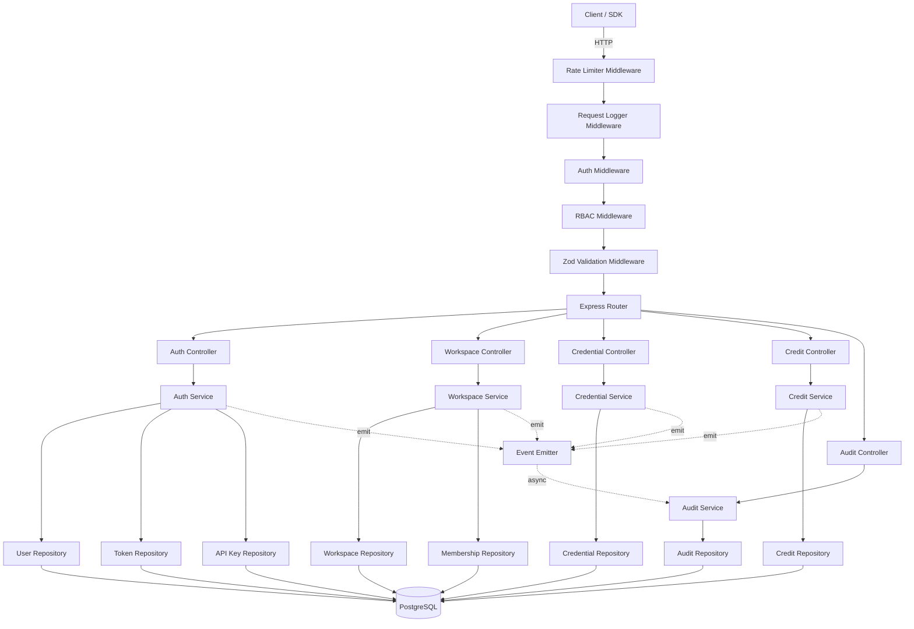

# Design Document: Module 1 — Foundation (OLTP Backend & User State)

## Overview

This module establishes the foundational backend for Morket, a GTM data engine. It provides a stateless Express.js API gateway with a layered architecture (routes → controllers → services → repositories), PostgreSQL for transactional storage, JWT-based authentication with refresh token rotation, RBAC, multi-tenant workspace management, encrypted credential storage, a consumption-based credit system, and immutable audit logging.

The system is designed to be horizontally scalable (no server-side sessions, stateless JWT auth) and Aurora-compatible. All future modules (enrichment orchestration, scraping, spreadsheet UI) will depend on this foundation.

### Key Design Decisions

1. **Layered architecture** — Clean separation of concerns enables independent testing and future refactoring. Routes handle HTTP concerns, controllers orchestrate, services contain business logic, repositories handle data access.
2. **JWT with refresh token rotation** — Stateless access tokens for scalability, database-backed refresh tokens for revocation capability. Rotation on each refresh prevents token reuse.
3. **PostgreSQL row-level locking for credits** — `SELECT ... FOR UPDATE` ensures correct concurrent credit operations without external distributed locks.
4. **AES-256-GCM for credential encryption** — Authenticated encryption prevents both tampering and unauthorized decryption of stored third-party API keys.
5. **Async audit logging** — Audit entries are emitted via an in-process event emitter and written asynchronously to avoid adding latency to API responses.

## Architecture



### Middleware Pipeline Order

1. **Rate Limiter** — Token bucket per IP, configurable window/max.
2. **Request Logger** — Logs method, path, status, response time.
3. **Auth Middleware** — Extracts and verifies JWT or API key. Sets `req.user`. Skips for public routes.
4. **RBAC Middleware** — Checks `req.user.role` against route's required minimum role within the workspace context.
5. **Zod Validation Middleware** — Validates `req.body`, `req.params`, `req.query` against route-specific Zod schemas.
6. **Error Handler** — Global catch-all that formats errors into JSON_Envelope.

## Components and Interfaces

### Directory Structure

```
packages/backend/
├── src/
│   ├── config/
│   │   └── env.ts                 # Zod-validated environment config
│   ├── middleware/
│   │   ├── auth.ts                # JWT/API key verification
│   │   ├── rbac.ts                # Role-based access control
│   │   ├── validate.ts            # Zod schema validation
│   │   ├── rateLimiter.ts         # Rate limiting
│   │   ├── requestLogger.ts       # Request logging
│   │   └── errorHandler.ts        # Global error handler
│   ├── modules/
│   │   ├── auth/
│   │   │   ├── auth.routes.ts
│   │   │   ├── auth.controller.ts
│   │   │   ├── auth.service.ts
│   │   │   ├── auth.schemas.ts    # Zod schemas
│   │   │   ├── user.repository.ts
│   │   │   ├── token.repository.ts
│   │   │   └── apiKey.repository.ts
│   │   ├── workspace/
│   │   │   ├── workspace.routes.ts
│   │   │   ├── workspace.controller.ts
│   │   │   ├── workspace.service.ts
│   │   │   ├── workspace.schemas.ts
│   │   │   ├── workspace.repository.ts
│   │   │   └── membership.repository.ts
│   │   ├── credential/
│   │   │   ├── credential.routes.ts
│   │   │   ├── credential.controller.ts
│   │   │   ├── credential.service.ts
│   │   │   ├── credential.schemas.ts
│   │   │   └── credential.repository.ts
│   │   ├── credit/
│   │   │   ├── credit.routes.ts
│   │   │   ├── credit.controller.ts
│   │   │   ├── credit.service.ts
│   │   │   ├── credit.schemas.ts
│   │   │   └── credit.repository.ts
│   │   └── audit/
│   │       ├── audit.routes.ts
│   │       ├── audit.controller.ts
│   │       ├── audit.service.ts
│   │       ├── audit.schemas.ts
│   │       └── audit.repository.ts
│   ├── shared/
│   │   ├── types.ts               # Shared TypeScript types
│   │   ├── errors.ts              # Custom error classes
│   │   ├── envelope.ts            # JSON envelope helper
│   │   ├── encryption.ts          # AES-256-GCM utilities
│   │   ├── eventBus.ts            # In-process event emitter
│   │   └── db.ts                  # PostgreSQL connection pool
│   ├── app.ts                     # Express app setup
│   └── server.ts                  # Entry point
├── migrations/
│   └── *.ts                       # Sequential migration files
├── tests/
│   ├── unit/
│   └── property/
├── package.json
├── tsconfig.json
└── .env.example
```

### Core Interfaces

```typescript
// JSON Envelope
interface ApiResponse<T> {
  success: boolean;
  data: T | null;
  error: string | null;
}

// User
interface User {
  id: string;           // UUID
  email: string;
  passwordHash: string;
  createdAt: Date;
  updatedAt: Date;
}

// Workspace
interface Workspace {
  id: string;           // UUID
  name: string;
  createdAt: Date;
  updatedAt: Date;
}

// Workspace Membership
type WorkspaceRole = 'owner' | 'admin' | 'member' | 'viewer';

interface WorkspaceMembership {
  id: string;
  userId: string;
  workspaceId: string;
  role: WorkspaceRole;
  createdAt: Date;
}

// Auth context attached to requests
interface AuthContext {
  userId: string;
  workspaceId?: string;
  role?: WorkspaceRole;
  authMethod: 'jwt' | 'api_key';
}

// Refresh Token
interface RefreshToken {
  id: string;
  userId: string;
  tokenHash: string;
  expiresAt: Date;
  revokedAt: Date | null;
  createdAt: Date;
}

// API Key
interface ApiKey {
  id: string;
  userId: string;
  workspaceId: string;
  keyHash: string;
  keyPrefix: string;    // First 8 chars for identification
  name: string;
  revokedAt: Date | null;
  createdAt: Date;
}

// API Credential (third-party keys)
interface ApiCredential {
  id: string;
  workspaceId: string;
  providerName: string;
  encryptedValue: string;  // AES-256-GCM encrypted
  iv: string;              // Initialization vector
  authTag: string;         // GCM auth tag
  createdAt: Date;
  updatedAt: Date;
}

// Credit Balance
interface CreditBalance {
  workspaceId: string;
  balance: number;        // Integer, no fractional credits
  lowBalanceThreshold: number;
  updatedAt: Date;
}

// Credit Transaction
type CreditTransactionType = 'deposit' | 'withdrawal' | 'adjustment';

interface CreditTransaction {
  id: string;
  workspaceId: string;
  type: CreditTransactionType;
  amount: number;         // Always positive; type indicates direction
  balanceAfter: number;
  description: string;
  createdAt: Date;
}

// Audit Log Entry
interface AuditLogEntry {
  id: string;
  workspaceId: string;
  actorId: string;
  action: string;
  targetResource: string;
  targetId: string;
  metadata: Record<string, unknown>;
  createdAt: Date;
}

// Role hierarchy (numeric for comparison)
const ROLE_HIERARCHY: Record<WorkspaceRole, number> = {
  viewer: 0,
  member: 1,
  admin: 2,
  owner: 3,
};
```

### Key Service Interfaces

```typescript
// Auth Service
interface IAuthService {
  register(email: string, password: string): Promise<User>;
  login(email: string, password: string): Promise<{ accessToken: string; refreshToken: string }>;
  refreshTokens(refreshToken: string): Promise<{ accessToken: string; refreshToken: string }>;
  requestPasswordReset(email: string): Promise<void>;
  resetPassword(token: string, newPassword: string): Promise<void>;
  createApiKey(userId: string, workspaceId: string, name: string): Promise<{ key: string; apiKey: ApiKey }>;
  revokeApiKey(apiKeyId: string): Promise<void>;
  verifyAccessToken(token: string): Promise<AuthContext>;
  verifyApiKey(key: string): Promise<AuthContext>;
}

// Workspace Service
interface IWorkspaceService {
  create(name: string, ownerId: string): Promise<Workspace>;
  getById(workspaceId: string): Promise<Workspace>;
  listForUser(userId: string): Promise<Workspace[]>;
  update(workspaceId: string, data: Partial<Workspace>): Promise<Workspace>;
  delete(workspaceId: string): Promise<void>;
  inviteMember(workspaceId: string, email: string, role: WorkspaceRole): Promise<void>;
  acceptInvitation(invitationId: string, userId: string): Promise<WorkspaceMembership>;
  updateMemberRole(workspaceId: string, userId: string, newRole: WorkspaceRole): Promise<void>;
  removeMember(workspaceId: string, userId: string): Promise<void>;
}

// Credit Service
interface ICreditService {
  initializeBalance(workspaceId: string): Promise<CreditBalance>;
  deposit(workspaceId: string, amount: number, description: string): Promise<CreditTransaction>;
  withdraw(workspaceId: string, amount: number, description: string): Promise<CreditTransaction>;
  getBalance(workspaceId: string): Promise<CreditBalance>;
  getTransactions(workspaceId: string, options: PaginationOptions): Promise<PaginatedResult<CreditTransaction>>;
}

// Credential Service
interface ICredentialService {
  store(workspaceId: string, providerName: string, value: string): Promise<ApiCredential>;
  retrieve(credentialId: string): Promise<string>;  // Internal only — returns decrypted value
  list(workspaceId: string): Promise<Omit<ApiCredential, 'encryptedValue' | 'iv' | 'authTag'>[]>;
  delete(credentialId: string): Promise<void>;
}

// Audit Service
interface IAuditService {
  log(entry: Omit<AuditLogEntry, 'id' | 'createdAt'>): Promise<void>;
  query(workspaceId: string, options: AuditQueryOptions): Promise<PaginatedResult<AuditLogEntry>>;
}

// Shared pagination types
interface PaginationOptions {
  page: number;
  limit: number;
}

interface PaginatedResult<T> {
  items: T[];
  total: number;
  page: number;
  limit: number;
  totalPages: number;
}

interface AuditQueryOptions extends PaginationOptions {
  startDate?: Date;
  endDate?: Date;
  action?: string;
}
```

## Data Models

### Entity-Relationship Diagram

```mermaid
erDiagram
    users {
        uuid id PK
        varchar email UK
        varchar password_hash
        timestamp created_at
        timestamp updated_at
    }

    workspaces {
        uuid id PK
        varchar name
        timestamp created_at
        timestamp updated_at
    }

    workspace_memberships {
        uuid id PK
        uuid user_id FK
        uuid workspace_id FK
        varchar role
        timestamp created_at
    }

    workspace_invitations {
        uuid id PK
        uuid workspace_id FK
        varchar email
        varchar role
        varchar status
        timestamp expires_at
        timestamp created_at
    }

    refresh_tokens {
        uuid id PK
        uuid user_id FK
        varchar token_hash
        timestamp expires_at
        timestamp revoked_at
        timestamp created_at
    }

    api_keys {
        uuid id PK
        uuid user_id FK
        uuid workspace_id FK
        varchar key_hash
        varchar key_prefix
        varchar name
        timestamp revoked_at
        timestamp created_at
    }

    api_credentials {
        uuid id PK
        uuid workspace_id FK
        varchar provider_name
        text encrypted_value
        varchar iv
        varchar auth_tag
        timestamp created_at
        timestamp updated_at
    }

    credit_balances {
        uuid workspace_id PK,FK
        integer balance
        integer low_balance_threshold
        timestamp updated_at
    }

    credit_transactions {
        uuid id PK
        uuid workspace_id FK
        varchar type
        integer amount
        integer balance_after
        varchar description
        timestamp created_at
    }

    audit_logs {
        uuid id PK
        uuid workspace_id FK
        uuid actor_id FK
        varchar action
        varchar target_resource
        uuid target_id
        jsonb metadata
        timestamp created_at
    }

    users ||--o{ workspace_memberships : "has"
    workspaces ||--o{ workspace_memberships : "has"
    workspaces ||--o{ workspace_invitations : "has"
    users ||--o{ refresh_tokens : "has"
    users ||--o{ api_keys : "has"
    workspaces ||--o{ api_keys : "has"
    workspaces ||--o{ api_credentials : "has"
    workspaces ||--|| credit_balances : "has"
    workspaces ||--o{ credit_transactions : "has"
    workspaces ||--o{ audit_logs : "has"
    users ||--o{ audit_logs : "actor"
```



### PostgreSQL Schema Notes

- All primary keys are UUIDs generated via `gen_random_uuid()`.
- `workspace_memberships` has a unique constraint on `(user_id, workspace_id)`.
- `credit_balances.balance` uses `CHECK (balance >= 0)` to enforce non-negative balances at the database level.
- `credit_transactions` and `audit_logs` tables have no UPDATE or DELETE operations — enforced at the application layer and optionally via database triggers/policies.
- `api_credentials.encrypted_value` stores the AES-256-GCM ciphertext as base64.
- Indexes: `workspace_memberships(user_id)`, `credit_transactions(workspace_id, created_at DESC)`, `audit_logs(workspace_id, created_at DESC)`, `api_keys(key_hash)`, `refresh_tokens(token_hash)`.

### Credit Operations — Concurrency Strategy

Credit withdrawals use `SELECT ... FOR UPDATE` on the `credit_balances` row within a transaction:

```sql
BEGIN;
SELECT balance FROM credit_balances WHERE workspace_id = $1 FOR UPDATE;
-- Application checks: balance >= withdrawal_amount
UPDATE credit_balances SET balance = balance - $2, updated_at = NOW() WHERE workspace_id = $1;
INSERT INTO credit_transactions (id, workspace_id, type, amount, balance_after, description, created_at)
  VALUES ($3, $1, 'withdrawal', $2, $4, $5, NOW());
COMMIT;
```

This ensures serialized access to the balance row, preventing double-spending under concurrent requests.
