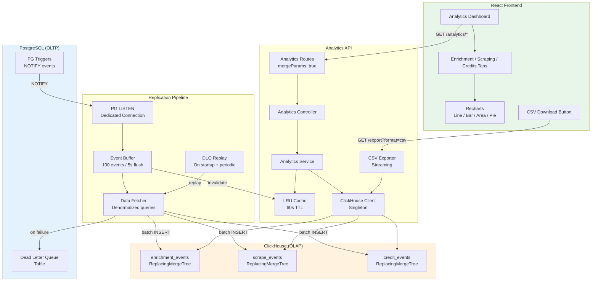
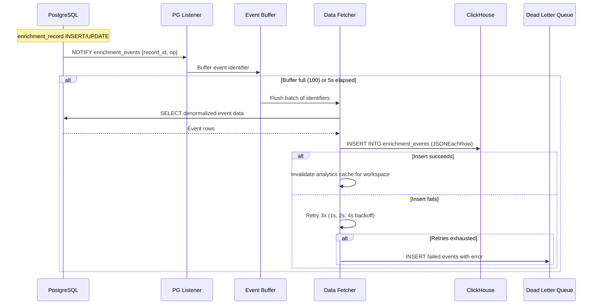
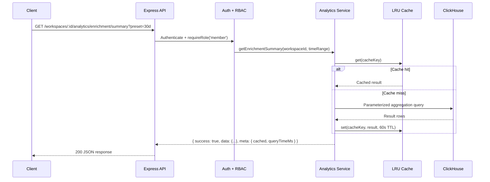
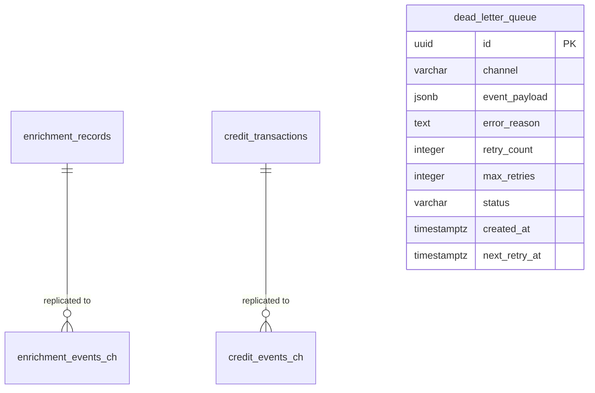

# Design Document: Module 5 — OLAP Analytics Layer

## Overview

This module introduces ClickHouse as a dedicated OLAP analytics store alongside the existing PostgreSQL OLTP database. Data flows from PostgreSQL to ClickHouse via an event-driven replication pipeline using PG NOTIFY, and analytics queries are served exclusively from ClickHouse through new REST API endpoints. The frontend gains an analytics dashboard with interactive Recharts visualizations and CSV export.

The module strictly separates OLTP and OLAP concerns: PostgreSQL remains the system of record for all transactional data, while ClickHouse serves denormalized, read-optimized event tables for aggregation queries. The replication pipeline bridges the two with near-real-time event streaming, a dead letter queue for resilience, and idempotent inserts via ReplacingMergeTree deduplication.

### Key Design Decisions

1. **ReplacingMergeTree for all event tables** — Provides automatic deduplication on `event_id`, making the replication pipeline idempotent. Re-inserting the same event (e.g., during DLQ replay or backfill) produces no duplicates after ClickHouse merges.
2. **PG NOTIFY with identifier-only payloads** — Triggers emit only UUIDs and operation types (staying under the 8KB NOTIFY limit). The replication service fetches full denormalized data from PostgreSQL using these identifiers, keeping triggers lightweight.
3. **Dead letter queue in PostgreSQL** — Failed ClickHouse inserts are persisted to a PostgreSQL table rather than lost. This provides durability, inspectability, and replay capability without introducing an external message broker.
4. **In-memory LRU cache with workspace-scoped invalidation** — Analytics query results are cached for 60s with cache keys scoped to workspace + query type + parameters. The replication pipeline invalidates cache entries for a workspace when new events are flushed, ensuring freshness.
5. **Streaming CSV export** — CSV exports use ClickHouse's streaming query capabilities with chunked transfer encoding, avoiding buffering large result sets in Node.js memory. Supports up to 1M rows.
6. **Separate ClickHouse migration directory** — ClickHouse DDL is managed as numbered SQL files under `packages/backend/migrations/clickhouse/`, distinct from PostgreSQL migrations, with a `_ch_migrations` tracking table in ClickHouse itself.
7. **Backend-driven CSV export over frontend Web Worker** — Since ClickHouse can stream large result sets efficiently, CSV generation happens server-side. The frontend triggers a download via the export endpoint rather than processing data client-side.
8. **Analytics module follows existing backend patterns** — Routes → Controller → Service → Repository layering, factory functions, `mergeParams: true`, Zod validation, `{ success, data, error, meta }` envelope.

## Architecture



### Replication Flow



### Analytics Query Flow



## Components and Interfaces

### Directory Structure

```
packages/backend/
├── migrations/
│   ├── ... (001–011 existing PG migrations)
│   ├── 012_create_dead_letter_queue.ts          # DLQ table in PostgreSQL
│   ├── 013_create_replication_triggers.ts       # PG NOTIFY triggers
│   └── clickhouse/
│       ├── 001_enrichment_events.sql            # enrichment_events table
│       ├── 002_scrape_events.sql                # scrape_events table
│       ├── 003_credit_events.sql                # credit_events table
│       └── runner.ts                            # ClickHouse migration runner
├── src/
│   ├── clickhouse/
│   │   └── client.ts                            # ClickHouse client singleton
│   ├── modules/
│   │   ├── analytics/
│   │   │   ├── analytics.routes.ts              # Express router factory
│   │   │   ├── analytics.controller.ts          # HTTP handlers
│   │   │   ├── analytics.service.ts             # Query logic + cache
│   │   │   ├── analytics.schemas.ts             # Zod schemas for query params
│   │   │   ├── analytics.cache.ts               # In-memory LRU cache
│   │   │   └── csv-exporter.ts                  # Streaming CSV generation
│   │   └── replication/
│   │       ├── replication.service.ts            # PG LISTEN + buffer + flush
│   │       ├── replication.queries.ts            # Denormalized PG SELECT queries
│   │       ├── dlq.repository.ts                # Dead letter queue CRUD
│   │       └── dlq.routes.ts                    # Admin DLQ endpoints
```

```
packages/frontend/src/
├── api/
│   └── analytics.api.ts                         # Typed API client for analytics
├── types/
│   └── analytics.types.ts                       # TypeScript interfaces
├── stores/
│   └── analytics.store.ts                       # Zustand store
├── hooks/
│   └── useAnalytics.ts                          # Data fetching + auto-refresh
├── components/
│   └── analytics/
│       ├── AnalyticsDashboard.tsx                # Main page with tabs
│       ├── TimeRangeFilter.tsx                   # Preset + custom date picker
│       ├── SummaryCards.tsx                       # Metric summary cards
│       ├── EnrichmentTab.tsx                     # Enrichment charts + tables
│       ├── ScrapingTab.tsx                       # Scraping charts + tables
│       └── CreditsTab.tsx                        # Credits charts + tables
```

### Core TypeScript Interfaces

```typescript
// === ClickHouse Client (src/clickhouse/client.ts) ===

import { createClient, ClickHouseClient } from '@clickhouse/client';

interface ClickHouseConfig {
  url: string;           // CLICKHOUSE_URL, default 'http://localhost:8123'
  database: string;      // CLICKHOUSE_DATABASE, default 'morket'
  username: string;      // CLICKHOUSE_USER, default 'default'
  password: string;      // CLICKHOUSE_PASSWORD
  maxOpenConnections: number;  // default 10
  requestTimeout: number;      // default 30_000ms
  connectTimeout: number;      // default 5_000ms
}

// Singleton pattern matching getPool() for PostgreSQL
let client: ClickHouseClient | null = null;

function initClickHouse(config: ClickHouseConfig): ClickHouseClient;
function getClickHouse(): ClickHouseClient;  // throws if not initialized
async function closeClickHouse(): Promise<void>;
async function healthCheck(): Promise<boolean>;  // SELECT 1, 5s timeout


// === Analytics Schemas (src/modules/analytics/analytics.schemas.ts) ===

import { z } from 'zod';

const timeRangePresetSchema = z.enum(['24h', '7d', '30d', '90d']);

const customTimeRangeSchema = z.object({
  start: z.string().datetime(),
  end: z.string().datetime(),
}).refine(
  (d) => new Date(d.end).getTime() - new Date(d.start).getTime() <= 365 * 86400000,
  'Time range must not exceed 365 days'
);

const timeRangeQuerySchema = z.union([
  z.object({ preset: timeRangePresetSchema }),
  customTimeRangeSchema,
]).default({ preset: '30d' });

const granularitySchema = z.enum(['hour', 'day', 'week']);

const paginationQuerySchema = z.object({
  page: z.coerce.number().int().positive().default(1),
  limit: z.coerce.number().int().min(1).max(100).default(50),
});

const workspaceParamsSchema = z.object({
  id: z.string().uuid(),
});

const exportQuerySchema = z.object({
  format: z.literal('csv'),
}).merge(timeRangeQuerySchema);


// === Analytics Service Interfaces ===

interface TimeRange {
  start: Date;
  end: Date;
}

type Granularity = 'hour' | 'day' | 'week';

// Enrichment analytics
interface EnrichmentSummary {
  totalAttempts: number;
  successCount: number;
  failureCount: number;
  skippedCount: number;
  successRate: number;          // 0–100 percentage
  totalCredits: number;
  avgDurationMs: number;
}

interface ProviderBreakdown {
  providerSlug: string;
  attempts: number;
  successCount: number;
  failureCount: number;
  successRate: number;
  avgDurationMs: number;
  totalCredits: number;
}

interface FieldBreakdown {
  fieldName: string;
  attempts: number;
  successCount: number;
  failureCount: number;
  successRate: number;
}

interface TimeSeriesPoint {
  timestamp: string;            // ISO 8601
  attempts: number;
  successes: number;
  failures: number;
}

// Scraping analytics
interface ScrapingSummary {
  totalTasks: number;
  completedCount: number;
  failedCount: number;
  successRate: number;
  avgDurationMs: number;
}

interface DomainBreakdown {
  domain: string;
  tasks: number;
  successCount: number;
  failureCount: number;
  successRate: number;
  avgDurationMs: number;
}

interface TargetTypeBreakdown {
  targetType: string;
  tasks: number;
  successCount: number;
  failureCount: number;
  successRate: number;
}

// Credit analytics
interface CreditSummary {
  totalDebited: number;
  totalRefunded: number;
  totalToppedUp: number;
  netConsumption: number;
}

interface CreditProviderBreakdown {
  providerSlug: string;
  creditsConsumed: number;
  percentageOfTotal: number;
}

interface CreditSourceBreakdown {
  source: string;               // 'enrichment' | 'scraping' | 'manual'
  creditsConsumed: number;
  percentageOfTotal: number;
}

interface CreditTimeSeriesPoint {
  timestamp: string;
  debited: number;
  refunded: number;
  toppedUp: number;
}


// === Analytics Cache (src/modules/analytics/analytics.cache.ts) ===

interface CacheEntry<T> {
  data: T;
  expiresAt: number;            // Date.now() + TTL
}

interface AnalyticsCache {
  get<T>(key: string): T | null;
  set<T>(key: string, data: T, ttlMs?: number): void;
  invalidateWorkspace(workspaceId: string): void;  // Removes all keys for workspace
  clear(): void;
  size(): number;
}

// Cache key format: `analytics:${workspaceId}:${queryType}:${hash(params)}`
// Default TTL: 60_000ms
// Max entries: 1000 (LRU eviction)


// === CSV Exporter (src/modules/analytics/csv-exporter.ts) ===

interface CSVExportOptions {
  workspaceId: string;
  table: 'enrichment' | 'scraping' | 'credits';
  timeRange: TimeRange;
}

// Streams ClickHouse query results as CSV rows via Express response
// Sets Content-Type: text/csv, Content-Disposition: attachment
// Uses chunked transfer encoding
// Escapes fields per RFC 4180
async function streamCSVExport(res: express.Response, options: CSVExportOptions): Promise<void>;


// === Replication Service (src/modules/replication/replication.service.ts) ===

interface ReplicationConfig {
  batchSize: number;            // default 100
  flushIntervalMs: number;      // default 5_000
  maxRetries: number;           // default 3
  retryBackoffMs: number[];     // [1000, 2000, 4000]
}

interface ReplicationService {
  start(): Promise<void>;       // Connect PG LISTEN, start flush timer, replay DLQ
  stop(): Promise<void>;        // Graceful shutdown: flush remaining, close PG connection
  getStats(): ReplicationStats;
}

interface ReplicationStats {
  bufferedEvents: number;
  totalFlushed: number;
  totalFailed: number;
  lastFlushAt: Date | null;
  dlqPending: number;
}


// === Dead Letter Queue (src/modules/replication/dlq.repository.ts) ===

type DLQStatus = 'pending' | 'replayed' | 'exhausted';

interface DeadLetterEvent {
  id: string;
  channel: string;              // 'enrichment_events' | 'scrape_events' | 'credit_events'
  eventPayload: Record<string, unknown>;
  errorReason: string;
  retryCount: number;
  maxRetries: number;
  status: DLQStatus;
  createdAt: Date;
  nextRetryAt: Date;
}

async function insertDLQEvent(data: Omit<DeadLetterEvent, 'id' | 'createdAt'>): Promise<DeadLetterEvent>;
async function getPendingEvents(limit: number): Promise<DeadLetterEvent[]>;
async function markReplayed(id: string): Promise<void>;
async function markExhausted(id: string): Promise<void>;
async function incrementRetry(id: string, nextRetryAt: Date): Promise<void>;
async function resetExhausted(): Promise<number>;  // Returns count reset
async function listEvents(options: { status?: DLQStatus; page: number; limit: number }): Promise<PaginatedResult<DeadLetterEvent>>;
```

### Key Service Interfaces

```typescript
// === Analytics Service (src/modules/analytics/analytics.service.ts) ===

interface IAnalyticsService {
  // Enrichment
  getEnrichmentSummary(workspaceId: string, timeRange: TimeRange): Promise<EnrichmentSummary>;
  getEnrichmentByProvider(workspaceId: string, timeRange: TimeRange): Promise<ProviderBreakdown[]>;
  getEnrichmentByField(workspaceId: string, timeRange: TimeRange): Promise<FieldBreakdown[]>;
  getEnrichmentOverTime(workspaceId: string, timeRange: TimeRange, granularity: Granularity): Promise<TimeSeriesPoint[]>;

  // Scraping
  getScrapingSummary(workspaceId: string, timeRange: TimeRange): Promise<ScrapingSummary>;
  getScrapingByDomain(workspaceId: string, timeRange: TimeRange): Promise<DomainBreakdown[]>;
  getScrapingByType(workspaceId: string, timeRange: TimeRange): Promise<TargetTypeBreakdown[]>;
  getScrapingOverTime(workspaceId: string, timeRange: TimeRange, granularity: Granularity): Promise<TimeSeriesPoint[]>;

  // Credits
  getCreditSummary(workspaceId: string, timeRange: TimeRange): Promise<CreditSummary>;
  getCreditByProvider(workspaceId: string, timeRange: TimeRange): Promise<CreditProviderBreakdown[]>;
  getCreditBySource(workspaceId: string, timeRange: TimeRange): Promise<CreditSourceBreakdown[]>;
  getCreditOverTime(workspaceId: string, timeRange: TimeRange, granularity: Granularity): Promise<CreditTimeSeriesPoint[]>;
}

// === Analytics Controller (src/modules/analytics/analytics.controller.ts) ===

// Factory function following existing pattern
function createAnalyticsController(): {
  // Enrichment endpoints
  getEnrichmentSummary: RequestHandler;
  getEnrichmentByProvider: RequestHandler;
  getEnrichmentByField: RequestHandler;
  getEnrichmentOverTime: RequestHandler;
  exportEnrichmentCSV: RequestHandler;

  // Scraping endpoints
  getScrapingSummary: RequestHandler;
  getScrapingByDomain: RequestHandler;
  getScrapingByType: RequestHandler;
  getScrapingOverTime: RequestHandler;
  exportScrapingCSV: RequestHandler;

  // Credits endpoints
  getCreditSummary: RequestHandler;
  getCreditByProvider: RequestHandler;
  getCreditBySource: RequestHandler;
  getCreditOverTime: RequestHandler;
  exportCreditCSV: RequestHandler;
};

// === Analytics Routes (src/modules/analytics/analytics.routes.ts) ===

// Factory function returning router, mounted at /api/v1/workspaces/:id/analytics
function createAnalyticsRoutes(): Router;
// Uses mergeParams: true to access :id from parent workspace router
// All routes require authenticate + requireRole('member')
// Query params validated with Zod schemas
```

### API Endpoints

| Method | Path | Role | Description |
|--------|------|------|-------------|
| GET | `/api/v1/workspaces/:id/analytics/enrichment/summary` | member+ | Enrichment summary metrics |
| GET | `/api/v1/workspaces/:id/analytics/enrichment/by-provider` | member+ | Per-provider breakdown |
| GET | `/api/v1/workspaces/:id/analytics/enrichment/by-field` | member+ | Per-field breakdown |
| GET | `/api/v1/workspaces/:id/analytics/enrichment/over-time` | member+ | Time-series enrichment data |
| GET | `/api/v1/workspaces/:id/analytics/enrichment/export` | member+ | CSV export of enrichment events |
| GET | `/api/v1/workspaces/:id/analytics/scraping/summary` | member+ | Scraping summary metrics |
| GET | `/api/v1/workspaces/:id/analytics/scraping/by-domain` | member+ | Per-domain breakdown |
| GET | `/api/v1/workspaces/:id/analytics/scraping/by-type` | member+ | Per-target-type breakdown |
| GET | `/api/v1/workspaces/:id/analytics/scraping/over-time` | member+ | Time-series scraping data |
| GET | `/api/v1/workspaces/:id/analytics/scraping/export` | member+ | CSV export of scrape events |
| GET | `/api/v1/workspaces/:id/analytics/credits/summary` | member+ | Credit summary metrics |
| GET | `/api/v1/workspaces/:id/analytics/credits/by-provider` | member+ | Per-provider credit breakdown |
| GET | `/api/v1/workspaces/:id/analytics/credits/by-source` | member+ | Per-source credit breakdown |
| GET | `/api/v1/workspaces/:id/analytics/credits/over-time` | member+ | Time-series credit data |
| GET | `/api/v1/workspaces/:id/analytics/credits/export` | member+ | CSV export of credit events |
| GET | `/api/v1/admin/analytics/dead-letter-queue` | admin | List DLQ events (paginated) |
| POST | `/api/v1/admin/analytics/dead-letter-queue/replay` | admin | Reset exhausted DLQ events |

### Component Details

#### ClickHouse Client (`src/clickhouse/client.ts`)

Singleton wrapper around `@clickhouse/client`. Mirrors the `getPool()` / `initPool()` pattern from `src/shared/db.ts`:

- `initClickHouse(config)` — Creates client instance from env vars, stores as module-level singleton
- `getClickHouse()` — Returns singleton, throws if not initialized
- `closeClickHouse()` — Graceful close for shutdown
- `healthCheck()` — `SELECT 1` with 5s timeout, returns boolean

Configuration sourced from environment variables added to `src/config/env.ts`:
- `CLICKHOUSE_URL` (default `http://localhost:8123`)
- `CLICKHOUSE_DATABASE` (default `morket`)
- `CLICKHOUSE_USER` (default `default`)
- `CLICKHOUSE_PASSWORD` (required in production, optional in dev/test)

The client validates connectivity on startup but logs a warning and continues if ClickHouse is unreachable — the Express API still serves OLTP endpoints.

#### Replication Service (`src/modules/replication/replication.service.ts`)

Runs as a background process started during app initialization in `src/index.ts`:

1. **Startup**: Opens a dedicated PG connection (not from pool) for `LISTEN enrichment_events`, `LISTEN scrape_events`, `LISTEN credit_events`
2. **Event buffering**: Incoming NOTIFY payloads are parsed and added to an in-memory array per channel
3. **Flush trigger**: `setInterval` at `flushIntervalMs` (5s) OR buffer reaching `batchSize` (100)
4. **Flush execution**:
   - Group buffered identifiers by channel
   - For each channel: execute denormalized SELECT from PostgreSQL to fetch full event data
   - Batch INSERT into corresponding ClickHouse table using `client.insert({ format: 'JSONEachRow' })`
   - On success: invalidate analytics cache for affected workspace IDs
   - On failure: retry 3x with exponential backoff (1s, 2s, 4s)
   - After retries exhausted: write to DLQ
5. **DLQ replay**: On startup and every 60s, check for pending DLQ events and attempt replay
6. **Shutdown**: Flush remaining buffer, close PG LISTEN connection

The dedicated PG connection ensures LISTEN notifications aren't interrupted by pool connection recycling.

#### Analytics Cache (`src/modules/analytics/analytics.cache.ts`)

Simple in-memory LRU cache using a `Map` with TTL tracking:

- Cache key: `analytics:${workspaceId}:${queryType}:${stableHash(params)}`
- Default TTL: 60 seconds
- Max entries: 1000 (evict oldest on overflow)
- `invalidateWorkspace(workspaceId)` — Iterates keys, removes all matching workspace prefix
- Thread-safe for single-process Node.js (no mutex needed)

The cache sits between the analytics service and ClickHouse client. Cache hits skip ClickHouse entirely. The `meta` field in API responses includes `cached: boolean` and `queryTimeMs: number`.

#### CSV Exporter (`src/modules/analytics/csv-exporter.ts`)

Streams ClickHouse query results directly to the Express response:

1. Set response headers: `Content-Type: text/csv`, `Content-Disposition: attachment; filename="..."`
2. Write CSV header row
3. Execute ClickHouse query with `format: 'JSONEachRow'` and stream results
4. For each row: format as CSV line, escape per RFC 4180, write to response
5. End response when stream completes

Filename format: `{table}-{workspaceId}-{startDate}-{endDate}.csv`

No in-memory buffering of the full result set — rows are streamed as they arrive from ClickHouse.

## Data Models

### ClickHouse Tables

#### enrichment_events

```sql
CREATE TABLE IF NOT EXISTS enrichment_events (
  event_id UUID,
  workspace_id UUID,
  job_id UUID,
  record_id UUID,
  provider_slug LowCardinality(String),
  enrichment_field LowCardinality(String),
  status LowCardinality(String),          -- 'success', 'failed', 'skipped'
  credits_consumed UInt32,
  duration_ms UInt32,
  error_category Nullable(String),
  created_at DateTime64(3, 'UTC'),
  job_created_at DateTime64(3, 'UTC')
) ENGINE = ReplacingMergeTree(event_id)
PARTITION BY toYYYYMM(created_at)
ORDER BY (workspace_id, created_at, event_id)
SETTINGS index_granularity = 8192;
```

#### scrape_events

```sql
CREATE TABLE IF NOT EXISTS scrape_events (
  event_id UUID,
  workspace_id UUID,
  job_id UUID,
  task_id UUID,
  target_domain LowCardinality(String),
  target_type LowCardinality(String),     -- 'linkedin_profile', 'company_website', 'job_posting'
  status LowCardinality(String),          -- 'completed', 'failed', 'cancelled'
  duration_ms UInt32,
  proxy_used Nullable(String),
  error_category Nullable(String),
  created_at DateTime64(3, 'UTC'),
  job_created_at DateTime64(3, 'UTC')
) ENGINE = ReplacingMergeTree(event_id)
PARTITION BY toYYYYMM(created_at)
ORDER BY (workspace_id, created_at, event_id)
SETTINGS index_granularity = 8192;
```

#### credit_events

```sql
CREATE TABLE IF NOT EXISTS credit_events (
  event_id UUID,
  workspace_id UUID,
  transaction_type LowCardinality(String),  -- 'debit', 'refund', 'topup'
  amount Int32,
  source LowCardinality(String),            -- 'enrichment', 'scraping', 'manual'
  reference_id Nullable(UUID),
  provider_slug Nullable(LowCardinality(String)),
  created_at DateTime64(3, 'UTC')
) ENGINE = ReplacingMergeTree(event_id)
PARTITION BY toYYYYMM(created_at)
ORDER BY (workspace_id, created_at, event_id)
SETTINGS index_granularity = 8192;
```

### PostgreSQL Tables (New Migrations)

#### dead_letter_queue (Migration 012)

```sql
CREATE TABLE dead_letter_queue (
  id UUID PRIMARY KEY DEFAULT gen_random_uuid(),
  channel VARCHAR(50) NOT NULL,             -- 'enrichment_events', 'scrape_events', 'credit_events'
  event_payload JSONB NOT NULL,
  error_reason TEXT NOT NULL,
  retry_count INTEGER NOT NULL DEFAULT 0,
  max_retries INTEGER NOT NULL DEFAULT 5,
  status VARCHAR(20) NOT NULL DEFAULT 'pending',  -- 'pending', 'replayed', 'exhausted'
  created_at TIMESTAMPTZ NOT NULL DEFAULT NOW(),
  next_retry_at TIMESTAMPTZ NOT NULL DEFAULT NOW()
);

CREATE INDEX idx_dlq_status_next_retry ON dead_letter_queue(status, next_retry_at)
  WHERE status = 'pending';
```

#### PG NOTIFY Triggers (Migration 013)

```sql
-- Enrichment records trigger
CREATE OR REPLACE FUNCTION notify_enrichment_event() RETURNS trigger AS $$
BEGIN
  PERFORM pg_notify('enrichment_events', json_build_object(
    'record_id', NEW.id,
    'op', TG_OP
  )::text);
  RETURN NEW;
END;
$$ LANGUAGE plpgsql;

CREATE TRIGGER trg_enrichment_record_notify
  AFTER INSERT OR UPDATE ON enrichment_records
  FOR EACH ROW EXECUTE FUNCTION notify_enrichment_event();

-- Credit transactions trigger
CREATE OR REPLACE FUNCTION notify_credit_event() RETURNS trigger AS $$
BEGIN
  PERFORM pg_notify('credit_events', json_build_object(
    'transaction_id', NEW.id,
    'op', TG_OP
  )::text);
  RETURN NEW;
END;
$$ LANGUAGE plpgsql;

CREATE TRIGGER trg_credit_transaction_notify
  AFTER INSERT ON credit_transactions
  FOR EACH ROW EXECUTE FUNCTION notify_credit_event();

-- Scrape events: callable function (invoked by webhook handler)
CREATE OR REPLACE FUNCTION notify_scrape_event(p_task_id UUID, p_job_id UUID) RETURNS void AS $$
BEGIN
  PERFORM pg_notify('scrape_events', json_build_object(
    'task_id', p_task_id,
    'job_id', p_job_id
  )::text);
END;
$$ LANGUAGE plpgsql;
```

### Denormalized Fetch Queries (Replication)

The replication service fetches full event data from PostgreSQL using the identifiers received via NOTIFY:

```sql
-- Enrichment event fetch (by record_id)
SELECT
  er.id AS event_id,
  er.workspace_id,
  er.job_id,
  er.id AS record_id,
  er.provider_slug,
  -- enrichment_field derived from job's requested_fields or record metadata
  er.status,
  er.credits_consumed,
  EXTRACT(EPOCH FROM (er.updated_at - er.created_at)) * 1000 AS duration_ms,
  er.error_reason AS error_category,
  er.created_at,
  ej.created_at AS job_created_at
FROM enrichment_records er
JOIN enrichment_jobs ej ON er.job_id = ej.id
WHERE er.id = ANY($1);

-- Credit event fetch (by transaction_id)
SELECT
  ct.id AS event_id,
  ct.workspace_id,
  ct.transaction_type,
  ct.amount,
  -- source derived from description or reference
  ct.reference_id,
  -- provider_slug derived from reference enrichment record if applicable
  ct.created_at
FROM credit_transactions ct
WHERE ct.id = ANY($1);
```

### Entity-Relationship (New Tables)



### Frontend State Management

```typescript
// === Analytics Store (src/stores/analytics.store.ts) ===

type TimeRangePreset = '24h' | '7d' | '30d' | '90d';
type ActiveTab = 'enrichment' | 'scraping' | 'credits';

interface AnalyticsState {
  // Active filters
  activeTab: ActiveTab;
  timeRangePreset: TimeRangePreset | null;
  customTimeRange: { start: string; end: string } | null;
  selectedProvider: string | null;        // For enrichment tab drill-down

  // Enrichment data
  enrichmentSummary: EnrichmentSummary | null;
  enrichmentByProvider: ProviderBreakdown[];
  enrichmentByField: FieldBreakdown[];
  enrichmentOverTime: TimeSeriesPoint[];

  // Scraping data
  scrapingSummary: ScrapingSummary | null;
  scrapingByDomain: DomainBreakdown[];
  scrapingByType: TargetTypeBreakdown[];
  scrapingOverTime: TimeSeriesPoint[];

  // Credits data
  creditSummary: CreditSummary | null;
  creditByProvider: CreditProviderBreakdown[];
  creditBySource: CreditSourceBreakdown[];
  creditOverTime: CreditTimeSeriesPoint[];

  // UI state
  isLoading: Record<string, boolean>;     // Per-section loading flags
  error: string | null;

  // Actions
  setActiveTab: (tab: ActiveTab) => void;
  setTimeRange: (preset: TimeRangePreset) => void;
  setCustomTimeRange: (start: string, end: string) => void;
  setSelectedProvider: (slug: string | null) => void;
  fetchEnrichmentData: (workspaceId: string) => Promise<void>;
  fetchScrapingData: (workspaceId: string) => Promise<void>;
  fetchCreditData: (workspaceId: string) => Promise<void>;
  reset: () => void;
}
```

### Frontend Component Behaviors

#### AnalyticsDashboard (`components/analytics/AnalyticsDashboard.tsx`)
- Main page component routed at `/workspaces/:workspaceId/analytics`
- Renders `TimeRangeFilter` at top, tab bar below, active tab content area
- On mount: fetches data for active tab using current time range
- On tab change: fetches data for new tab if not already loaded
- On time range change: re-fetches data for active tab
- Auto-refresh: `setInterval` at 60s when tab is visible (uses `document.visibilityState`)
- Cleanup: clears interval and resets store on unmount

#### TimeRangeFilter (`components/analytics/TimeRangeFilter.tsx`)
- Row of preset buttons (24h, 7d, 30d, 90d) with active state highlighting
- "Custom" button opens date range picker (two date inputs)
- Calls `analyticsStore.setTimeRange()` or `setCustomTimeRange()` on change
- Validates custom range: end > start, max 365 days

#### SummaryCards (`components/analytics/SummaryCards.tsx`)
- Reusable component accepting array of `{ label, value, format }` items
- Renders horizontal card row with Tailwind grid
- Shows skeleton placeholders when `isLoading` is true
- Format types: `number`, `percentage`, `duration`, `credits`

#### EnrichmentTab (`components/analytics/EnrichmentTab.tsx`)
- Summary cards row (total, success rate, credits, avg duration)
- Recharts `LineChart` for over-time data (3 lines: attempts, successes, failures)
- Recharts `BarChart` for provider breakdown (clickable bars for drill-down)
- Sortable table for field breakdown
- "Export CSV" button triggers `window.location.href` to export endpoint
- Granularity auto-selected: 24h→hour, 7d/30d→day, 90d→week

#### ScrapingTab (`components/analytics/ScrapingTab.tsx`)
- Summary cards row (total tasks, success rate, avg duration)
- Recharts `LineChart` for over-time data
- Recharts horizontal `BarChart` for top 10 domains
- Sortable table for target type breakdown
- "Export CSV" button

#### CreditsTab (`components/analytics/CreditsTab.tsx`)
- Summary cards row (debited, refunded, topped up, net)
- Recharts `AreaChart` for over-time data (stacked: debits, refunds, top-ups)
- Recharts `PieChart` for source breakdown
- Sortable table for provider credit consumption
- "Export CSV" button

### Route Integration

Frontend route added to React Router:
```
/workspaces/:workspaceId/analytics → AnalyticsDashboard
```

Sidebar navigation updated with "Analytics" link (chart icon) between "Jobs" and "Settings".

Backend route wired in `src/app.ts`:
```typescript
// Analytics routes (authenticated, workspace-scoped)
app.use('/api/v1/workspaces/:id/analytics', authenticate, createAnalyticsRoutes());

// Admin DLQ routes (authenticated, admin only)
app.use('/api/v1/admin/analytics', authenticate, createDLQRoutes());
```

## Correctness Properties

### Property 1: Time range validation bounds

*For any* time range query parameter, the resolved start and end dates SHALL satisfy: `start < end`, `end - start <= 365 days`, and `end <= now()`. Invalid ranges SHALL produce a 400 validation error.

**Validates: Requirements 3.5, 3.6, 11.6, 14.1, 14.2**

### Property 2: Workspace isolation

*For any* analytics query executed against ClickHouse, the generated SQL SHALL contain a `WHERE workspace_id = {workspaceId:UUID}` clause using parameterized binding. No query SHALL return data from a workspace other than the one specified in the URL path.

**Validates: Requirements 3.7, 4.5, 5.5**

### Property 3: Cache key uniqueness

*For any* two analytics queries with different (workspaceId, queryType, timeRange, granularity) tuples, the computed cache keys SHALL be different. For identical tuples, the cache keys SHALL be identical.

**Validates: Requirements 11.3, 11.4**

### Property 4: CSV round-trip fidelity

*For any* set of analytics event rows, serializing to CSV via the exporter and parsing the CSV back SHALL produce field values identical to the originals. Special characters (commas, quotes, newlines) SHALL survive the round-trip.

**Validates: Requirements 6.6, 6.7**

### Property 5: Replication idempotency

*For any* event inserted into ClickHouse via the replication pipeline, inserting the same event (same `event_id`) a second time SHALL NOT increase the row count after a ClickHouse OPTIMIZE FINAL on the table.

**Validates: Requirements 2.8**

### Property 6: DLQ lifecycle

*For any* dead letter queue event, the status transitions SHALL follow: `pending → replayed` (on success) or `pending → pending` (on retry with incremented count) or `pending → exhausted` (when retry_count >= max_retries). No other transitions SHALL occur.

**Validates: Requirements 12.2, 12.3**

### Property 7: JSON envelope consistency

*For any* response from an analytics endpoint, the response body SHALL conform to `{ success: boolean, data: T | null, error: { code, message } | null, meta?: { ... } }`. When status >= 400, `success` SHALL be `false` and `error` SHALL be non-null. When status < 400, `success` SHALL be `true`.

**Validates: Requirements 14.4, 14.6**

### Property 8: Granularity bucketing correctness

*For any* time-series query with granularity G and time range [start, end], every returned timestamp SHALL be aligned to the start of its G-bucket (start of hour, start of day, start of week), and the set of timestamps SHALL cover the range without gaps or overlaps.

**Validates: Requirements 3.4, 4.4, 5.3**

## Testing Strategy

- Unit tests for analytics service query builders (mock ClickHouse client, verify parameterized queries and workspace scoping)
- Unit tests for analytics cache (TTL expiry, LRU eviction, workspace invalidation)
- Unit tests for CSV exporter (RFC 4180 escaping, header row, streaming behavior)
- Unit tests for replication buffer (flush on size, flush on interval, retry logic, DLQ fallback)
- Unit tests for DLQ repository (CRUD operations, status transitions)
- Property-based tests (fast-check, 100+ iterations):
  - Time range validation (Property 1)
  - Cache key uniqueness (Property 3)
  - CSV round-trip fidelity (Property 4)
  - DLQ status transitions (Property 6)
  - Granularity bucketing (Property 8)
- Integration tests: replication pipeline end-to-end (PG NOTIFY → buffer → ClickHouse insert) — requires Docker Compose with ClickHouse
- Frontend: unit tests for analytics store state transitions, component render tests (loading/empty/populated states)
