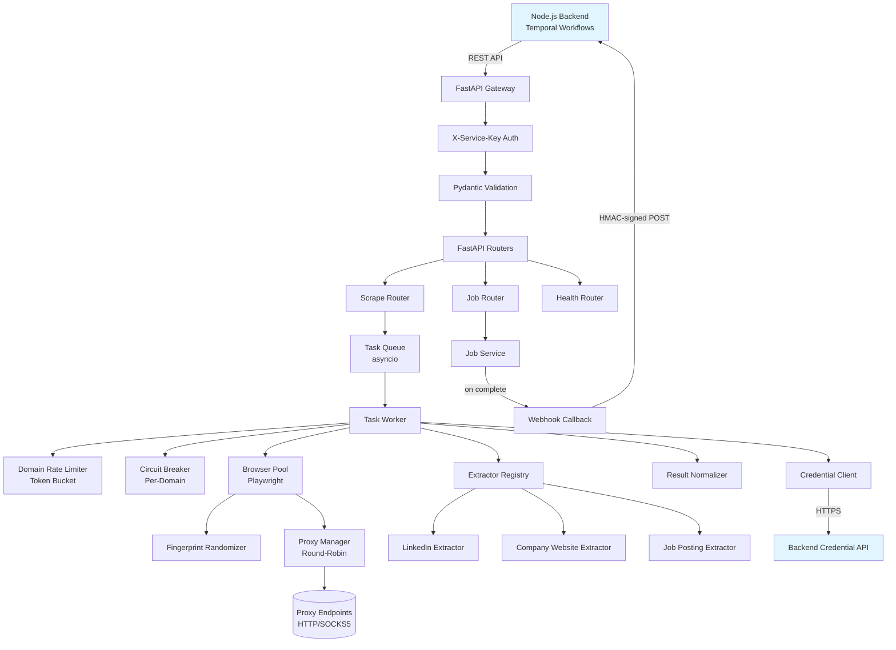
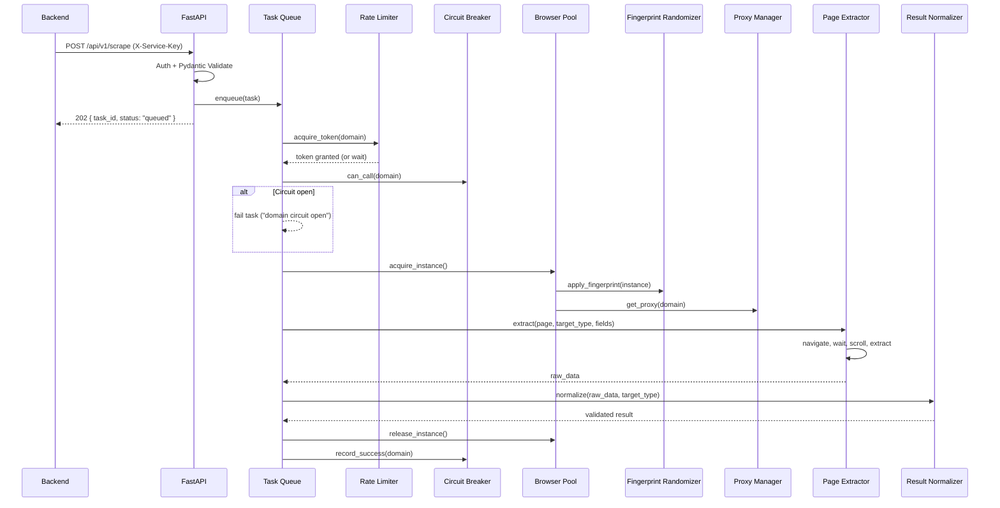
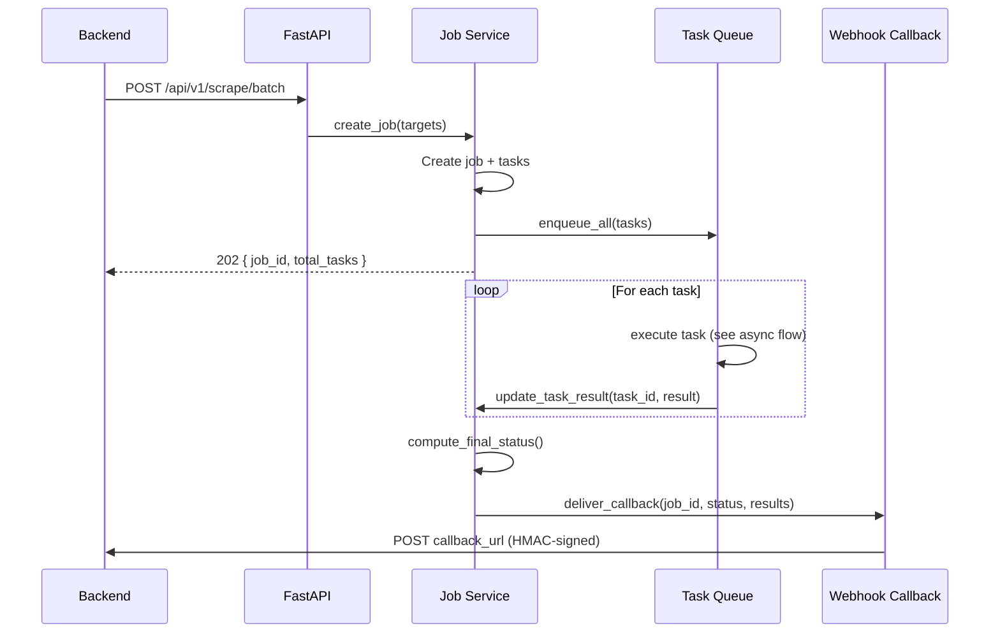
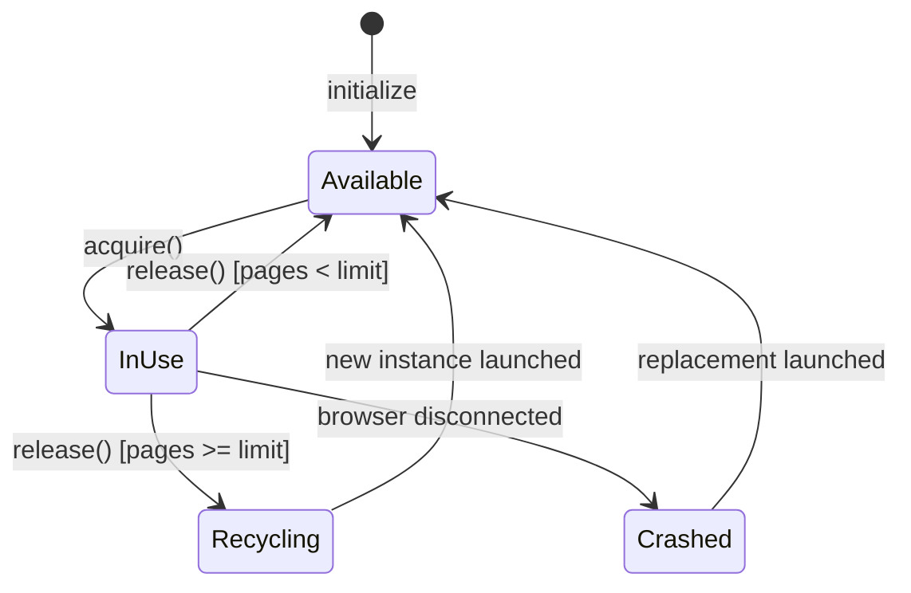
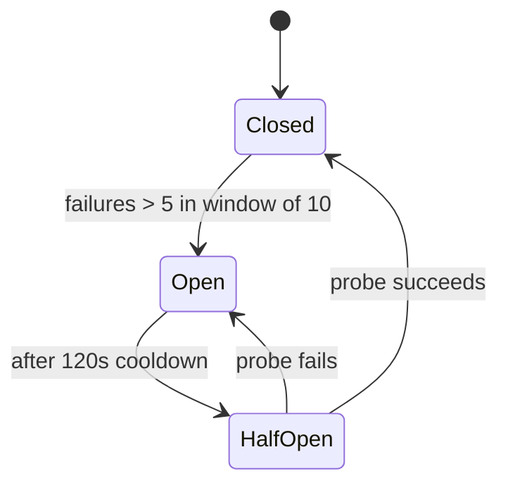

# Design Document: Module 3 — Scraping Microservices

## Overview

This module implements a standalone Python/FastAPI scraping microservice that provides headless browser automation for data sources lacking structured APIs. It runs in `packages/scraper/` as an enrichment provider that the Node.js backend's Temporal.io workflows invoke via REST API. The service scrapes LinkedIn profiles, company websites, job postings, and other targets, returning normalized Pydantic-validated results through the enrichment pipeline.

The scraper is designed for resilience and stealth: it manages a pool of Playwright browser instances, rotates proxies, randomizes browser fingerprints, enforces per-domain rate limits and politeness policies, and uses circuit breakers to isolate failing domains. All results are validated against Pydantic output schemas before being returned to the backend.

### Key Design Decisions

1. **FastAPI + asyncio for concurrency** — FastAPI's native async support maps naturally to the I/O-bound scraping workload. The asyncio task queue manages concurrent browser sessions without threading overhead, and Pydantic v2 provides fast request/response validation.
2. **Playwright over Selenium** — Playwright provides better auto-wait semantics, built-in stealth capabilities, and native async Python support. Its Chromium-only mode reduces image size and resource consumption in Docker.
3. **In-memory state for pool, circuit breaker, and rate limiter** — The scraper runs as a single-process service. In-memory state for browser pool, circuit breaker, and rate limiter is simpler and faster than external stores. If horizontal scaling is needed, these can be moved to Redis.
4. **Pluggable extractor registry** — New target types are added by registering an extractor module without modifying existing code. Each extractor encapsulates navigation logic, wait conditions, and CSS/XPath selectors for its target type.
5. **Token bucket rate limiting per domain** — Provides smooth, bursty-tolerant rate control. Combined with adaptive backoff on 429 responses, this respects target site resources while maximizing throughput.
6. **Service-to-service auth via X-Service-Key** — No JWT/RBAC needed. The scraper is an internal service called only by the backend. A shared API key is simpler and sufficient for this trust boundary.
7. **HMAC-SHA256 webhook callbacks** — Same pattern as Module 2's webhook delivery, ensuring the backend can verify callback authenticity.
8. **Docker multi-stage build with resource caps** — Separates dependency installation (Playwright + Chromium) from application code for smaller images. Resource limits (2 CPU, 4GB RAM) prevent runaway browser instances from affecting the host.

## Architecture



### Request Flow: Async Scrape Task



### Request Flow: Batch Job



## Components and Interfaces

### Directory Structure

```
packages/scraper/
├── src/
│   ├── config/
│   │   ├── settings.py              # Pydantic Settings (env validation)
│   │   └── domain_policies.yaml     # Per-domain rate limit overrides
│   ├── routers/
│   │   ├── scrape.py                # POST /scrape, POST /scrape/sync, GET /scrape/:taskId
│   │   ├── jobs.py                  # POST /scrape/batch, GET /jobs/:id, GET /jobs/:id/results, POST /jobs/:id/cancel
│   │   └── health.py                # GET /health, GET /readiness, GET /metrics
│   ├── services/
│   │   ├── task_queue.py            # Asyncio task queue with priority scheduling
│   │   ├── job_service.py           # Batch job lifecycle management
│   │   └── task_executor.py         # Orchestrates single task execution
│   ├── browser/
│   │   ├── pool.py                  # Playwright browser pool management
│   │   └── fingerprint.py           # Fingerprint randomization
│   ├── extractors/
│   │   ├── registry.py              # Pluggable extractor registry
│   │   ├── base.py                  # Abstract base extractor
│   │   ├── linkedin_profile.py      # LinkedIn profile extractor
│   │   ├── company_website.py       # Company website extractor
│   │   └── job_posting.py           # Job posting extractor
│   ├── proxy/
│   │   ├── manager.py               # Proxy rotation, health checks
│   │   └── types.py                 # Proxy data models
│   ├── resilience/
│   │   ├── circuit_breaker.py       # Per-domain circuit breaker
│   │   └── rate_limiter.py          # Token bucket rate limiter
│   ├── integration/
│   │   ├── credential_client.py     # Backend credential retrieval + cache
│   │   └── webhook.py               # HMAC-signed webhook callbacks
│   ├── models/
│   │   ├── requests.py              # Pydantic request models
│   │   ├── responses.py             # Pydantic response models + envelope
│   │   ├── normalizer.py            # Result normalization logic
│   │   └── schemas.py               # Target-type output schemas (LinkedIn, Company, Job)
│   ├── middleware/
│   │   ├── auth.py                  # X-Service-Key authentication
│   │   ├── request_id.py            # UUID request ID injection
│   │   └── error_handler.py         # Global exception handler → JSON envelope
│   └── main.py                      # FastAPI app entry point, lifespan events
├── tests/
│   ├── unit/                        # pytest unit tests
│   ├── property/                    # hypothesis property-based tests
│   └── conftest.py                  # Shared fixtures
├── Dockerfile                       # Multi-stage production build
├── docker-compose.yml               # Resource-limited container config
└── pyproject.toml                   # Python project config (deps, black, ruff, pytest)
```


### Core Python Interfaces

```python
# === Configuration (src/config/settings.py) ===

from pydantic_settings import BaseSettings

class ScraperSettings(BaseSettings):
    # Service
    port: int = 8001
    service_key: str                          # X-Service-Key for auth
    log_level: str = "INFO"
    
    # Backend integration
    backend_api_url: str                      # e.g. "https://api.morket.io/api/v1"
    backend_service_key: str                  # Key for calling backend API
    webhook_secret: str                       # HMAC-SHA256 signing key
    default_webhook_url: str | None = None    # Default callback URL
    
    # Browser pool
    browser_pool_size: int = 5
    browser_pool_max: int = 20
    browser_page_limit: int = 100             # Recycle after N pages
    navigation_timeout_ms: int = 30000
    
    # Task queue
    max_queue_depth: int = 500
    task_timeout_seconds: int = 60
    
    # Rate limiting defaults
    rate_limit_tokens: int = 2
    rate_limit_interval_seconds: int = 10
    
    # Circuit breaker
    cb_window_size: int = 10
    cb_failure_threshold: int = 5
    cb_cooldown_seconds: int = 120
    
    # Proxy
    proxy_endpoints: list[str] = []           # Loaded from env or config
    proxy_health_check_interval_seconds: int = 60
    proxy_domain_cooldown_seconds: int = 30
    
    # Credential client
    credential_cache_ttl_seconds: int = 300   # 5 minutes
    credential_max_retries: int = 3
    
    # Docker / resource management
    graceful_shutdown_seconds: int = 30
    
    # Domain policies
    domain_policies_path: str = "src/config/domain_policies.yaml"
    
    class Config:
        env_prefix = "SCRAPER_"


# === JSON Envelope (src/models/responses.py) ===

from pydantic import BaseModel
from typing import TypeVar, Generic

T = TypeVar("T")

class ApiResponse(BaseModel, Generic[T]):
    success: bool
    data: T | None = None
    error: str | None = None
    meta: dict | None = None


# === Scrape Task Models (src/models/requests.py) ===

from pydantic import BaseModel, Field
from enum import Enum

class TargetType(str, Enum):
    LINKEDIN_PROFILE = "linkedin_profile"
    COMPANY_WEBSITE = "company_website"
    JOB_POSTING = "job_posting"

class ScrapeRequest(BaseModel):
    target_type: TargetType
    target_url: str
    requested_fields: list[str] | None = None
    workspace_id: str
    callback_url: str | None = None

class BatchScrapeRequest(BaseModel):
    targets: list[ScrapeRequest] = Field(..., max_length=100)
    callback_url: str | None = None

class SyncScrapeRequest(ScrapeRequest):
    timeout_seconds: int = Field(default=60, ge=5, le=120)


# === Task & Job State ===

class TaskStatus(str, Enum):
    QUEUED = "queued"
    RUNNING = "running"
    COMPLETED = "completed"
    FAILED = "failed"

class JobStatus(str, Enum):
    QUEUED = "queued"
    RUNNING = "running"
    COMPLETED = "completed"
    PARTIALLY_COMPLETED = "partially_completed"
    FAILED = "failed"
    CANCELLED = "cancelled"

class ScrapeTask:
    id: str                    # UUID
    job_id: str | None         # None for standalone tasks
    target_type: TargetType
    target_url: str
    requested_fields: list[str] | None
    workspace_id: str
    status: TaskStatus
    result: dict | None
    error: str | None
    created_at: datetime
    started_at: datetime | None
    completed_at: datetime | None

class ScrapeJob:
    id: str                    # UUID
    targets: list[ScrapeTask]
    status: JobStatus
    total_tasks: int
    completed_tasks: int
    failed_tasks: int
    callback_url: str | None
    created_at: datetime
    updated_at: datetime
```

### Key Service Interfaces

```python
# === Browser Pool (src/browser/pool.py) ===

class BrowserPool:
    async def initialize(self, pool_size: int) -> None: ...
    async def acquire(self, timeout: float = 10.0) -> BrowserInstance: ...
    async def release(self, instance: BrowserInstance) -> None: ...
    async def shutdown(self) -> None: ...
    def get_stats(self) -> dict: ...
    # Stats: total, available, in_use, pages_processed, recycled_count

class BrowserInstance:
    id: str
    browser: Browser              # Playwright Browser
    pages_processed: int
    created_at: float
    
    async def new_page(self, proxy: ProxyEndpoint | None = None) -> Page: ...
    def needs_recycling(self, max_pages: int) -> bool: ...


# === Fingerprint Randomizer (src/browser/fingerprint.py) ===

class FingerprintProfile:
    user_agent: str
    viewport_width: int           # 1280–1920
    viewport_height: int          # 720–1080
    timezone: str
    language: str
    geolocation: dict | None      # { latitude, longitude }

class FingerprintRandomizer:
    def generate(self, proxy_region: str | None = None) -> FingerprintProfile: ...
    async def apply(self, page: Page, profile: FingerprintProfile) -> None: ...


# === Page Extractor (src/extractors/base.py) ===

from abc import ABC, abstractmethod

class BaseExtractor(ABC):
    target_type: TargetType
    
    @abstractmethod
    async def extract(
        self, page: Page, target_url: str, requested_fields: list[str] | None
    ) -> dict: ...
    
    async def wait_for_content(self, page: Page, selector: str, timeout: int = 10000) -> None: ...
    async def scroll_for_content(self, page: Page, max_scrolls: int = 5) -> None: ...


# === Extractor Registry (src/extractors/registry.py) ===

class ExtractorRegistry:
    def register(self, extractor: BaseExtractor) -> None: ...
    def get(self, target_type: TargetType) -> BaseExtractor: ...
    def list_types(self) -> list[TargetType]: ...


# === Proxy Manager (src/proxy/manager.py) ===

class ProxyEndpoint:
    url: str
    protocol: str                 # http, https, socks5
    region: str | None
    is_healthy: bool
    success_count: int
    failure_count: int
    last_used_domains: dict[str, float]  # domain → timestamp

class ProxyManager:
    async def initialize(self, endpoints: list[str]) -> None: ...
    def select(self, target_domain: str) -> ProxyEndpoint: ...
    def mark_unhealthy(self, proxy: ProxyEndpoint) -> None: ...
    def mark_success(self, proxy: ProxyEndpoint) -> None: ...
    async def health_check_loop(self) -> None: ...
    def get_stats(self) -> dict: ...


# === Rate Limiter (src/resilience/rate_limiter.py) ===

class DomainRateLimiter:
    async def acquire(self, domain: str) -> None: ...       # Blocks until token available
    def reduce_rate(self, domain: str, factor: float = 0.5, duration_seconds: int = 300) -> None: ...
    def get_stats(self, domain: str) -> dict: ...
    def load_policies(self, yaml_path: str) -> None: ...


# === Circuit Breaker (src/resilience/circuit_breaker.py) ===

class CircuitState(str, Enum):
    CLOSED = "closed"
    OPEN = "open"
    HALF_OPEN = "half_open"

class DomainCircuitBreaker:
    def can_call(self, domain: str) -> bool: ...
    def record_success(self, domain: str) -> None: ...
    def record_failure(self, domain: str) -> None: ...
    def get_state(self, domain: str) -> CircuitState: ...
    def get_all_states(self) -> dict[str, CircuitState]: ...


# === Credential Client (src/integration/credential_client.py) ===

class CredentialClient:
    async def get_credential(self, workspace_id: str, provider: str) -> dict: ...
    def invalidate_cache(self, workspace_id: str, provider: str) -> None: ...


# === Webhook Callback (src/integration/webhook.py) ===

class WebhookCallback:
    async def deliver(
        self, url: str, job_id: str, status: str, results: list[dict] | None, summary: dict
    ) -> bool: ...


# === Task Queue (src/services/task_queue.py) ===

class TaskQueue:
    async def enqueue(self, task: ScrapeTask) -> None: ...
    async def enqueue_batch(self, tasks: list[ScrapeTask]) -> None: ...
    async def cancel_job_tasks(self, job_id: str) -> int: ...
    async def start_workers(self) -> None: ...
    async def drain(self, timeout: float = 30.0) -> None: ...
    def get_stats(self) -> dict: ...
    # Stats: queue_depth, active_workers, avg_duration


# === Task Executor (src/services/task_executor.py) ===

class TaskExecutor:
    async def execute(self, task: ScrapeTask) -> ScrapeTask: ...
    # Orchestrates: rate limit → circuit breaker → browser acquire →
    # fingerprint → proxy → extract → normalize → release
```


### API Endpoints

| Method | Path | Auth | Description |
|--------|------|------|-------------|
| POST | `/api/v1/scrape` | X-Service-Key | Submit async scrape task |
| POST | `/api/v1/scrape/sync` | X-Service-Key | Submit sync scrape task (blocks until result) |
| GET | `/api/v1/scrape/:taskId` | X-Service-Key | Get task status and result |
| POST | `/api/v1/scrape/batch` | X-Service-Key | Submit batch scrape job |
| GET | `/api/v1/scrape/jobs/:jobId` | X-Service-Key | Get job status and progress |
| GET | `/api/v1/scrape/jobs/:jobId/results` | X-Service-Key | Get completed task results for job |
| POST | `/api/v1/scrape/jobs/:jobId/cancel` | X-Service-Key | Cancel queued tasks in job |
| GET | `/health` | None | Service health + pool stats |
| GET | `/readiness` | None | Readiness probe (pool + proxy check) |
| GET | `/metrics` | None | Operational metrics |

### Component Details

#### Browser Pool (`src/browser/pool.py`)

Manages a fixed-size pool of Playwright Chromium instances. Each instance is a headless browser process that can create pages for scraping.

Lifecycle:
1. **Startup**: Launch `pool_size` Chromium instances with `--no-sandbox --disable-dev-shm-usage --disable-gpu`
2. **Acquire**: Callers request an instance via `acquire()`. If none available, block up to 10s then raise `PoolExhaustedError`
3. **Use**: Caller creates a page, applies fingerprint + proxy, navigates, extracts data
4. **Release**: Caller returns instance. Pool clears cookies/storage, increments page counter
5. **Recycle**: If `pages_processed >= page_limit`, terminate and launch a fresh instance
6. **Crash recovery**: If a browser process crashes, detect via Playwright's `disconnected` event, remove from pool, launch replacement



#### Extractor Registry (`src/extractors/registry.py`)

A dictionary mapping `TargetType` → `BaseExtractor` instance. Populated at startup:

```python
registry = ExtractorRegistry()
registry.register(LinkedInProfileExtractor())
registry.register(CompanyWebsiteExtractor())
registry.register(JobPostingExtractor())
```

Adding a new target type requires:
1. Create a new extractor class extending `BaseExtractor`
2. Register it in the startup code

No existing extractor code needs modification (open/closed principle).

#### Circuit Breaker (`src/resilience/circuit_breaker.py`)

Per-domain in-memory state machine. Same pattern as Module 2's provider circuit breaker, but scoped to target domains instead of provider slugs.



- Sliding window: tracks the most recent 10 requests per domain
- Threshold: 5 failures within the window triggers open state
- Cooldown: 120 seconds before transitioning to half-open
- Half-open: allows exactly 1 probe request; success → closed, failure → open

#### Rate Limiter (`src/resilience/rate_limiter.py`)

Token bucket algorithm per domain:
- Each domain gets a bucket with `tokens_per_interval` tokens (default 2)
- Tokens replenish every `interval_seconds` (default 10s)
- `acquire()` is async — blocks (via `asyncio.Event`) until a token is available
- On 429 response: `reduce_rate()` halves the replenishment rate for 5 minutes
- Per-domain overrides loaded from `domain_policies.yaml`

#### Proxy Manager (`src/proxy/manager.py`)

Round-robin rotation with health tracking:
- Proxies loaded from `SCRAPER_PROXY_ENDPOINTS` env var (comma-separated) or config
- Selection skips unhealthy proxies and proxies used for the same domain within cooldown period
- Failed connections mark proxy unhealthy
- Background task checks unhealthy proxies every 60s, restores on successful test connection
- Metrics: success/failure counts per proxy exposed via `/health`

#### Credential Client (`src/integration/credential_client.py`)

HTTP client for backend credential API:
- Calls `GET /api/v1/workspaces/:id/credentials/:provider` with `X-Service-Key` header
- In-memory cache keyed by `(workspace_id, provider)` with configurable TTL (default 5min)
- On cache miss or expiry: fetch from backend with 3 retries (1s, 2s, 4s exponential backoff)
- Never logs or persists decrypted credential values
- HTTPS-only transport

#### Webhook Callback (`src/integration/webhook.py`)

HMAC-SHA256 signed HTTP POST callbacks:
- Payload: `{ job_id, status, summary: { total, completed, failed }, results: [...] | null }`
- Signature: `HMAC-SHA256(webhook_secret, JSON payload)` in `X-Webhook-Signature` header
- Timeout: 10s per attempt
- Retries: 3 attempts with exponential backoff (2s, 4s, 8s)
- For jobs with ≤100 tasks: include full results array. For larger jobs: summary only.

#### Task Queue (`src/services/task_queue.py`)

Asyncio-based priority queue:
- Priority: tasks from smaller jobs are processed first (job size as priority key)
- Standalone tasks (no job) get highest priority
- Max queue depth: 500 tasks. Returns 503 when full.
- Workers: `max_concurrency` async workers (default = browser pool size)
- Task timeout: 60s per task. Cancelled via `asyncio.wait_for()`
- Graceful shutdown: stop accepting new tasks, drain in-progress tasks within grace period

## Data Models

The scraper service is stateless — it does not use a database. All task and job state is held in memory. This is appropriate because:
- Tasks are short-lived (seconds to minutes)
- The backend (Module 2) is the system of record for enrichment results
- Job results are delivered via webhook callbacks and the GET results endpoint
- On service restart, in-flight tasks are lost (the backend's Temporal workflows handle retries)

### In-Memory State Models

```python
# Task state (src/models/requests.py — extended)

@dataclass
class ScrapeTaskState:
    id: str                          # UUID
    job_id: str | None
    target_type: TargetType
    target_url: str
    requested_fields: list[str] | None
    workspace_id: str
    status: TaskStatus
    result: dict | None = None
    error: str | None = None
    created_at: datetime = field(default_factory=datetime.utcnow)
    started_at: datetime | None = None
    completed_at: datetime | None = None
    priority: int = 0                # Lower = higher priority

@dataclass
class ScrapeJobState:
    id: str                          # UUID
    task_ids: list[str]
    status: JobStatus
    total_tasks: int
    completed_tasks: int = 0
    failed_tasks: int = 0
    callback_url: str | None = None
    created_at: datetime = field(default_factory=datetime.utcnow)
    updated_at: datetime = field(default_factory=datetime.utcnow)
```

### Target-Type Output Schemas

```python
# === LinkedIn Profile (src/models/schemas.py) ===

class LinkedInProfileResult(BaseModel):
    name: str | None = None
    headline: str | None = None
    current_company: str | None = None
    location: NormalizedLocation | None = None
    summary: str | None = None
    profile_url: str | None = None

# === Company Website (src/models/schemas.py) ===

class CompanyWebsiteResult(BaseModel):
    company_name: str | None = None
    description: str | None = None
    industry: str | None = None
    employee_count_range: str | None = None
    headquarters: NormalizedLocation | None = None
    contact_email: str | None = None
    contact_phone: str | None = None
    website_url: str | None = None

# === Job Posting (src/models/schemas.py) ===

class JobPostingResult(BaseModel):
    job_title: str | None = None
    company_name: str | None = None
    location: NormalizedLocation | None = None
    salary_range: str | None = None
    description: str | None = None
    posting_url: str | None = None

# === Shared ===

class NormalizedLocation(BaseModel):
    city: str | None = None
    state_region: str | None = None
    country: str | None = None
    raw: str | None = None           # Original text before normalization
```

### Domain Policy Schema (YAML)

```yaml
# src/config/domain_policies.yaml
domains:
  linkedin.com:
    tokens_per_interval: 1
    interval_seconds: 15
    min_delay_ms: 2000
    max_delay_ms: 5000
    allowed_hours:
      start: 6    # UTC
      end: 22
    respect_robots_txt: true
  
  indeed.com:
    tokens_per_interval: 2
    interval_seconds: 10
    min_delay_ms: 1000
    max_delay_ms: 3000
    respect_robots_txt: true
  
  default:
    tokens_per_interval: 2
    interval_seconds: 10
    min_delay_ms: 500
    max_delay_ms: 2000
    respect_robots_txt: false
```

### Circuit Breaker State (In-Memory)

```python
@dataclass
class CircuitBreakerState:
    domain: str
    state: CircuitState              # closed, open, half_open
    recent_calls: deque[tuple[float, bool]]  # (timestamp, success) — max 10
    last_state_change: float         # time.monotonic()
```

### Rate Limiter State (In-Memory)

```python
@dataclass
class TokenBucket:
    domain: str
    tokens: float
    max_tokens: int
    refill_rate: float               # tokens per second
    last_refill: float               # time.monotonic()
    reduced_until: float | None      # Adaptive backoff expiry
    original_refill_rate: float      # For restoring after backoff
```


## Correctness Properties

*A property is a characteristic or behavior that should hold true across all valid executions of a system — essentially, a formal statement about what the system should do. Properties serve as the bridge between human-readable specifications and machine-verifiable correctness guarantees.*

### Property 1: JSON envelope consistency

*For any* response produced by the error handler or any route handler, the response body SHALL be valid JSON conforming to the `{ success: bool, data: T | None, error: str | None, meta: dict | None }` schema, and when the response status code is >= 400, `success` SHALL be `false` and `error` SHALL be non-null; when status < 400, `success` SHALL be `true`.

**Validates: Requirements 1.3, 1.4**

### Property 2: Readiness reflects pool state

*For any* combination of browser pool available count (0..N) and healthy proxy count (0..M), the `/readiness` endpoint SHALL return 200 if and only if both available count > 0 and healthy proxy count > 0.

**Validates: Requirements 1.6**

### Property 3: Request ID uniqueness

*For any* sequence of requests to the service, each response SHALL contain an `X-Request-ID` header with a valid UUID, and no two responses SHALL share the same request ID.

**Validates: Requirements 1.7**

### Property 4: Service key authentication

*For any* request to an authenticated endpoint, the request SHALL be accepted (not 401) if and only if the `X-Service-Key` header matches the configured service key. Requests with missing or non-matching keys SHALL receive a 401 response.

**Validates: Requirements 2.6, 2.7**

### Property 5: Pydantic validation produces 422 with field errors

*For any* scrape request payload that violates the target-type Pydantic schema (missing required fields, wrong types, invalid values), the service SHALL return a 422 status code with the envelope containing field-level validation error details.

**Validates: Requirements 2.4, 2.5**

### Property 6: Async task creation returns queued status

*For any* valid `POST /api/v1/scrape` request, the response SHALL contain a task ID (valid UUID) and status `"queued"`.

**Validates: Requirements 2.1**

### Property 7: Task status retrieval reflects current state

*For any* task in any state (queued, running, completed, failed), `GET /api/v1/scrape/:taskId` SHALL return the task's current status, and SHALL include result data if and only if the task status is `"completed"`.

**Validates: Requirements 2.3**

### Property 8: Batch job creates one task per target

*For any* valid batch request with N targets (1 ≤ N ≤ 100), the created job SHALL contain exactly N tasks, and the response SHALL include a job ID (valid UUID).

**Validates: Requirements 3.1**

### Property 9: Job status derived from task outcomes

*For any* completed job with C successful tasks and F failed tasks where C + F = total: if F == 0 then job status SHALL be `"completed"`; if C == 0 then job status SHALL be `"failed"`; if both C > 0 and F > 0 then job status SHALL be `"partially_completed"`.

**Validates: Requirements 3.4**

### Property 10: Job results contain only completed tasks

*For any* job, `GET /api/v1/scrape/jobs/:jobId/results` SHALL return results only for tasks with status `"completed"`, and the count of returned results SHALL equal the job's `completed_tasks` counter.

**Validates: Requirements 3.3**

### Property 11: Job cancellation preserves running tasks

*For any* job with a mix of queued and running tasks, cancellation SHALL transition all queued tasks to a non-executable state and SHALL NOT terminate running tasks. After cancellation, the job status SHALL be `"cancelled"`.

**Validates: Requirements 3.5**

### Property 12: Browser instance recycling after page threshold

*For any* browser instance that has processed N pages where N ≥ the configured page limit, the pool SHALL recycle (terminate and replace) that instance on release rather than returning it to the available pool.

**Validates: Requirements 4.7**

### Property 13: Missing extraction fields default to null

*For any* extraction result where one or more target fields are not found on the page, those fields SHALL be `null` in the result rather than causing the extraction to fail.

**Validates: Requirements 5.5**

### Property 14: Fingerprint attributes within valid ranges

*For any* generated fingerprint profile, the user agent SHALL be from the curated list, the viewport width SHALL be in [1280, 1920], and the viewport height SHALL be in [720, 1080].

**Validates: Requirements 6.1, 6.2**

### Property 15: Fingerprint geo-consistency with proxy region

*For any* generated fingerprint profile with an assigned proxy region, the timezone, language, and geolocation SHALL be consistent with that geographic region.

**Validates: Requirements 6.3**

### Property 16: Fingerprint rotation across sessions

*For any* two consecutively generated fingerprint profiles, they SHALL differ in at least one attribute (user agent, viewport, timezone, or language) to prevent fingerprint correlation.

**Validates: Requirements 6.6**

### Property 17: Action delays within configured range

*For any* generated inter-action delay, the delay value SHALL be within the configured range [min_delay_ms, max_delay_ms] (default [500, 2000]).

**Validates: Requirements 6.5**

### Property 18: Proxy round-robin skips unhealthy

*For any* proxy pool with a mix of healthy and unhealthy proxies, proxy selection SHALL follow round-robin order among healthy proxies only, never selecting an unhealthy proxy.

**Validates: Requirements 7.2**

### Property 19: Failed proxy marked unhealthy

*For any* proxy that experiences a connection failure, the proxy SHALL be marked as unhealthy and SHALL be excluded from subsequent selections until restored by a health check.

**Validates: Requirements 7.3**

### Property 20: Proxy per-domain cooldown

*For any* proxy and target domain, the proxy SHALL not be selected for that domain again within the configured cooldown period (default 30s) after being used for that domain.

**Validates: Requirements 7.7**

### Property 21: Proxy metrics accuracy

*For any* sequence of proxy success and failure recordings, the per-proxy success and failure counts SHALL equal the actual number of successes and failures recorded.

**Validates: Requirements 7.6**

### Property 22: Token bucket rate limiting per domain

*For any* domain, the rate limiter SHALL not grant more than `tokens_per_interval` tokens within any `interval_seconds` window, and rate limiting on one domain SHALL not affect token availability for other domains.

**Validates: Requirements 8.1, 8.7**

### Property 23: Domain policy YAML parsing round trip

*For any* valid domain policy YAML configuration, loading the configuration and then serializing the resulting policy objects back to YAML SHALL produce an equivalent configuration.

**Validates: Requirements 8.3**

### Property 24: Allowed scraping hours enforcement

*For any* domain with configured allowed scraping hours and any current time, a task SHALL be eligible for execution if and only if the current time falls within the allowed window.

**Validates: Requirements 8.4**

### Property 25: Robots.txt compliance

*For any* domain with robots.txt compliance enabled and any URL path, the service SHALL allow scraping if and only if the URL is permitted by the domain's robots.txt rules for the configured user agent.

**Validates: Requirements 8.5**

### Property 26: Adaptive rate reduction on 429

*For any* domain that receives a 429 response, the token replenishment rate SHALL be reduced by 50% for the configured backoff period, and SHALL be restored to the original rate after the backoff period expires.

**Validates: Requirements 8.6**

### Property 27: Circuit breaker state transition on failures

*For any* domain, the circuit breaker SHALL transition from closed to open when the failure count exceeds the threshold (default 5) within the sliding window of the most recent N requests (default 10). Older requests outside the window SHALL NOT count toward the failure threshold.

**Validates: Requirements 9.1, 9.2**

### Property 28: Open circuit rejects immediately

*For any* domain in the open state, `can_call()` SHALL return `false`, causing tasks to fail immediately without launching a browser.

**Validates: Requirements 9.3**

### Property 29: Half-open probe determines next state

*For any* domain in the half-open state, if the single allowed probe request succeeds, the circuit SHALL transition to closed with a reset failure count; if the probe fails, the circuit SHALL transition back to open for another cooldown period.

**Validates: Requirements 9.6, 9.7**

### Property 30: Credential cache TTL behavior

*For any* credential retrieval, if the credential was fetched within the TTL window, the cached value SHALL be returned without a backend API call; if the TTL has expired, a fresh credential SHALL be fetched from the backend.

**Validates: Requirements 10.2, 10.3**

### Property 31: Result normalization produces valid schema

*For any* raw extraction data and target type, the normalizer SHALL produce output that validates against the target type's Pydantic output schema, with all text fields stripped of HTML tags and trimmed of whitespace.

**Validates: Requirements 11.1, 11.2, 11.4**

### Property 32: Partial result on validation failure

*For any* normalized result where some fields fail Pydantic validation, the normalizer SHALL return a partial result containing only the valid fields rather than failing entirely.

**Validates: Requirements 11.3**

### Property 33: URL normalization

*For any* URL string, the normalizer SHALL produce a URL with an `https://` scheme and with common tracking parameters (utm_*, fbclid, gclid, etc.) removed.

**Validates: Requirements 11.5**

### Property 34: Location normalization structure

*For any* location string, the normalizer SHALL produce a `NormalizedLocation` object with `city`, `state_region`, `country`, and `raw` fields, where `raw` preserves the original input.

**Validates: Requirements 11.6**

### Property 35: Result serialization round trip

*For any* valid normalized result (LinkedInProfileResult, CompanyWebsiteResult, or JobPostingResult), serializing to JSON and deserializing back to the Pydantic model SHALL produce an equivalent object.

**Validates: Requirements 11.7**

### Property 36: Priority queue ordering by job size

*For any* set of tasks from jobs of different sizes, the task queue SHALL dequeue tasks from smaller jobs before tasks from larger jobs when all tasks are enqueued simultaneously.

**Validates: Requirements 12.2**

### Property 37: Queue stats accuracy

*For any* sequence of enqueue and dequeue operations, the reported queue depth SHALL equal the actual number of pending tasks, and active workers SHALL equal the number of currently executing tasks.

**Validates: Requirements 12.6**

### Property 38: Structured log format

*For any* log entry emitted by the service, the entry SHALL be valid JSON containing at minimum a `request_id`, `level`, and `timestamp` field. For failed tasks, the entry SHALL additionally contain `target_url`, `proxy_used`, and `error_reason`. For completed tasks, the entry SHALL contain `target_domain`, `duration_ms`, and `fields_extracted`.

**Validates: Requirements 14.1, 14.3, 14.6**

### Property 39: No credentials in logs or metrics

*For any* log entry or metrics output, the content SHALL NOT contain decrypted credential values, authentication tokens, or personally identifiable information from scraped pages.

**Validates: Requirements 10.6, 14.5**

### Property 40: HMAC-SHA256 webhook signature correctness

*For any* webhook payload and shared secret, the `X-Webhook-Signature` header SHALL contain a valid HMAC-SHA256 signature that can be verified by recomputing `HMAC-SHA256(secret, JSON payload)`.

**Validates: Requirements 15.2**

### Property 41: Webhook payload size by job task count

*For any* completed job, the webhook payload SHALL include the full array of task results if the job has ≤ 100 tasks, and SHALL include only the job summary (without individual results) if the job has > 100 tasks.

**Validates: Requirements 15.6**

### Property 42: Webhook callback URL override

*For any* scrape request that includes a `callback_url` field, the webhook callback SHALL be delivered to that URL instead of the default configured webhook URL.

**Validates: Requirements 15.5**

### Property 43: Terminal job state triggers webhook

*For any* job that reaches a terminal state (completed, partially_completed, failed, cancelled), the service SHALL deliver a webhook callback containing the job ID, final status, and result summary.

**Validates: Requirements 15.1**

## Error Handling

### Error Hierarchy

The scraper uses a custom exception hierarchy caught by a global FastAPI exception handler that formats all errors into the JSON envelope:

```python
class ScraperError(Exception):
    """Base error for all scraper-specific errors."""
    status_code: int = 500
    message: str = "Internal server error"

class ValidationError(ScraperError):
    status_code = 422
    # Pydantic validation failures — includes field-level details

class AuthenticationError(ScraperError):
    status_code = 401
    message = "Invalid or missing service key"

class PoolExhaustedError(ScraperError):
    status_code = 503
    message = "Browser pool exhausted — no instances available"

class QueueFullError(ScraperError):
    status_code = 503
    message = "Task queue is full"

class CircuitOpenError(ScraperError):
    status_code = 503
    message = "Circuit breaker open for target domain"

class NoHealthyProxiesError(ScraperError):
    status_code = 503
    message = "No healthy proxies available"

class CredentialNotFoundError(ScraperError):
    status_code = 502
    message = "Missing credentials for provider"

class TaskNotFoundError(ScraperError):
    status_code = 404
    message = "Task not found"

class JobNotFoundError(ScraperError):
    status_code = 404
    message = "Job not found"

class TaskTimeoutError(ScraperError):
    status_code = 504
    message = "Task execution timed out"
```

### Error Handling Strategy by Component

| Component | Error Condition | Handling |
|-----------|----------------|----------|
| Auth Middleware | Missing/invalid X-Service-Key | Return 401, do not process request |
| Pydantic Validation | Invalid request payload | Return 422 with field-level errors |
| Task Queue | Queue at max depth (500) | Return 503 QueueFullError |
| Browser Pool | No instances available within 10s | Return 503 PoolExhaustedError |
| Circuit Breaker | Domain in open state | Fail task immediately with CircuitOpenError |
| Proxy Manager | All proxies unhealthy | Fail task with NoHealthyProxiesError |
| Rate Limiter | Tokens exhausted | Block (async wait), do NOT reject |
| Rate Limiter | 429 from target | Reduce rate 50%, retry after backoff |
| Credential Client | Backend returns 404 | Fail task with CredentialNotFoundError |
| Credential Client | Backend unreachable | Retry 3x (1s, 2s, 4s), then fail task |
| Page Extractor | Field not found on page | Set field to null, continue extraction |
| Page Extractor | Navigation timeout (30s) | Fail task with TaskTimeoutError |
| Result Normalizer | Partial validation failure | Return partial result with valid fields only |
| Webhook Callback | Delivery failure | Retry 3x (2s, 4s, 8s), then log and drop |
| Task Executor | Task exceeds 60s timeout | Cancel task, release browser, mark failed |
| Global Handler | Unhandled exception | Return 500 with generic message, log traceback |

### Graceful Shutdown

On SIGTERM:
1. Stop accepting new requests (return 503 for new tasks)
2. Cancel all queued tasks in the task queue
3. Wait for in-progress tasks to complete (up to 30s grace period)
4. Close all browser instances in the pool
5. Cancel background tasks (proxy health checks, rate limiter cleanup)
6. Exit process

## Testing Strategy

### Testing Framework

- **Unit tests**: pytest + pytest-asyncio
- **Property-based tests**: hypothesis (Python PBT library)
- **HTTP integration tests**: httpx (async test client for FastAPI)
- **Mocking**: unittest.mock + pytest-mock for browser/network dependencies
- **Linting**: Black + Ruff
- **Configuration**: pyproject.toml for all tool configs

### Test Organization

```
tests/
├── unit/
│   ├── test_fingerprint.py          # Fingerprint generation
│   ├── test_circuit_breaker.py      # Circuit breaker state machine
│   ├── test_rate_limiter.py         # Token bucket algorithm
│   ├── test_proxy_manager.py        # Proxy rotation and health
│   ├── test_normalizer.py           # Result normalization
│   ├── test_task_queue.py           # Priority queue ordering
│   ├── test_job_service.py          # Job status computation
│   ├── test_auth.py                 # Service key validation
│   ├── test_webhook.py              # HMAC signing and payload
│   └── test_settings.py             # Pydantic Settings validation
├── property/
│   ├── test_envelope_properties.py  # Property 1: JSON envelope
│   ├── test_fingerprint_properties.py  # Properties 14–17
│   ├── test_circuit_breaker_properties.py  # Properties 27–29
│   ├── test_rate_limiter_properties.py  # Properties 22, 26
│   ├── test_proxy_properties.py     # Properties 18–21
│   ├── test_normalizer_properties.py  # Properties 31–35
│   ├── test_job_status_properties.py  # Properties 8–11
│   ├── test_queue_properties.py     # Properties 36–37
│   ├── test_webhook_properties.py   # Properties 40–43
│   ├── test_auth_properties.py      # Property 4
│   └── test_domain_policy_properties.py  # Properties 23–25
├── integration/
│   ├── test_scrape_endpoints.py     # Full request lifecycle
│   ├── test_batch_endpoints.py      # Batch job lifecycle
│   ├── test_health_endpoints.py     # Health/readiness/metrics
│   └── test_credential_client.py    # Backend API integration
└── conftest.py                      # Shared fixtures, test settings
```

### Property-Based Testing Configuration

- Library: **hypothesis** (Python)
- Minimum iterations: **100 per property** (`@settings(max_examples=100)`)
- Each property test MUST reference its design document property via comment tag
- Tag format: `# Feature: scraping-microservices, Property {N}: {title}`
- Each correctness property is implemented by a SINGLE hypothesis test function

### Unit vs Property Test Balance

**Property tests** cover:
- All 43 correctness properties above — universal behaviors across generated inputs
- Focus on: state machines (circuit breaker), algorithms (token bucket, round-robin), data transformations (normalization, serialization), validation logic

**Unit tests** cover:
- Specific examples: known LinkedIn page HTML → expected extraction result
- Edge cases: empty proxy pool, queue at max depth, batch with exactly 100 targets, batch with 101 targets
- Integration points: credential client retry behavior, webhook delivery retries
- Error conditions: browser crash recovery, SIGTERM handling, timeout cancellation

### Key Test Fixtures

```python
# conftest.py — shared fixtures

@pytest.fixture
def settings():
    """Test settings with safe defaults."""
    return ScraperSettings(
        service_key="test-key",
        backend_api_url="http://localhost:3000/api/v1",
        backend_service_key="test-backend-key",
        webhook_secret="test-webhook-secret",
        browser_pool_size=2,
        browser_pool_max=5,
        max_queue_depth=10,
        proxy_endpoints=["http://proxy1:8080", "http://proxy2:8080"],
    )

@pytest.fixture
def circuit_breaker(settings):
    return DomainCircuitBreaker(
        window_size=settings.cb_window_size,
        failure_threshold=settings.cb_failure_threshold,
        cooldown_seconds=settings.cb_cooldown_seconds,
    )

@pytest.fixture
def rate_limiter(settings):
    return DomainRateLimiter(
        default_tokens=settings.rate_limit_tokens,
        default_interval=settings.rate_limit_interval_seconds,
    )
```

### Hypothesis Strategies (Generators)

```python
# Reusable hypothesis strategies for property tests

from hypothesis import strategies as st

# Target types
target_types = st.sampled_from(["linkedin_profile", "company_website", "job_posting"])

# Valid scrape requests
scrape_requests = st.builds(
    ScrapeRequest,
    target_type=target_types,
    target_url=st.from_regex(r"https://[a-z]+\.[a-z]{2,4}/[a-z0-9/]+", fullmatch=True),
    workspace_id=st.uuids().map(str),
)

# Fingerprint profiles
fingerprint_profiles = st.builds(
    FingerprintProfile,
    user_agent=st.sampled_from(CURATED_USER_AGENTS),
    viewport_width=st.integers(min_value=1280, max_value=1920),
    viewport_height=st.integers(min_value=720, max_value=1080),
    timezone=st.sampled_from(VALID_TIMEZONES),
    language=st.sampled_from(VALID_LANGUAGES),
)

# Raw extraction data (with optional HTML noise)
html_text = st.text(min_size=0, max_size=500).map(lambda t: f"<p>{t}</p><br/><b>noise</b>")
raw_extractions = st.dictionaries(
    keys=st.sampled_from(["name", "headline", "company", "location", "description"]),
    values=html_text,
    min_size=1,
    max_size=5,
)

# Circuit breaker call sequences
call_results = st.lists(st.booleans(), min_size=1, max_size=20)

# Job task outcome combinations
task_outcomes = st.lists(
    st.sampled_from(["completed", "failed"]),
    min_size=1,
    max_size=100,
)
```
