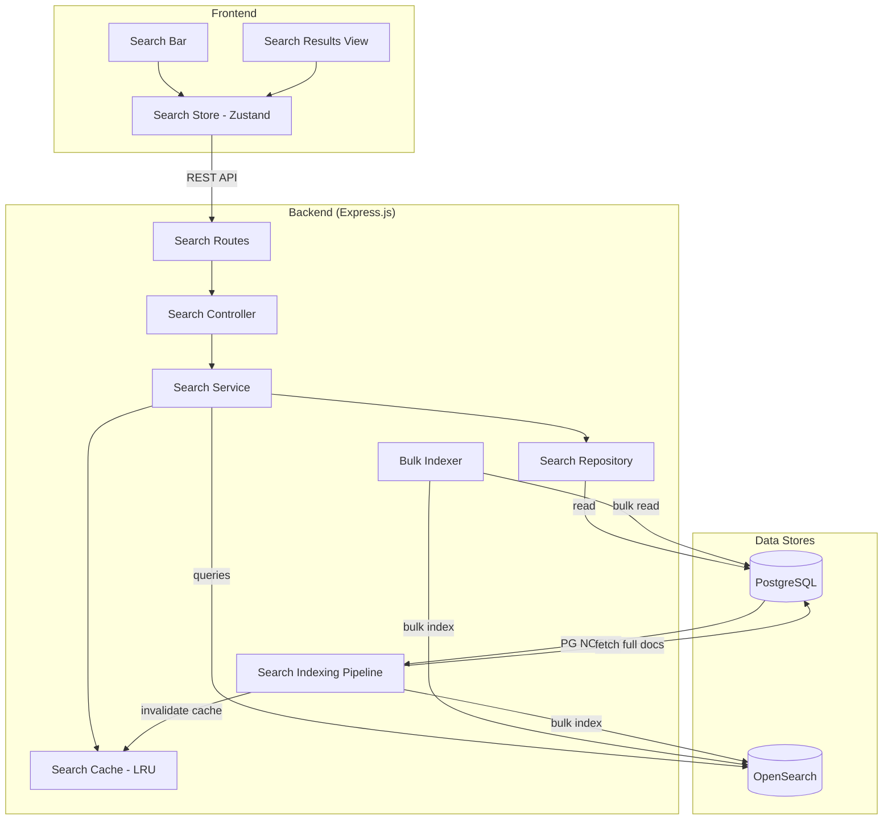
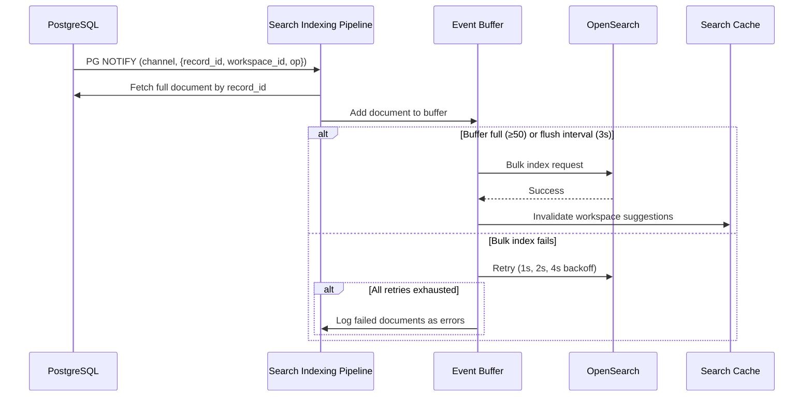
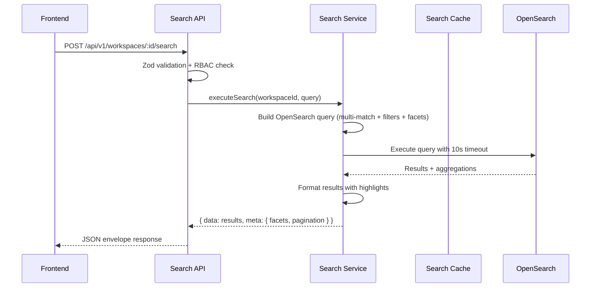

# Design Document — Module 6: Search Layer

## Overview

Module 6 adds full-text search capabilities to the Morket GTM data engine by introducing OpenSearch as a dedicated search engine alongside the existing PostgreSQL (OLTP) and ClickHouse (OLAP) stores. The search layer enables workspace members to perform fast, flexible searches across enrichment records, contact/company data, and scrape results using natural language queries, field-specific filters, fuzzy matching, faceted navigation, and autocomplete suggestions.

The module follows the same architectural patterns established in Modules 1–5:
- Backend: new `search` module under `packages/backend/src/modules/search/` with the standard layered architecture (Routes → Controllers → Services → Repository)
- Data pipeline: PG NOTIFY triggers → dedicated LISTEN connection → event buffer → bulk OpenSearch indexing (mirrors the Module 5 replication pipeline pattern)
- Caching: in-memory LRU cache with workspace-scoped invalidation (same pattern as `analytics.cache.ts`)
- Frontend: Zustand store + React components integrated into the existing App Shell

### Key Design Decisions

1. **Separate indexing pipeline (not shared with replication service)**: The search indexing pipeline listens on its own PG NOTIFY channels (`search_index_enrichment`, `search_index_records`, `search_index_scrape`) distinct from the ClickHouse replication channels. This avoids coupling the two pipelines and allows independent scaling, buffering, and retry configurations.

2. **Workspace-scoped indexes**: Each workspace gets its own OpenSearch index (`morket-workspace-{workspaceId}`). This provides natural data isolation, simplifies access control (no need for document-level security), and allows per-workspace reindexing without affecting other workspaces.

3. **OpenSearch client as singleton**: Following the `getPool()`/`getClickHouse()` pattern, the OpenSearch client uses a singleton `getOpenSearch()`/`initOpenSearch()` pattern for connection management.

4. **Bulk indexer with advisory locks**: Reindex operations use PostgreSQL advisory locks to prevent concurrent reindex runs for the same workspace, matching the transactional safety patterns used in credit mutations.

5. **Edge ngram analyzer for autocomplete**: Rather than using a separate completion suggester, the design uses an `edge_ngram` token filter on text fields. This keeps the mapping simpler and allows suggestions to come from the same index used for search.

## Architecture

### System Context Diagram



### Data Flow — Incremental Indexing



### Data Flow — Search Query



## Components and Interfaces

### Backend Module Structure

```
packages/backend/src/modules/search/
├── mappings/
│   └── workspace-index.v1.ts       # Index mapping definition (versioned)
├── opensearch/
│   └── client.ts                    # OpenSearch singleton client (getOpenSearch/initOpenSearch)
├── search.cache.ts                  # LRU cache for suggestions (reuses analytics.cache pattern)
├── search.controller.ts             # Controller factory — HTTP handlers
├── search.indexing-pipeline.ts      # PG NOTIFY listener + event buffer + bulk indexer
├── search.repository.ts             # PostgreSQL queries for index status, reindex jobs, full doc fetch
├── search.routes.ts                 # Route factories — workspace search + admin health routes
├── search.schemas.ts                # Zod schemas for search query, suggest, reindex, filters
├── search.service.ts                # Business logic — search, suggest, index management, bulk reindex
├── search.service.test.ts           # Unit tests
├── search.controller.test.ts        # Unit tests
├── search.cache.test.ts             # Unit tests
└── search.indexing-pipeline.test.ts # Unit tests
```

### Frontend Structure

```
packages/frontend/src/
├── api/
│   └── search.api.ts                # API client for search endpoints
├── components/
│   └── search/
│       ├── SearchBar.tsx             # Header search input with autocomplete dropdown
│       ├── SearchResultsView.tsx     # Full search results page
│       ├── FacetSidebar.tsx          # Faceted filter checkboxes
│       ├── SearchResultCard.tsx      # Individual result card with highlights
│       └── SearchPagination.tsx      # Pagination controls
├── stores/
│   └── search.store.ts              # Zustand store for search state
├── hooks/
│   └── useSearch.ts                 # Search hook with debounce
└── types/
    └── search.types.ts              # TypeScript types for search domain
```

### OpenSearch Client Interface (`opensearch/client.ts`)

```typescript
// Singleton pattern matching getPool()/getClickHouse()
import { Client } from '@opensearch-project/opensearch';

let client: Client | null = null;

export function initOpenSearch(config: OpenSearchConfig): Client;
export function getOpenSearch(): Client;  // throws if not initialized
export async function healthCheck(): Promise<ClusterHealth>;

interface OpenSearchConfig {
  nodeUrls: string[];          // from OPENSEARCH_NODE_URLS
  username?: string;           // from OPENSEARCH_USERNAME
  password?: string;           // from OPENSEARCH_PASSWORD
  requestTimeoutMs: number;    // from OPENSEARCH_REQUEST_TIMEOUT_MS (default 10000)
  maxRetries: number;          // default 3
  sslCertPath?: string;        // from OPENSEARCH_SSL_CERT_PATH
}

interface ClusterHealth {
  status: 'green' | 'yellow' | 'red';
  numberOfNodes: number;
  activeShards: number;
  unassignedShards: number;
  clusterName: string;
}
```

### Search Service Interface (`search.service.ts`)

```typescript
export function createSearchService(cache: SearchCache): SearchService;

interface SearchService {
  // Index management
  createWorkspaceIndex(workspaceId: string): Promise<void>;
  deleteWorkspaceIndex(workspaceId: string): Promise<void>;
  reindexWorkspace(workspaceId: string): Promise<ReindexJob>;
  getReindexStatus(workspaceId: string): Promise<ReindexStatus | null>;

  // Search
  search(workspaceId: string, query: SearchQuery): Promise<SearchResponse>;
  suggest(workspaceId: string, prefix: string): Promise<Suggestion[]>;

  // Health
  getClusterHealth(): Promise<ClusterHealth>;
  getIndexList(): Promise<IndexInfo[]>;
}
```

### Search Controller Interface (`search.controller.ts`)

```typescript
export function createSearchController(service: SearchService): SearchController;

interface SearchController {
  // Workspace-scoped search endpoints
  search(req: Request, res: Response, next: NextFunction): Promise<void>;
  suggest(req: Request, res: Response, next: NextFunction): Promise<void>;
  reindex(req: Request, res: Response, next: NextFunction): Promise<void>;
  getReindexStatus(req: Request, res: Response, next: NextFunction): Promise<void>;

  // Admin endpoints
  getClusterHealth(req: Request, res: Response, next: NextFunction): Promise<void>;
  getIndexList(req: Request, res: Response, next: NextFunction): Promise<void>;
}
```

### Search Routes (`search.routes.ts`)

```typescript
// Returns two routers: workspace-scoped search + admin health
export function createSearchRoutes(): { searchRoutes: Router; adminSearchRoutes: Router };
```

Route mapping:

| Method | Path | Auth | Handler |
|--------|------|------|---------|
| POST | `/api/v1/workspaces/:id/search` | member+ | `search` |
| GET | `/api/v1/workspaces/:id/search/suggest` | member+ | `suggest` |
| POST | `/api/v1/workspaces/:id/search/reindex` | admin | `reindex` |
| GET | `/api/v1/workspaces/:id/search/reindex/status` | admin | `getReindexStatus` |
| GET | `/api/v1/admin/search/health` | admin | `getClusterHealth` |
| GET | `/api/v1/admin/search/indices` | admin | `getIndexList` |

### Indexing Pipeline Interface (`search.indexing-pipeline.ts`)

```typescript
export function createSearchIndexingPipeline(
  config?: Partial<IndexingPipelineConfig>,
  deps?: IndexingPipelineDeps,
): SearchIndexingPipeline;

interface IndexingPipelineConfig {
  batchSize: number;          // default 50
  flushIntervalMs: number;    // default 3000
  maxRetries: number;         // default 3
  retryBackoffMs: number[];   // [1000, 2000, 4000]
}

interface IndexingPipelineDeps {
  searchCache?: SearchCache;  // for workspace invalidation on flush
}

interface SearchIndexingPipeline {
  start(): Promise<void>;
  stop(): Promise<void>;
  getStats(): IndexingStats;
  // Test helpers
  _handleNotification(channel: string, payload: string | undefined): void;
  _flushAll(): Promise<void>;
}
```

The pipeline follows the exact same pattern as `createReplicationService()`:
- Dedicated `pg.Client` connection for LISTEN (not from pool)
- Listens on channels: `search_index_enrichment`, `search_index_records`, `search_index_scrape`
- Buffers events in memory, flushes on batch size threshold or timer
- Fetches full document data from PostgreSQL using record IDs
- Transforms to OpenSearch document format matching the index mapping
- Sends bulk index/delete requests to OpenSearch
- Retries with exponential backoff, logs failures
- Invalidates suggestion cache for affected workspaces on flush

### Bulk Indexer (within `search.service.ts`)

The bulk indexer is part of the search service, not a separate component. It:
1. Acquires a PostgreSQL advisory lock (`pg_advisory_xact_lock(hashtext('reindex:' || workspaceId))`)
2. Creates a `search_reindex_jobs` row with status `running`
3. Reads records in cursor-based batches of 500 from PostgreSQL
4. Transforms and bulk-indexes each batch into OpenSearch
5. Updates progress (`indexed_documents`) after each batch
6. On failure: logs the failed batch, continues with remaining batches
7. On completion: updates job status to `completed` or `failed`, releases lock

### Search Cache (`search.cache.ts`)

Reuses the same LRU cache pattern from `analytics.cache.ts` with:
- Key format: `search:{workspaceId}:suggest:{prefix}`
- Default TTL: 30 seconds
- Max entries: 500
- `invalidateWorkspace(workspaceId)` clears all cached suggestions for a workspace
- Called by the indexing pipeline after each flush

### Zustand Store (`search.store.ts`)

```typescript
interface SearchState {
  // Query state
  query: string;
  filters: SearchFilters;
  sort: SearchSort;
  page: number;
  pageSize: number;

  // Results
  results: SearchResult[];
  totalResults: number;
  totalPages: number;
  facets: Record<string, FacetBucket[]>;
  executionTimeMs: number;

  // Suggestions
  suggestions: string[];
  suggestionsLoading: boolean;

  // Loading
  loading: boolean;
  error: string | null;

  // Actions
  setQuery(query: string): void;
  executeSearch(workspaceId: string): Promise<void>;
  fetchSuggestions(workspaceId: string, prefix: string): Promise<void>;
  toggleFacet(field: string, value: string): void;
  setSort(sort: SearchSort): void;
  setPage(page: number): void;
  clearFilters(): void;
  reset(): void;
}
```

## Data Models

### OpenSearch Index Mapping (v1)

Index name pattern: `morket-workspace-{workspaceId}`

```json
{
  "settings": {
    "number_of_shards": 1,
    "number_of_replicas": 1,
    "analysis": {
      "filter": {
        "edge_ngram_filter": {
          "type": "edge_ngram",
          "min_gram": 2,
          "max_gram": 15
        }
      },
      "analyzer": {
        "morket_analyzer": {
          "type": "custom",
          "tokenizer": "standard",
          "filter": ["lowercase", "asciifolding", "edge_ngram_filter"]
        }
      }
    }
  },
  "mappings": {
    "properties": {
      "document_type":      { "type": "keyword" },
      "record_id":          { "type": "keyword" },
      "workspace_id":       { "type": "keyword" },
      "name":               { "type": "text", "analyzer": "morket_analyzer", "search_analyzer": "standard", "fields": { "keyword": { "type": "keyword" } } },
      "email":              { "type": "text", "analyzer": "morket_analyzer", "search_analyzer": "standard", "fields": { "keyword": { "type": "keyword" } } },
      "company":            { "type": "text", "analyzer": "morket_analyzer", "search_analyzer": "standard", "fields": { "keyword": { "type": "keyword" } } },
      "job_title":          { "type": "text", "analyzer": "morket_analyzer", "search_analyzer": "standard", "fields": { "keyword": { "type": "keyword" } } },
      "location":           { "type": "text", "analyzer": "morket_analyzer", "search_analyzer": "standard", "fields": { "keyword": { "type": "keyword" } } },
      "phone":              { "type": "keyword" },
      "domain":             { "type": "keyword" },
      "provider_slug":      { "type": "keyword" },
      "enrichment_status":  { "type": "keyword" },
      "enrichment_fields":  { "type": "keyword" },
      "raw_data":           { "type": "object", "enabled": false },
      "tags":               { "type": "keyword" },
      "source_url":         { "type": "keyword" },
      "scrape_target_type": { "type": "keyword" },
      "created_at":         { "type": "date" },
      "updated_at":         { "type": "date" }
    }
  }
}
```

### PostgreSQL Tables (Migrations 014–016)

#### Migration 014: `search_index_status` table

```sql
CREATE TABLE search_index_status (
  id              UUID PRIMARY KEY DEFAULT gen_random_uuid(),
  workspace_id    UUID NOT NULL REFERENCES workspaces(id) ON DELETE CASCADE,
  last_indexed_at TIMESTAMPTZ,
  document_count  INTEGER NOT NULL DEFAULT 0,
  index_version   INTEGER NOT NULL DEFAULT 1,
  status          VARCHAR(20) NOT NULL DEFAULT 'active'
                  CHECK (status IN ('active', 'reindexing', 'error')),
  error_reason    TEXT,
  created_at      TIMESTAMPTZ NOT NULL DEFAULT NOW(),
  updated_at      TIMESTAMPTZ NOT NULL DEFAULT NOW(),
  CONSTRAINT uq_search_index_status_workspace UNIQUE (workspace_id)
);
```

#### Migration 015: `search_reindex_jobs` table

```sql
CREATE TABLE search_reindex_jobs (
  id                UUID PRIMARY KEY DEFAULT gen_random_uuid(),
  workspace_id      UUID NOT NULL REFERENCES workspaces(id) ON DELETE CASCADE,
  status            VARCHAR(20) NOT NULL DEFAULT 'pending'
                    CHECK (status IN ('pending', 'running', 'completed', 'failed')),
  total_documents   INTEGER NOT NULL DEFAULT 0,
  indexed_documents INTEGER NOT NULL DEFAULT 0,
  failed_documents  INTEGER NOT NULL DEFAULT 0,
  started_at        TIMESTAMPTZ,
  completed_at      TIMESTAMPTZ,
  error_reason      TEXT,
  created_at        TIMESTAMPTZ NOT NULL DEFAULT NOW()
);

CREATE INDEX idx_search_reindex_jobs_workspace_created
  ON search_reindex_jobs (workspace_id, created_at DESC);
```

#### Migration 016: PG NOTIFY triggers for search indexing

```sql
-- Enrichment records → search_index_enrichment channel
CREATE OR REPLACE FUNCTION notify_search_index_enrichment() RETURNS trigger AS $$
BEGIN
  IF TG_OP = 'DELETE' THEN
    PERFORM pg_notify('search_index_enrichment', json_build_object(
      'record_id', OLD.id,
      'workspace_id', OLD.workspace_id,
      'op', 'DELETE'
    )::text);
    RETURN OLD;
  ELSE
    PERFORM pg_notify('search_index_enrichment', json_build_object(
      'record_id', NEW.id,
      'workspace_id', NEW.workspace_id,
      'op', TG_OP
    )::text);
    RETURN NEW;
  END IF;
END;
$$ LANGUAGE plpgsql;

CREATE TRIGGER trg_search_index_enrichment
  AFTER INSERT OR UPDATE OR DELETE ON enrichment_records
  FOR EACH ROW EXECUTE FUNCTION notify_search_index_enrichment();

-- Contact/company records → search_index_records channel
CREATE OR REPLACE FUNCTION notify_search_index_records() RETURNS trigger AS $$
BEGIN
  IF TG_OP = 'DELETE' THEN
    PERFORM pg_notify('search_index_records', json_build_object(
      'record_id', OLD.id,
      'workspace_id', OLD.workspace_id,
      'op', 'DELETE'
    )::text);
    RETURN OLD;
  ELSE
    PERFORM pg_notify('search_index_records', json_build_object(
      'record_id', NEW.id,
      'workspace_id', NEW.workspace_id,
      'op', TG_OP
    )::text);
    RETURN NEW;
  END IF;
END;
$$ LANGUAGE plpgsql;

-- Applied to the spreadsheet data table (records table)
CREATE TRIGGER trg_search_index_records
  AFTER INSERT OR UPDATE OR DELETE ON records
  FOR EACH ROW EXECUTE FUNCTION notify_search_index_records();

-- Scrape results → search_index_scrape channel (callable function)
CREATE OR REPLACE FUNCTION notify_search_index_scrape(
  p_task_id UUID, p_workspace_id UUID, p_job_id UUID
) RETURNS void AS $$
BEGIN
  PERFORM pg_notify('search_index_scrape', json_build_object(
    'task_id', p_task_id,
    'workspace_id', p_workspace_id,
    'job_id', p_job_id,
    'op', 'INSERT'
  )::text);
END;
$$ LANGUAGE plpgsql;
```

### Zod Schemas (`search.schemas.ts`)

```typescript
// Search query schema
export const searchQuerySchema = z.object({
  q: z.string().max(500).default(''),
  filters: z.object({
    document_type: z.array(z.enum(['enrichment_record', 'contact', 'company', 'scrape_result'])).optional(),
    provider_slug: z.array(z.string()).optional(),
    enrichment_status: z.array(z.string()).optional(),
    scrape_target_type: z.array(z.string()).optional(),
    tags: z.array(z.string()).optional(),
    created_at: z.object({
      gte: z.string().datetime().optional(),
      lte: z.string().datetime().optional(),
    }).optional(),
    updated_at: z.object({
      gte: z.string().datetime().optional(),
      lte: z.string().datetime().optional(),
    }).optional(),
  }).optional().default({}),
  facets: z.array(z.enum([
    'document_type', 'provider_slug', 'enrichment_status', 'scrape_target_type', 'tags'
  ])).optional().default(['document_type', 'provider_slug', 'enrichment_status', 'scrape_target_type', 'tags']),
  page: z.coerce.number().int().positive().default(1),
  pageSize: z.coerce.number().int().min(1).max(100).default(20),
  sort: z.object({
    field: z.enum(['_score', 'created_at', 'updated_at', 'name']).default('_score'),
    direction: z.enum(['asc', 'desc']).default('desc'),
  }).optional().default({ field: '_score', direction: 'desc' }),
  fuzziness: z.enum(['0', '1', '2', 'AUTO']).optional().default('AUTO'),
});

// Suggest query schema
export const suggestQuerySchema = z.object({
  q: z.string().min(2).max(100),
});

// Search result schema (for response validation / round-trip)
export const searchResultSchema = z.object({
  record_id: z.string(),
  document_type: z.string(),
  workspace_id: z.string(),
  name: z.string().nullable(),
  email: z.string().nullable(),
  company: z.string().nullable(),
  job_title: z.string().nullable(),
  location: z.string().nullable(),
  phone: z.string().nullable(),
  domain: z.string().nullable(),
  provider_slug: z.string().nullable(),
  enrichment_status: z.string().nullable(),
  tags: z.array(z.string()).nullable(),
  source_url: z.string().nullable(),
  scrape_target_type: z.string().nullable(),
  created_at: z.string(),
  updated_at: z.string(),
  score: z.number(),
  highlights: z.record(z.array(z.string())).optional(),
});

// Workspace params
export const workspaceParamsSchema = z.object({
  id: z.string().uuid(),
});
```

### API Response Shapes

Search response:
```json
{
  "success": true,
  "data": [
    {
      "record_id": "uuid",
      "document_type": "enrichment_record",
      "name": "Jane Doe",
      "company": "Acme Corp",
      "score": 12.5,
      "highlights": {
        "name": ["<mark>Jane</mark> Doe"],
        "company": ["<mark>Acme</mark> Corp"]
      }
    }
  ],
  "meta": {
    "total": 142,
    "page": 1,
    "pageSize": 20,
    "totalPages": 8,
    "executionTimeMs": 45,
    "facets": {
      "document_type": [
        { "value": "enrichment_record", "count": 89 },
        { "value": "contact", "count": 53 }
      ],
      "provider_slug": [
        { "value": "apollo", "count": 67 },
        { "value": "clearbit", "count": 42 }
      ]
    }
  }
}
```

Suggest response:
```json
{
  "success": true,
  "data": ["Jane Doe", "Jane Smith", "Janice Brown"]
}
```


## Correctness Properties

*A property is a characteristic or behavior that should hold true across all valid executions of a system — essentially, a formal statement about what the system should do. Properties serve as the bridge between human-readable specifications and machine-verifiable correctness guarantees.*

### Property 1: SearchQuery serialization round-trip

*For any* valid SearchQuery object (with arbitrary search term up to 500 chars, any combination of filters, valid pagination, and valid sort), serializing to JSON via `JSON.stringify` and deserializing back through the `searchQuerySchema.parse()` Zod schema shall produce an object deeply equal to the original.

**Validates: Requirements 14.3**

### Property 2: SearchResult serialization round-trip

*For any* valid SearchResult object (with arbitrary field values, score, and highlight fragments), parsing through the `searchResultSchema.parse()` Zod schema and re-serializing via `JSON.stringify` shall produce a string identical to the original serialization.

**Validates: Requirements 14.5**

### Property 3: Document transformation preserves required fields

*For any* valid PostgreSQL record (enrichment record, contact/company record, or scrape result), transforming it into an OpenSearch document shall produce an object containing all required Index_Mapping fields (`document_type`, `record_id`, `workspace_id`, `created_at`, `updated_at`) with correct types, and the `document_type` value shall match the source table.

**Validates: Requirements 3.4**

### Property 4: Idempotent indexing

*For any* document and any number of times it is indexed (≥1), the OpenSearch index shall contain exactly one document with that `record_id`. Re-indexing the same document shall overwrite the previous version without producing duplicates.

**Validates: Requirements 3.8**

### Property 5: Workspace scoping on all queries

*For any* search query or suggestion query and *for any* workspace ID, the generated OpenSearch query body shall contain a mandatory `term` filter on `workspace_id` matching the authenticated user's workspace. No query shall be sent to OpenSearch without this filter.

**Validates: Requirements 5.9, 7.5**

### Property 6: Field-specific query parsing

*For any* search term containing the pattern `{field}:{value}` where `field` is one of the searchable fields (`name`, `email`, `company`, `job_title`, `location`, `domain`), the query builder shall produce a field-specific `match` query on that field rather than a multi-match query. For search terms without the `field:value` pattern, the query builder shall produce a multi-match query across all searchable fields.

**Validates: Requirements 5.2**

### Property 7: Filter application produces correct query clauses

*For any* combination of keyword filters (`document_type`, `provider_slug`, `enrichment_status`, `scrape_target_type`, `tags`) and date range filters (`created_at`, `updated_at`), the generated OpenSearch query shall contain a `bool.filter` clause with one `terms` filter per active keyword filter and one `range` filter per active date range filter. The number of filter clauses shall equal the number of active filters.

**Validates: Requirements 5.4, 5.5**

### Property 8: Pagination computes correct from/size with max window guard

*For any* valid `page` (≥1) and `pageSize` (1–100), the OpenSearch query shall set `from` to `(page - 1) * pageSize` and `size` to `pageSize`. *For any* `page` and `pageSize` where `page × pageSize > 10,000`, the service shall reject the request with a 400 error before querying OpenSearch.

**Validates: Requirements 5.7, 15.6**

### Property 9: Response envelope structure

*For any* response from the search API (search, suggest, reindex status, health), the response body shall conform to the `{ success, data, error, meta }` envelope format. For search responses specifically, `meta` shall contain `total` (≥0), `page` (≥1), `pageSize` (1–100), and `totalPages` (≥0) where `totalPages = ceil(total / pageSize)`.

**Validates: Requirements 9.4, 9.5**

### Property 10: Suggestion response invariants

*For any* suggestion query response, the returned suggestions array shall: (a) contain at most 10 items, (b) contain no duplicate strings, and (c) be sorted by document frequency in descending order (each item's frequency ≥ the next item's frequency).

**Validates: Requirements 7.1, 7.3, 7.4**

### Property 11: Facet buckets have no zero counts

*For any* search response containing facets, every facet bucket in every facet field shall have a `count` value ≥ 1. No bucket with `count` of 0 shall appear in the response.

**Validates: Requirements 6.4**

### Property 12: Invalid inputs return 400

*For any* request body or query parameter that fails Zod schema validation (e.g., search term > 500 chars, suggest prefix < 2 chars, invalid sort field, pageSize > 100, non-UUID workspace ID), the API shall return HTTP 400 with `success: false` and field-level error details in the `error` field.

**Validates: Requirements 9.2, 7.7**

### Property 13: Cache key isolation by workspace

*For any* two distinct workspace IDs and the same suggestion prefix, the cache shall store and return separate entries. A cache hit for workspace A's prefix shall never be returned for workspace B's identical prefix query.

**Validates: Requirements 15.3, 15.4**

### Property 14: Cache invalidation on index flush

*For any* workspace that receives newly indexed documents via the indexing pipeline flush, all cached suggestion entries for that workspace shall be invalidated. A subsequent suggestion query for that workspace shall query OpenSearch rather than returning stale cached data.

**Validates: Requirements 15.5**

### Property 15: Index naming follows workspace pattern

*For any* workspace ID (valid UUID), the created OpenSearch index name shall be exactly `morket-workspace-{workspaceId}` where `{workspaceId}` is the lowercase UUID string. The index name shall be deterministic — the same workspace ID always produces the same index name.

**Validates: Requirements 2.1**

### Property 16: NOTIFY payload contains only identifiers

*For any* PG NOTIFY payload emitted by the search indexing triggers, the JSON payload shall contain only identifier fields (UUIDs and operation type string) and shall not contain any document content fields. The total payload size shall be well under the 8000-byte PostgreSQL NOTIFY limit.

**Validates: Requirements 8.5**

## Error Handling

### Error Classification

The search module uses the existing `AppError` hierarchy with these specific error scenarios:

| Error Type | HTTP Status | Scenario |
|-----------|-------------|----------|
| `ValidationError` | 400 | Invalid search query, suggest prefix too short, invalid filters, pageSize > 100, result window > 10,000 |
| `NotFoundError` | 404 | Workspace index does not exist (e.g., reindex status for workspace with no index) |
| `ConflictError` | 409 | Concurrent reindex attempt for the same workspace (advisory lock already held) |
| `AppError` (custom) | 408 | Search query timeout (>10s) |
| `AppError` (custom) | 503 | OpenSearch cluster unreachable |

### Error Handling Patterns

1. **OpenSearch unreachable**: The search service catches connection errors from the OpenSearch client and throws a 503 `AppError` with message "Search service temporarily unavailable". The global `errorHandler` middleware formats this into the standard JSON envelope.

2. **Query timeout**: The OpenSearch client is configured with a 10-second request timeout. On timeout, the service catches the error and throws a 408 `AppError` with message "Search query timed out".

3. **Indexing pipeline failures**: Failed bulk index operations are retried 3 times with exponential backoff (1s, 2s, 4s). After exhausting retries, failed documents are logged at error level with their record IDs and workspace IDs. Unlike the ClickHouse replication pipeline, the search indexing pipeline does not use a dead letter queue — documents will be re-indexed on the next data change or during a manual reindex operation.

4. **Bulk reindex failures**: Individual batch failures during bulk reindex are logged and skipped. The reindex job continues with remaining batches. The final job status reflects partial completion (`failed_documents > 0`).

5. **Startup resilience**: If OpenSearch is unreachable during application startup, the client logs a warning but does not block the Express API from starting. Search endpoints return 503 until the cluster becomes available. The indexing pipeline buffers events and attempts to flush when the cluster recovers.

6. **Zero results**: Search queries returning zero results are not errors — they return HTTP 200 with an empty `data` array and zero-value facets.

### OpenSearch Query Construction Safety

- All user-provided search terms are passed through OpenSearch's query string escaping to prevent query injection
- Field-specific search (`field:value`) validates the field name against an allowlist before constructing the query
- Filter values are passed as `terms` filter arrays, not interpolated into query strings
- The `raw_data` field is `enabled: false` in the mapping and is never searchable or returned in results

## Testing Strategy

### Property-Based Testing

Property-based tests use `fast-check` and are located in `packages/backend/tests/property/search.property.test.ts`. Each test runs a minimum of 100 iterations.

Tests to implement:

| Property | Test Description | Generator Strategy |
|----------|-----------------|-------------------|
| P1 | SearchQuery round-trip | Generate arbitrary SearchQuery objects with random search terms (0–500 chars), random filter combinations, valid page/pageSize, valid sort fields |
| P2 | SearchResult round-trip | Generate arbitrary SearchResult objects with random field values, scores, and highlight arrays |
| P3 | Document transformation | Generate random PG rows for each document type, verify transformed OpenSearch documents have required fields |
| P5 | Workspace scoping | Generate random workspace UUIDs and search/suggest queries, verify the built OpenSearch query body always contains workspace_id term filter |
| P6 | Field-specific query parsing | Generate random `field:value` strings and plain search terms, verify correct query type is produced |
| P7 | Filter application | Generate random filter combinations (0–5 keyword filters, 0–2 date ranges), verify correct number and type of filter clauses |
| P8 | Pagination | Generate random page (1–1000) and pageSize (1–100), verify from/size calculation and max window rejection |
| P9 | Response envelope | Generate random search responses, verify envelope structure and pagination math |
| P10 | Suggestion invariants | Generate random suggestion arrays, verify max 10, no duplicates, sorted by frequency |
| P11 | Facet bucket invariants | Generate random facet results, verify no zero-count buckets |
| P12 | Invalid input rejection | Generate strings outside valid ranges (too long, too short, invalid enum values), verify 400 response |
| P13 | Cache key isolation | Generate pairs of distinct workspace UUIDs with same prefix, verify separate cache entries |
| P14 | Cache invalidation | Generate workspace IDs, populate cache, simulate flush, verify cache miss |
| P15 | Index naming | Generate random UUIDs, verify index name matches pattern |
| P16 | NOTIFY payload | Generate random record IDs and operation types, verify payload contains only identifiers |

Each test must be tagged with a comment:
```typescript
// Feature: search-layer, Property 1: SearchQuery serialization round-trip
```

### Unit Testing

Unit tests are co-located with source files as `*.test.ts`:

- `search.service.test.ts` — Mock OpenSearch client, test search/suggest/reindex logic, error handling
- `search.controller.test.ts` — Mock service, test HTTP request/response handling, status codes
- `search.cache.test.ts` — Test LRU eviction, TTL expiry, workspace invalidation
- `search.indexing-pipeline.test.ts` — Mock PG client and OpenSearch client, test event buffering, flush logic, retry behavior

Key unit test scenarios:
- Search with empty query returns all documents (scoped to workspace)
- Search with `field:value` syntax produces field-specific query
- Facet filters are applied correctly and facet counts recomputed
- Suggestion deduplication works across multiple fields
- Cache returns hit within TTL, miss after TTL
- Indexing pipeline buffers events and flushes at threshold
- Bulk reindex acquires advisory lock and prevents concurrent runs
- OpenSearch unreachable returns 503
- Query timeout returns 408
- Zero results returns 200 with empty array

### Integration Testing

Integration tests in `packages/backend/tests/integration/search.integration.test.ts`:

- Full search flow: index a document → search for it → verify result
- Reindex flow: create workspace → bulk reindex → verify all documents indexed
- Faceted search: index documents with different types → search with facet filter → verify filtered results and updated facet counts
- Suggest flow: index documents → query suggestions → verify autocomplete results
- Health endpoint returns cluster status
- Admin indices endpoint returns workspace index list

### Frontend Testing

- `search.store.test.ts` — Zustand store actions, state transitions, API call mocking
- `SearchBar.test.tsx` — Keyboard navigation, debounce, suggestion selection
- `SearchResultsView.test.tsx` — Result rendering, facet toggling, pagination
