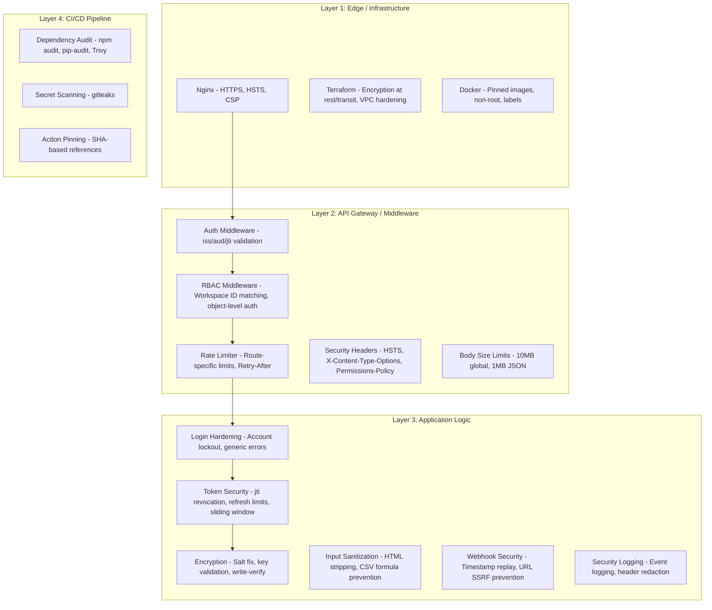

# Design Document: Security Audit

## Overview

This design specifies the security hardening changes required across the Morket platform — a GTM data engine handling sensitive credentials, OAuth tokens, billing data, and web scraping operations. The audit addresses 13 requirement areas spanning the backend (Express.js/TypeScript), frontend (React/TypeScript), scraper (Python/FastAPI), infrastructure (Terraform/Docker), and CI/CD (GitHub Actions).

The approach is incremental: each hardening change is a targeted modification to an existing file or configuration, not a new module. The changes are organized by layer (backend middleware, backend modules, scraper, frontend, infrastructure, CI/CD) to minimize merge conflicts and allow parallel implementation.

### Key Findings from Codebase Research

1. **Auth middleware** (`middleware/auth.ts`): Only validates JWT signature — missing `iss`, `aud`, `jti` claim validation. No account lockout mechanism.
2. **RBAC middleware** (`middleware/rbac.ts`): Does not verify workspace ID in URL matches user context. No object-level authorization enforcement.
3. **Rate limiter** (`middleware/rateLimiter.ts`): Only two tiers (auth: 5/min, general: 100/min). No `Retry-After` header. No enrichment or admin-specific limits.
4. **Error handler** (`middleware/errorHandler.ts`): Logs stack traces but doesn't explicitly strip them from responses in production. The generic 500 message is good, but `AppError` responses could leak internal details.
5. **Encryption** (`shared/encryption.ts`): Uses `Buffer.alloc(0)` as HKDF salt (empty). No master key length validation at runtime. No write-verify pattern.
6. **Scraper auth** (`middleware/auth.py`): Uses `!=` for string comparison (timing attack vulnerable). Service key hardcoded as `"placeholder"` in `create_app()`.
7. **Nginx** (`docker/nginx.conf`): No HTTPS redirect, no HSTS, no CSP header, `X-Frame-Options` set to `SAMEORIGIN` instead of `DENY`, uses deprecated `X-XSS-Protection: 1`.
8. **Dockerfiles**: Use mutable version tags (`node:20-alpine`, `python:3.11-slim`). No `LABEL` directives for provenance.
9. **CI pipeline**: No dependency audit, no container scanning, no secret scanning. GitHub Actions use `@v4`/`@v5` tags instead of pinned SHAs.
10. **Terraform secrets**: `encryption_master_key` generated via `random_password` (alphanumeric) instead of hex string. VPC flow logs are conditional. ECS internal SG allows all ports.
11. **Frontend auth store**: Tokens stored in Zustand memory only (good). No explicit DOM sanitization for enrichment data or deep link validation.
12. **Observability logger**: No header/field redaction for sensitive values in request logs.

## Architecture

The security hardening follows a defense-in-depth approach across four layers:



### Design Decisions

1. **In-memory account lockout**: Use the existing in-memory rate limiter pattern (Map-based) for login attempt tracking rather than adding a database table. This is consistent with the existing rate limiter and avoids migration complexity. Trade-off: lockout state is lost on restart, which is acceptable since it's a brute-force mitigation, not a permanent ban.

2. **JWT revocation via Redis**: Store revoked `jti` values in Redis with TTL matching the access token expiry (15min). This avoids a database query on every request while providing revocation capability. Falls back to no-revocation-check if Redis is unavailable (graceful degradation, consistent with existing Redis patterns).

3. **Constant-time comparison for scraper**: Use Python's `hmac.compare_digest()` instead of `==` for service key validation. This is a one-line change with significant security impact.

4. **Input sanitization as middleware**: Add a shared `sanitizeString()` utility rather than per-module sanitization. This ensures consistent HTML entity encoding across all string inputs.

5. **Webhook timestamp validation**: Include a `t=` timestamp in the HMAC payload and reject webhooks older than 5 minutes. This prevents replay attacks without requiring server-side nonce storage.

6. **SSRF prevention via URL validation**: Create a shared `validateWebhookUrl()` utility that resolves DNS and checks against RFC 1918 ranges. Applied to both webhook subscription URLs and scraper target URLs.

## Components and Interfaces

### Backend Middleware Changes

#### 1. Auth Middleware Enhancement (`middleware/auth.ts`)
- Add `iss` and `aud` claim validation to `jwt.verify()` options
- Add `jti` claim extraction and revocation check against Redis
- Add public routes for invitation accept/decline endpoints

```typescript
interface JwtPayload {
  userId: string;
  role?: string;
  workspaceId?: string;
  jti?: string;
  iss?: string;
  aud?: string;
}

// jwt.verify options extended:
const verifyOptions: jwt.VerifyOptions = {
  issuer: 'morket',
  audience: 'morket-api',
};
```

#### 2. RBAC Middleware Enhancement (`middleware/rbac.ts`)
- Add workspace ID cross-check: verify `req.params.id` matches the membership query result
- Export a `requireObjectOwnership()` middleware factory for resource-level auth

#### 3. Rate Limiter Enhancement (`middleware/rateLimiter.ts`)
- Add `Retry-After` header to 429 responses
- Export additional limiter instances: `enrichmentRateLimiter` (20/min), `adminRateLimiter` (10/min)

#### 4. Error Handler Enhancement (`middleware/errorHandler.ts`)
- Strip stack traces from `AppError` responses in production
- Ensure no internal file paths or DB error details leak

#### 5. New: Security Headers Middleware (`middleware/securityHeaders.ts`)
- Set `Strict-Transport-Security`, `X-Content-Type-Options`, `X-Frame-Options`, `X-XSS-Protection: 0`, `Permissions-Policy`
- Disable `X-Powered-By` (supplement helmet config)

#### 6. New: Request Body Size Middleware
- Configure `express.json({ limit: '1mb' })` for JSON
- Add `express.raw({ limit: '10mb' })` for file uploads

### Backend Module Changes

#### 7. Auth Service Enhancement (`modules/auth/auth.service.ts`)
- Add `jti` claim to access tokens via `crypto.randomUUID()`
- Add account lockout tracking (in-memory Map, 5 attempts / 15 min window)
- Add refresh token replay detection: if token not found, revoke all user tokens
- Add password change → revoke all refresh tokens
- Add sliding window refresh: issue new refresh token if within 1 day of expiry
- Limit active refresh tokens to 10 per user

#### 8. Encryption Enhancement (`shared/encryption.ts`)
- Validate master key is exactly 32 bytes before HKDF
- Use workspace ID hash as HKDF salt instead of empty buffer
- Add write-verify pattern: decrypt after encrypt to verify integrity

#### 9. Security Logger (`observability/logger.ts`)
- Add header redaction for `Authorization`, `X-Service-Key`
- Add field redaction for `password`, `secret`, `token`, `apiKey`
- Add security event logging functions: `logAuthFailure()`, `logAuthzFailure()`, `logRateLimitHit()`, `logWebhookFailure()`

#### 10. Input Sanitization Utility (`shared/sanitize.ts`)
- `sanitizeString(input: string): string` — HTML entity encode `<`, `>`, `"`, `'`, `&`
- `isFormulaInjection(value: string): boolean` — detect cells starting with `=`, `+`, `-`, `@`
- `validateUrlSafety(url: string): Promise<boolean>` — resolve DNS, reject RFC 1918/loopback/link-local

#### 11. Webhook Enhancement (`modules/enrichment/webhook.service.ts`)
- Include timestamp in HMAC payload: `${timestamp}.${JSON.stringify(payload)}`
- Validate webhook subscription URLs are HTTPS-only and not internal IPs

### Scraper Changes

#### 12. Auth Middleware Fix (`middleware/auth.py`)
- Replace `!=` with `hmac.compare_digest()` for constant-time comparison
- Load service key from settings (already available via `ScraperSettings`)

#### 13. App Factory Fix (`main.py`)
- Replace hardcoded `"placeholder"` with `settings.backend_service_key`
- Fail startup if `SERVICE_KEY` env var is not set

#### 14. URL Validation (`validators/url_validator.py`)
- Validate scrape target URLs: only `http`/`https` schemes
- Reject private/internal IP ranges (RFC 1918, link-local, loopback)

### Frontend Changes

#### 15. Content Sanitization
- Add `sanitizeHtml()` utility for escaping HTML entities in rendered content
- Apply to spreadsheet cell values, search results, workspace names, enrichment data

#### 16. Deep Link Validation
- Validate route parameters against expected UUID/slug patterns before API calls

#### 17. Referrer Policy
- Add `Referrer-Policy: strict-origin-when-cross-origin` to Axios request headers

### Infrastructure Changes

#### 18. Nginx Hardening (`docker/nginx.conf`)
- Add HTTPS redirect (port 80 → 443)
- Add HSTS header (max-age=31536000, includeSubDomains)
- Add CSP header (default-src 'self', script-src 'self', etc.)
- Change `X-Frame-Options` from `SAMEORIGIN` to `DENY`
- Change `X-XSS-Protection` from `1; mode=block` to `0`

#### 19. Dockerfile Hardening
- Pin to specific version tags (e.g., `node:20.11-alpine`, `python:3.11.7-slim`)
- Add `LABEL` directives (maintainer, version, description)
- Add `--disable-extensions` and `--disable-background-networking` to scraper Chromium flags

#### 20. Terraform Hardening
- VPC: Enable flow logs unconditionally (remove `count` conditional)
- VPC: Restrict ECS internal SG to ports 3000, 8001, 7233
- Secrets: Generate `encryption_master_key` as hex string using `random_id` instead of `random_password`
- S3: Ensure `block_public_access`, versioning, lifecycle policies
- Data stores: Verify encryption at rest and in transit for Aurora, Redis, OpenSearch, RabbitMQ

### CI/CD Changes

#### 21. CI Pipeline Hardening (`.github/workflows/ci.yml`)
- Add `npm audit --audit-level=high` step to backend and frontend jobs
- Add `pip-audit` step to scraper job
- Add Trivy container scan step
- Add gitleaks secret scanning step

#### 22. Deploy Pipeline Hardening (`.github/workflows/deploy.yml`)
- Pin all GitHub Actions to commit SHAs
- Add secret scanning step before Docker builds

## Data Models

### New: JWT Revocation (Redis)
```
Key: jti:{jti_value}
Value: "revoked"
TTL: 900 (15 minutes, matching access token expiry)
```

### New: Account Lockout (In-Memory)
```typescript
interface LoginAttemptTracker {
  // Map<email, { attempts: number; lockedUntil: number | null; timestamps: number[] }>
}
```

### Modified: JWT Access Token Claims
```typescript
interface AccessTokenPayload {
  userId: string;
  role: string;        // NEW: user role in workspace context
  workspaceId: string; // NEW: active workspace ID
  jti: string;         // NEW: unique token ID for revocation
  iss: string;         // NEW: "morket"
  aud: string;         // NEW: "morket-api"
  iat: number;
  exp: number;
}
```

### Modified: Refresh Token Table
No schema change needed — the existing `refresh_tokens` table already has `user_id`, `token_hash`, `expires_at`, `revoked_at` columns. The new behaviors (replay detection, max 10 tokens, sliding window) are enforced in application logic.

### Existing: Encryption (Modified Behavior)
```typescript
// HKDF salt changes from Buffer.alloc(0) to:
const salt = crypto.createHash('sha256').update(workspaceId).digest();
```


## Correctness Properties

*A property is a characteristic or behavior that should hold true across all valid executions of a system — essentially, a formal statement about what the system should do. Properties serve as the bridge between human-readable specifications and machine-verifiable correctness guarantees.*

### Property 1: Generic login error messages

*For any* login attempt with either a non-existent email or an incorrect password, the error response message SHALL be identical (e.g., "Invalid credentials"), preventing user enumeration.

**Validates: Requirements 1.1**

### Property 2: JWT claim validation rejects invalid tokens

*For any* JWT where the `iss` claim is not `"morket"` or the `aud` claim is not `"morket-api"`, the auth middleware SHALL reject the token with an authentication error, even if the signature is valid.

**Validates: Requirements 1.3**

### Property 3: Access tokens contain required claims

*For any* access token generated by the auth service, decoding it SHALL reveal `userId`, `jti`, `iss`, `aud`, `role`, and `workspaceId` claims, all with non-empty values.

**Validates: Requirements 1.5, 10.5**

### Property 4: RBAC workspace ID cross-check

*For any* workspace-scoped request where the URL workspace ID does not match the user's authenticated workspace membership, the RBAC middleware SHALL reject the request with a 403 status code.

**Validates: Requirements 2.1**

### Property 5: Role hierarchy enforcement

*For any* user with a role below the minimum required role for an endpoint, the RBAC middleware SHALL reject the request with a 403 status code. Specifically: viewers cannot perform write operations, non-admins cannot access admin endpoints, and billing_admin can only access billing endpoints.

**Validates: Requirements 2.2, 2.4, 2.5**

### Property 6: Zod validation returns field-level errors

*For any* request payload that fails Zod schema validation, the response SHALL be a 400 status with a body containing field-level error details, and the request SHALL NOT reach the controller.

**Validates: Requirements 3.2**

### Property 7: HTML sanitization encodes dangerous characters

*For any* string containing HTML metacharacters (`<`, `>`, `"`, `'`, `&`), the `sanitizeString()` function SHALL return a string where all such characters are HTML-entity encoded, and the output SHALL not contain any unescaped HTML tags.

**Validates: Requirements 3.3, 9.2, 9.3**

### Property 8: Formula injection detection

*For any* string starting with `=`, `+`, `-`, or `@`, the `isFormulaInjection()` function SHALL return `true`. For any string not starting with these characters, it SHALL return `false`.

**Validates: Requirements 3.5**

### Property 9: URL scheme and IP range validation

*For any* URL with a scheme other than `http` or `https`, the URL validator SHALL reject it. *For any* URL whose hostname resolves to an RFC 1918 address (10.0.0.0/8, 172.16.0.0/12, 192.168.0.0/16), loopback (127.0.0.0/8), or link-local (169.254.0.0/16) range, the validator SHALL reject it.

**Validates: Requirements 3.8, 13.4, 13.6**

### Property 10: Rate limiter includes Retry-After header

*For any* request that exceeds the rate limit, the 429 response SHALL include a `Retry-After` header with a positive numeric value representing seconds until the client may retry.

**Validates: Requirements 4.2**

### Property 11: Security headers present on all responses

*For any* HTTP response from the backend, the following headers SHALL be present: `Strict-Transport-Security` (with max-age ≥ 31536000), `X-Content-Type-Options: nosniff`, `X-Frame-Options: DENY`, and `Permissions-Policy`. The `X-Powered-By` header SHALL NOT be present.

**Validates: Requirements 4.3, 4.6**

### Property 12: Error responses exclude internal details in production

*For any* error thrown in production mode, the JSON response body SHALL NOT contain stack traces, internal file paths (matching patterns like `/app/src/` or `.ts:`), or raw database error messages.

**Validates: Requirements 4.4**

### Property 13: CORS rejects unlisted origins

*For any* origin not in the configured allowlist, CORS preflight requests SHALL NOT receive `Access-Control-Allow-Origin` in the response.

**Validates: Requirements 4.8**

### Property 14: Master key length validation

*For any* Buffer that is not exactly 32 bytes, `deriveWorkspaceKey()` SHALL throw an error before attempting HKDF derivation.

**Validates: Requirements 5.1**

### Property 15: Unique workspace key derivation

*For any* two distinct workspace IDs and the same master key, `deriveWorkspaceKey()` SHALL produce different derived keys.

**Validates: Requirements 5.2**

### Property 16: Encryption round-trip (write-verify)

*For any* plaintext string and valid 32-byte key, encrypting then decrypting SHALL produce the original plaintext.

**Validates: Requirements 5.3**

### Property 17: Log redaction of sensitive fields

*For any* log entry containing headers (`Authorization`, `X-Service-Key`) or body fields (`password`, `secret`, `token`, `apiKey`), the logged output SHALL contain redacted placeholder values (e.g., `[REDACTED]`) instead of the actual values.

**Validates: Requirements 5.5, 8.5**

### Property 18: AI filter whitelist validation

*For any* structured filter generated by the AI natural language parser, all field names SHALL be members of the allowed field whitelist, and all operators SHALL be members of the allowed operator set.

**Validates: Requirements 3.7**

### Property 19: Rate limiter enforces per-route limits

*For any* rate limiter instance configured with `maxRequests` and `windowMs`, after exactly `maxRequests` requests from the same IP within the window, the next request SHALL be rejected with a 429 status.

**Validates: Requirements 4.1**

### Property 20: Token expiry Zod validation

*For any* environment configuration where `JWT_ACCESS_EXPIRY` exceeds 15 minutes or `JWT_REFRESH_EXPIRY` exceeds 7 days, the Zod env schema SHALL reject the configuration.

**Validates: Requirements 10.1**

### Property 21: Refresh token limit per user

*For any* user, after creating more than 10 active refresh tokens, the total number of active (non-revoked) refresh tokens SHALL be at most 10, with the oldest tokens revoked first.

**Validates: Requirements 10.3**

### Property 22: Security event log structure

*For any* security event (failed login, authorization failure, rate limit hit, JWT validation failure, webhook signature failure), the log entry SHALL contain `trace_id`, `span_id`, `timestamp`, `level` (warn or error), and the event-specific fields (source IP, user agent, etc.).

**Validates: Requirements 11.1, 11.2, 11.3, 11.4, 11.6, 11.7**

### Property 23: Credential audit logging

*For any* credential CRUD operation (create, read, update, delete), the system SHALL write an audit log entry containing the acting user ID, workspace ID, and credential ID, but never the credential value.

**Validates: Requirements 11.8**

### Property 24: Webhook HMAC includes timestamp for replay prevention

*For any* webhook payload, the HMAC signature SHALL be computed over `${timestamp}.${payload}`, and verification SHALL reject any webhook where the timestamp is more than 5 minutes old.

**Validates: Requirements 13.2**

### Property 25: Webhook HMAC sign-verify round-trip

*For any* payload and shared secret, signing the payload with HMAC-SHA256 and then verifying the signature with the same secret SHALL succeed.

**Validates: Requirements 13.5**

### Property 26: Deep link parameter validation

*For any* route parameter string that does not match the expected pattern (UUID v4 for IDs, alphanumeric-dash for slugs), the frontend validator SHALL reject it before making an API call.

**Validates: Requirements 9.5**

## Error Handling

### Backend Error Handling

All security-related errors use the existing `AppError` hierarchy:

| Scenario | Error Class | Status | Code |
|----------|------------|--------|------|
| Invalid/expired JWT | `AuthenticationError` | 401 | `AUTHENTICATION_ERROR` |
| Missing JWT claims (iss/aud) | `AuthenticationError` | 401 | `AUTHENTICATION_ERROR` |
| Revoked JWT (jti in revocation list) | `AuthenticationError` | 401 | `AUTHENTICATION_ERROR` |
| Account locked (too many attempts) | `RateLimitError` | 429 | `RATE_LIMIT_ERROR` |
| Workspace ID mismatch | `AuthorizationError` | 403 | `AUTHORIZATION_ERROR` |
| Insufficient role | `AuthorizationError` | 403 | `AUTHORIZATION_ERROR` |
| Zod validation failure | `ValidationError` | 400 | `VALIDATION_ERROR` |
| Formula injection detected | `ValidationError` | 400 | `VALIDATION_ERROR` |
| Invalid webhook URL (SSRF) | `ValidationError` | 400 | `VALIDATION_ERROR` |
| Webhook signature mismatch | `AuthenticationError` | 401 | `AUTHENTICATION_ERROR` |
| Request body too large | Express built-in | 413 | `PAYLOAD_TOO_LARGE` |
| Rate limit exceeded | `RateLimitError` | 429 | `RATE_LIMIT_ERROR` |
| Invalid master key length | Runtime error | Startup failure | N/A |

### Production Error Sanitization

The error handler in production mode:
1. Returns only `code` and `message` from `AppError` instances — no stack, no internal details
2. For unknown errors: returns generic `INTERNAL_ERROR` with "An unexpected error occurred"
3. Logs full error details (including stack) to structured logger for debugging

### Scraper Error Handling

- Invalid/missing `X-Service-Key`: Returns 401 JSON envelope, logs source IP and path
- Invalid URL scheme or private IP: Returns 400 JSON envelope with validation error
- Missing `SERVICE_KEY` env var: Fails startup with clear error message

### Frontend Error Handling

- Token refresh failure: Clears all auth state, redirects to `/login`
- Invalid deep link parameters: Redirects to 404 page, does not make API call
- Sanitization: Applied before render — no error thrown, characters are encoded silently

## Testing Strategy

### Property-Based Testing

Property-based tests use `fast-check` (backend/frontend) and `hypothesis` (scraper) with a minimum of 100 iterations per property. Each test references its design property.

**Backend property tests** (`packages/backend/tests/property/security.property.test.ts`):
- Properties 1, 2, 3, 4, 5, 6, 7, 8, 9, 10, 11, 12, 13, 14, 15, 16, 17, 18, 19, 20, 21, 22, 23, 24, 25

**Frontend property tests** (`packages/frontend/tests/property/security.property.test.ts`):
- Properties 7 (sanitization), 26 (deep link validation)

**Scraper property tests** (`packages/scraper/tests/property/test_security.py`):
- Property 9 (URL validation)

Each property test MUST be tagged with a comment:
```typescript
// Feature: security-audit, Property 1: Generic login error messages
```

### Unit Tests

Unit tests cover specific examples, edge cases, and integration points:

**Backend unit tests** (co-located `*.test.ts`):
- Account lockout: 5 failed attempts → locked, 6th attempt → 429
- Refresh token replay: use same token twice → all tokens revoked
- Password change → all refresh tokens revoked
- Sliding window refresh: token near expiry → new token with full expiry
- Logout → 204 regardless of token validity
- Stripe webhook signature verification with raw body
- OAuth state parameter validation
- Body size limit: 1MB JSON, 10MB raw
- Health endpoint access restriction in production

**Scraper unit tests** (co-located `test_*.py`):
- Constant-time comparison (verify `hmac.compare_digest` is used)
- Startup failure without `SERVICE_KEY`
- Invalid service key logging

**Frontend unit tests** (co-located `*.test.ts`):
- Token refresh failure → clear auth state → redirect
- Referrer policy header on Axios requests
- DOM element removal for unauthorized roles (not just CSS hidden)

### Test Configuration

- Backend: Vitest + fast-check, 100+ iterations per property
- Frontend: Vitest + fast-check, 100+ iterations per property
- Scraper: pytest + hypothesis, 100+ iterations per property
- Integration tests: supertest against `createApp()` for middleware pipeline verification
